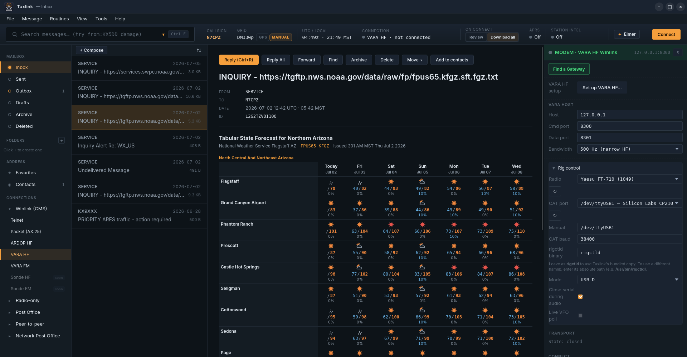
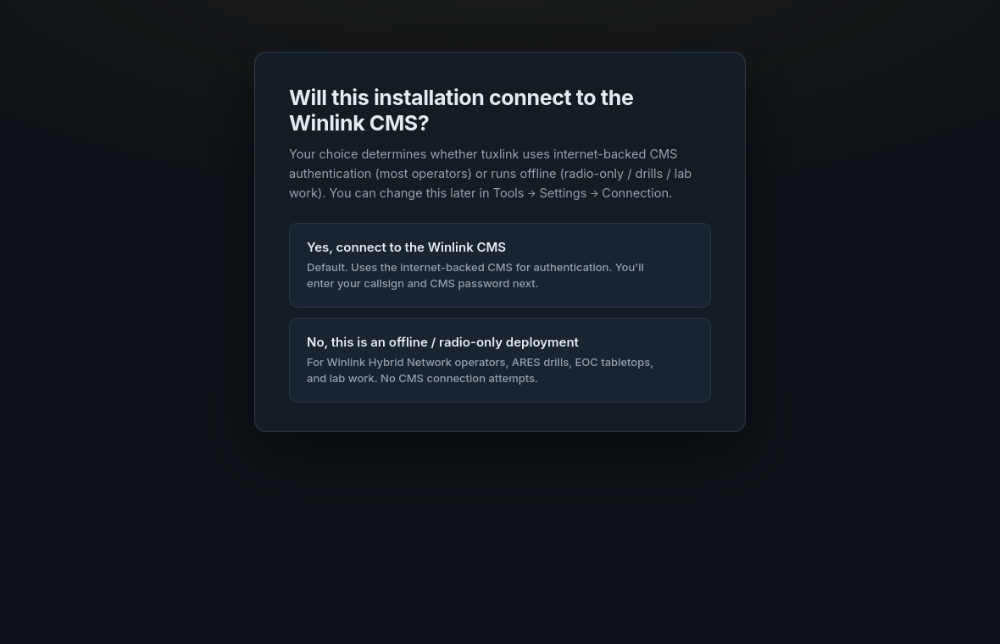
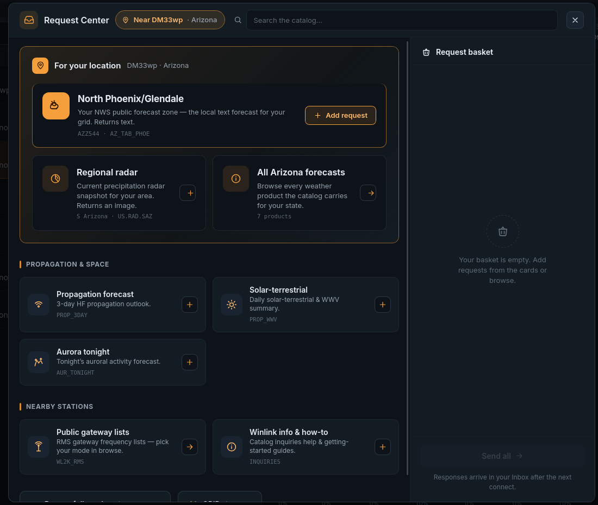

<p align="center">
  
</p>

# Tuxlink — native Linux Winlink client for amateur radio emergency communications

Tuxlink is a native Linux desktop [Winlink](https://winlink.org/) client for
amateur radio (ham radio) emergency communications. It implements the Winlink
B2F protocol directly in Rust and presents the mailbox, compose pane, and live
session log inside one desktop window. No Windows, no WINE, no browser tab, no
external CMS sidecar.

Beyond Winlink, Tuxlink fuses strategic and tactical emergency communications in
one workspace: long-haul Winlink email over HF, and tactical APRS messaging over
VHF and UHF with native control of the Benshi UV-Pro handheld.

<p align="center">
  <a href="LICENSE"></a>
  <a href="https://github.com/cameronzucker/tuxlink/releases/latest"></a>
  <a href="https://github.com/cameronzucker/tuxlink/releases/latest"></a>
  <a href="https://github.com/cameronzucker/tuxlink/actions/workflows/release.yml"></a>
  <a href="https://www.rust-lang.org"></a>
  <a href="https://www.kernel.org"></a>
</p>

> [!NOTE]
> **Tuxlink is in alpha and looking for testers.** It installs from `.deb`,
> `.rpm`, and `.AppImage` artifacts on every release. It is not yet ready for
> field deployment. Install it, run it through real workflows, and
> [file an issue](https://github.com/cameronzucker/tuxlink/issues) with a clear
> repro and the exported logs (Help → Logging → Export logs).
>
> Version tags are generated automatically from conventional-commit activity by
> [release-please](https://github.com/googleapis/release-please) and track
> repository velocity, not release readiness. The
> [Maturity](#maturity-what-is-and-is-not-proven) section covers which paths
> are validated and which are operator-verified.

> [!TIP]
> **Coming from Winlink Express or Pat?** Start with
> [Moving from other Winlink clients](docs/user-guide/32-from-express-or-pat.md):
> settings mapping, conceptual differences, current parity gaps, and a
> recommended migration sequence (including how to carry mailbox history across
> by copying the `native-mbox/` directory).

<p align="center">
  
</p>
<p align="center"><sub>The running Tuxlink mailbox with privacy-safe sample data: dashboard ribbon, folder sidebar, message list, reading pane, and status bar.</sub></p>

## What Tuxlink is

[Winlink](https://winlink.org/) is the de-facto amateur radio email system used
by emergency-communications (emcomm) teams, ARES and CERT organizations, the
Red Cross, and offshore cruisers. It moves email-style messages over radio when
the internet is down.

Two clients have reached the Winlink network on Linux.
[Winlink Express](https://winlink.org/WinlinkExpress) is the proprietary Windows
reference client; Linux operators run it under WINE.
[Pat](https://getpat.io/) is an open-source Go client that has served the Linux
Winlink community for years: cross-platform, packaged for Debian and Ubuntu,
with telnet, ARDOP, VARA HF/FM, PACTOR, and AX.25 support. Pat pairs a
command-line tool with an optional browser-served web UI, stores operator
credentials in `~/.config/pat/config.json`, and routes transport configuration
(Dire Wolf, ardopcf, rig control) through community-written tutorials per
transport.

Tuxlink occupies a third axis: a native desktop GUI, delivered as a single
[Tauri](https://tauri.app/) application. The complete Winlink Express Standard
Forms catalog, an address book, station finding, location-aware request
workflows, full-text search, and an offline map all ship in the box, and first
run needs no README and no video tutorial. The OS keyring holds the Winlink CMS password; Tuxlink never writes
it to a config file on disk. The mailbox, compose pane, address book, and
session log all render inside one desktop window.

Tuxlink unifies two layers of emergency communication that operators have
historically run on separate devices. The strategic layer carries Winlink email
over HF to wherever propagation reaches. The tactical layer carries APRS position
and text over VHF and UHF to stations in local range, with native control of the
Benshi UV-Pro handheld. Both run from one workspace on a mains-powered Linux
station, instead of a Windows laptop for Winlink alongside a battery handheld for
APRS.

## Features

Tuxlink ships the following on Linux for x86_64 and arm64:

### Winlink engine

- **Native B2F engine.** The Winlink B2F protocol is implemented directly in
  Rust: CMS over telnet (TLS or plaintext), the full propose / accept message
  exchange, and on-disk mailbox persistence. No external modem daemon or
  sidecar process handles CMS.
- **Telnet to CMS.** Operator-to-CMS sessions over the internet for
  development, training, and fall-back when HF propagation is poor.
- **AX.25 1200-baud packet.** Connected-mode AX.25 over a KISS TNC: USB serial,
  Bluetooth RFCOMM, or KISS-over-TCP to a soundcard modem such as
  [Dire Wolf](https://github.com/wb2osz/direwolf). Inline radio panel with an
  SSID picker.
- **ARDOP HF.** A complete UI for the ARDOP transport: pre-flight, dial, abort,
  quality scoring, and session log. A local `ardopcf` daemon drives the
  transport over its command and data sockets.
- **VARA HF / VARA FM.** A connection panel manages the TCP link to an
  operator-supplied VARA instance, surfaces connect and error state, and edits
  the persisted VARA configuration. Over-the-air peer sessions are pending.

### Tactical and local operations

- **APRS tactical chat.** Per-callsign message threads over APRS on VHF and UHF
  with delivery-acknowledgement tracking, presented inline beside the address
  book. A fixed, mains-powered station carries local tactical traffic without
  draining a handheld.
- **Native UV-Pro control.** Direct Bluetooth control of the Benshi UV-Pro
  handheld over its RFCOMM / GAIA link: a control strip for the radio, and a KISS
  path that also carries AX.25 packet and Winlink.
- **FULL and tactical identities.** A licensed FULL identity for Winlink and
  tactical identities for local operation, managed under Settings → Identities.

### Mailbox and messaging

- **Mailbox.** Inbox, Outbox, Sent, Drafts, Archive, plus operator-created
  nested user folders. A selection-aware context menu performs bulk Archive and
  Move across multiple messages.
- **Compose.** New message, Reply, Reply All, and Forward. Cc is carried end to
  end through the native B2F path. Drafts auto-save to a local store keyed by a
  stable draft id and reopen exactly as left.
- **Address book.** Contacts and distribution groups with an inline editor.
  Recipient fields autocomplete from contacts and expand groups to their
  members at send time.
- **HTML Forms, full Winlink Express catalog.** The complete Winlink Express
  Standard Forms snapshot (251 templates) ships bundled. Compose or view any
  catalog form through a hierarchical browser; native React composers cover the
  highest-volume forms (ICS-213, Bulletin), and the long tail renders through
  Tuxlink-skinned child webviews. Received form-tagged messages render their
  viewer template inline. Drop a `.html` file into the custom-forms directory
  and it appears in the browser on next launch, for club-specific forms or
  templates released after the bundled snapshot.
- **Find Messages.** Token-driven full-text search across folders
  (`FOLDER:`, `FROM:`, `SUBJECT:`, `BEFORE:`, `AFTER:`, `UNREAD:`, `HAS:`),
  plus saved and recent searches.

### Stations, requests, and position

- **Find a Gateway.** A location-aware station finder polls Winlink RMS gateway
  lists by mode and sorts results by distance from the operator's grid square.
  Star a gateway to save it as a favorite; the radio panels surface saved
  favorites and recent connections per transport.
- **Request Center.** A request-first workspace resolves location-aware catalog
  requests (state and marine forecasts, propagation, solar-terrestrial, aurora,
  public gateway lists) from the operator's grid square, runs a catalog-wide
  search, and composes Saildocs GRIB requests. Selected items collect in a
  unified basket and dispatch per rail.
- **Offline map.** A position and station map renders from a configurable tile
  source, with tile-source provenance status and a validated-precision gate for
  fine zoom.
- **GPS privacy controls.** Position broadcast defaults to off. Operators may
  switch to local-display-only or broadcast at a chosen precision. The default
  reduces a broadcast position to a 4-character Maidenhead grid (about one
  degree). Higher precision is opt-in.

### Interface and operations

- **Native desktop GUI.** [Tauri](https://tauri.app/) 2.x with a
  React 18 + TypeScript frontend rendered by WebKitGTK 4.1. Custom title bar
  and native-style menu bar, a dashboard ribbon (callsign, grid, time,
  connection, Connect), the folder sidebar, the message list with search
  highlighting, the reading pane, and a mode-aware radio panel.
- **Onboarding wizard.** A first-run wizard takes a new operator from install
  to first message: callsign, grid, default transport, and an optional test
  send. It offers a CMS-connected path and an offline / radio-only path.
- **Session log.** A per-mode surface inside the radio panel renders both the
  human-readable projection of the CMS session and the raw B2F wire dialogue.
- **Color schemes.** Six bundled presets (Default dark, Daylight, High contrast
  light, Paper, Night / tactical red, Grayscale) plus an inline Theme Designer
  for custom palettes, for outdoor and bright-sun LCD readability.
- **Diagnostic logging.** Structured logging exports to a single `.tar.zst`
  archive via Help → Logging → Export logs, or attaches automatically through
  Help → Report Issue. Environment probes capture keyring, audio, serial,
  modem-process, network, and display state at startup and on errors.
- **OS keyring credentials.** The OS keyring (secret-service on Linux) holds
  the Winlink CMS password. Tuxlink never persists it to a config file on disk.

## Install

Download the artifact for your distribution and architecture from the
**[latest release](https://github.com/cameronzucker/tuxlink/releases/latest)**.
Every release publishes `.deb`, `.rpm`, and `.AppImage` bundles for both
`x86_64` and `arm64`, alongside `SHA256SUMS` for verification.

```bash
# Debian / Ubuntu (amd64 shown; arm64 bundles are also published)
sudo dpkg -i tuxlink_*_amd64.deb

# Fedora / RHEL
sudo rpm -i tuxlink-*.x86_64.rpm

# Distribution-agnostic
chmod +x tuxlink_*_amd64.AppImage && ./tuxlink_*_amd64.AppImage
```

**System dependency:** Tuxlink requires WebKitGTK 4.1 and a secret-service
compatible keyring daemon. Distributions that ship only WebKitGTK 4.0 (older
Debian stable, older RHEL / CentOS) need a backport.

Full install and first-run instructions live in
**[docs/install.md](docs/install.md)**. To build from source instead, see
**[docs/development.md](docs/development.md)**; the build needs the Rust
toolchain only (no Go).

### Uninstall and data cleanup

Uninstalling Tuxlink has two parts. Removing the package keeps operator data by
default: messages, contacts, settings, station catalogs, logs, and OS-keyring
credentials remain in the current user's profile so a reinstall resumes cleanly.
A full uninstall removes both.

**Part 1 — remove your data.** This is per-user and cannot be done by the package
manager (it runs as root and cannot infer which user homes or keyrings to scrub).
Open **Help → Uninstall Cleanup…** in the app, or run it from the terminal as the
user whose data is being removed:

```bash
tuxlink cleanup --dry-run        # preview; removes nothing
tuxlink cleanup --transient      # cache, logs, webview state; keep mailbox + settings
tuxlink cleanup --all            # config, mailbox, contacts, stations, logs, known keyring entries
```

Run Part 1 before uninstalling, or reinstall and run it afterward if the package
is already gone. Secret Service credentials cannot be enumerated service-wide;
full cleanup removes the accounts it can discover, and the dialog lists the
keyring services (`tuxlink`, legacy `tuxlink-pat`) to check manually.

**Part 2 — remove the application.**

```bash
sudo apt remove tuxlink          # Debian / Ubuntu (.deb)
sudo dnf remove tuxlink          # Fedora / RHEL (.rpm)
# AppImage / manual: delete the .AppImage, then scripts/uninstall-desktop-entry.sh
```

Verify it is gone: `dpkg -l | grep -i tuxlink` (Debian) or `rpm -q tuxlink`
(Fedora) returns nothing. Package installs put the launcher and icons under
`/usr/share`, removed by the package manager; the per-user launcher entries the
cleanup tool lists apply only to AppImage / manual installs.

## Interface

The first-run wizard takes a new operator from install to first message with no
README and no tutorial, on a CMS-connected path or an offline / radio-only
path:

<p align="center">
  
</p>

The Request Center resolves location-aware catalog requests, searches the
Winlink catalog, and collects selected items in a unified send basket:

<p align="center">
  
</p>

<sub>Images are generated from the current frontend in WebKitGTK using privacy-safe sample data.</sub>

## Maturity: what is and is not proven

Where each path stands:

- **Validated:** native CMS connection over telnet and real Winlink message
  receive and render, against the Winlink CMS test server.
- **Operator-pending (Part 97):** AX.25 has cleared validation over a TCP / KISS
  loopback. **On-air RF validation over a real radio is the operator's to
  perform.** Tuxlink never transmits without explicit, per-invocation operator
  consent (see [Amateur radio and Part 97](#amateur-radio-and-part-97)).
- **Operator-pending (Part 97):** APRS tactical chat and native UV-Pro Bluetooth
  control are built and pass backend validation. On-air RF validation over a real
  radio, including clean abort and de-key, is the operator's to perform.
- **Production CMS:** reaching the production Winlink CMS requires Winlink's
  prior registration of the Tuxlink client. Until that completes, CMS
  connectivity targets the test server.

### Pending

- **VARA over-the-air peer sessions.** The VARA panel manages the TCP transport
  to an operator's VARA instance; the RF connect-to-peer session lifecycle is
  pending.
- **Hamlib rig control** and USB rig autodetect.
- **Native HF modem.** VARA is x86 Windows software that runs under WINE on x86
  Linux but not on ARM. Tuxlink targets a clean-room native HF modem (Sonde,
  developed as a separate project) rather than bundling VARA; VARA-TCP wire
  compatibility serves operators who bring their own VARA install.

## Architecture

Tuxlink's desktop application lives in `src-tauri/` (Tauri 2.x with a React 18 +
TypeScript frontend in `src/` rendered by WebKitGTK 4.1). The Winlink engine, the
CMS connection, the B2F exchange, the mailbox, and the AX.25 packet path are
native Rust in `src-tauri/`; no external modem or sidecar process intervenes for
CMS. The desktop app ships as a single crate in the `v0.x` series, per
[ADR 0002](docs/adr/0002-tauri-react-single-crate.md).

**Sonde**, the clean-room native HF modem, is developed as a separate clean-room
project in its own repository (per [ADR 0019](docs/adr/0019-sonde-rebrand-and-extraction.md)).
Tuxlink will consume it as an external modem backend; it is not yet wired into
the desktop app's Winlink session lifecycle.

[CLAUDE.md](CLAUDE.md) documents the agent workflow, commit discipline, ethos,
and safety rails this project operates under.

## Amateur radio and Part 97

Tuxlink transmits under the operator's amateur radio callsign to real Winlink
CMS gateways. CMS-connected features require a valid amateur radio license. The
licensed operator bears responsibility for ensuring every transmission complies
with Part 97 of the FCC rules, or the equivalent regulations in the operator's
jurisdiction.

Tuxlink prohibits automated or agent-initiated transmissions absent explicit,
per-invocation operator consent. See
[docs/live-cms-testing-policy.md](docs/live-cms-testing-policy.md).

## Documentation

In-app documentation lives at **Help → Documentation**; bundled topics cover the
wizard, every transport, the mailbox, composing, HTML forms, operating modes,
search, settings, color schemes, keyboard shortcuts, and troubleshooting. The
source markdown resides in [`docs/user-guide/`](docs/user-guide/) for reading
outside the app. **Help → About Tuxlink** shows the running build's version,
license, and source-repository links.

## License

[GNU GPL v3 or later](LICENSE). Copyright 2026 Cameron Zucker.

## Contributing and development

[docs/development.md](docs/development.md) documents the build prerequisites,
toolchain setup, and runtime keyring requirement.
[CLAUDE.md](CLAUDE.md) holds the agent workflow, commit discipline, and project
ethos.
