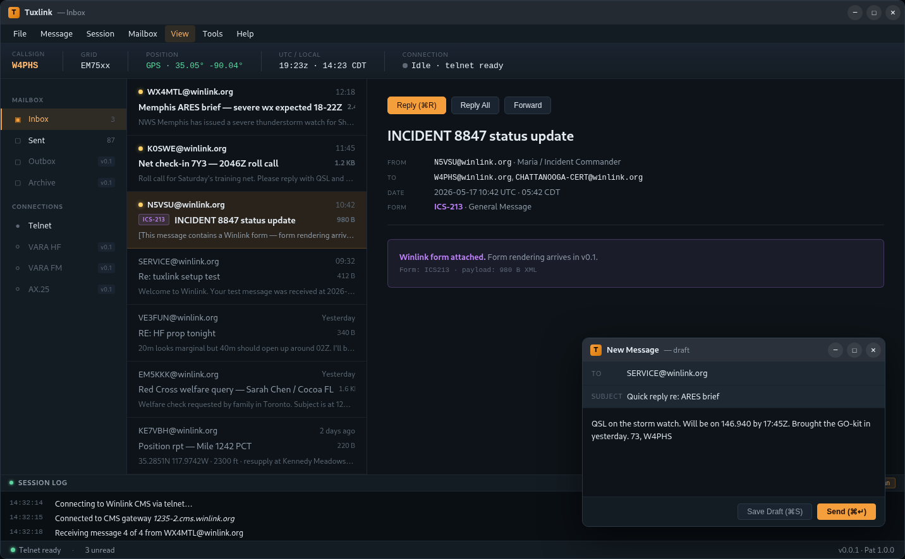
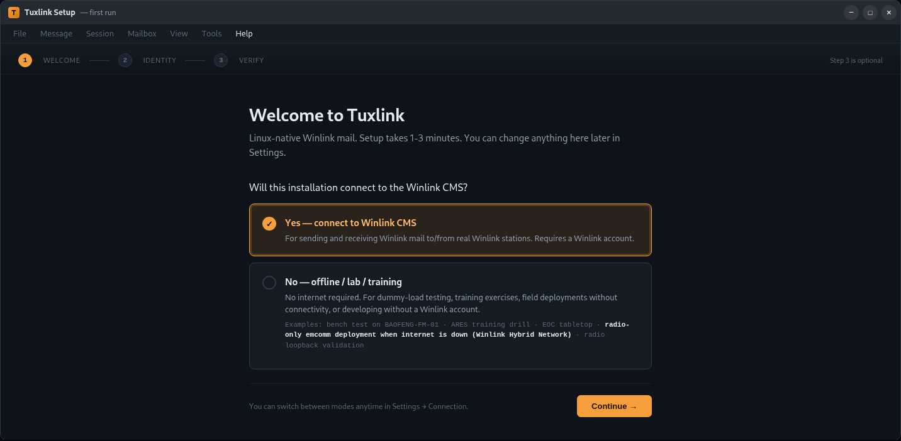
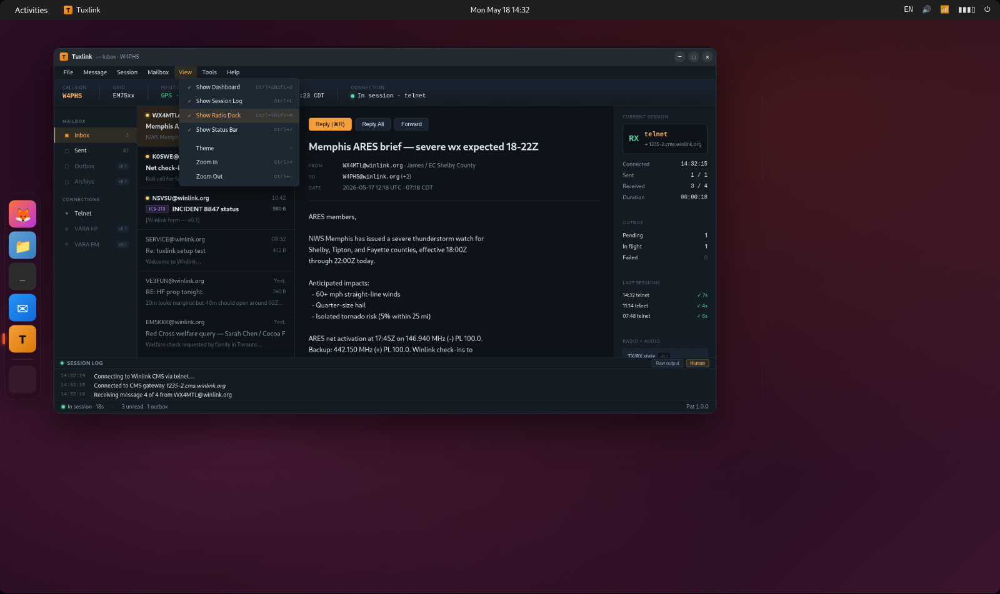

  

# Tuxlink

A native Linux desktop Winlink client for amateur-radio emergency
communications. No Windows. No browser tab to maintain. A Rust
application that implements the Winlink B2F protocol directly.

  
  
  
  
  

> [!WARNING]
> **🚧 Tuxlink is pre-alpha software under active construction. It is not a working product.**
>
> [release-please](https://github.com/googleapis/release-please) generates
> version tags on this repository automatically from conventional-commit
> activity. They reflect repository velocity, not release readiness.
> Anything below `v1.0` remains incomplete, breakable, and unsuitable for
> production or emergency-communications use.
>
> No installable artifacts exist. Running Tuxlink today requires
> [building from source](docs/development.md) in a Tauri development
> environment on a developer machine with the full toolchain. The UI
> remains in active flux; the screenshots and mockups below may depict
> surfaces that are out-of-date, partially-implemented, or under
> active redesign.
>
> Feature claims describe what has working code paths. They do not imply
> the integrated product is ready to operate. **Do not rely on Tuxlink
> for any emcomm deployment or as the only client for a real Winlink
> workflow.** Watch the repository for the first tagged release that
> does not carry this banner.

  

The Tuxlink mailbox: dashboard ribbon, folder sidebar, reading pane, and the live B2F session log.

## Status

**Pre-alpha** (see the banner above). Working code paths exist for:
CMS-over-telnet sessions, B2F message exchange in Rust, AX.25 1200-baud
packet plumbing, an ARDOP HF transport core (radio-free MVP), GPS
privacy controls, and a first-run wizard. Several surfaces remain under
active reconstruction against the locked UX spec
(`docs/design/v0.0.1-ux-mockups.md`) and may misbehave or look
unfinished; the radio-mode connection panels are the most-visible
affected area.

On-air RF paths and production CMS access remain operator-verified-only.
**Do not rely on Tuxlink for live emergency traffic.** See
[Maturity](#maturity-what-is-and-isnt-proven) for the
verified-vs-aspirational breakdown.

## What it is

[Winlink](https://winlink.org/) is the de-facto amateur-radio email
system used by emergency-communications teams, CERT organizations, the
Red Cross, and offshore cruisers.

Two clients reach the Winlink network on Linux today.
[Winlink Express](https://winlink.org/WinlinkExpress) (WLE) is the
proprietary Windows reference client; Linux operators run it under
WINE. [Pat](https://getpat.io/) is an open-source Go client that has
served the Linux Winlink community for years: cross-platform, packaged
for Debian and Ubuntu, with support for telnet, ARDOP, VARA HF/FM,
PACTOR, and AX.25 (via Direwolf or a serial TNC). Pat's interface
combines a command-line tool with an optional
browser-served local web UI; operator credentials reside in
`~/.config/pat/config.json`; transport configuration (Direwolf,
ardopcf, the rig-control layer) typically routes new operators through
community-written tutorials per transport.

Tuxlink occupies a third axis: a native desktop GUI, delivered as a
single Tauri application, that pursues feature parity with WLE.
First-run requires no README and no YouTube tutorial. The OS keyring
holds the Winlink CMS password; Tuxlink never persists it to a config
file on disk. The mailbox, compose pane, and session log render inside
a desktop window: no browser tab to maintain, no external CMS sidecar.

## Current features

The shipped surface area as of the latest pre-alpha build:

- **Native Winlink engine.** B2F implemented directly in Rust. CMS over
  telnet (TLS or plaintext), full propose / accept exchange, mailbox
  persistence. No external modem daemon or sidecar process for CMS.
- **Desktop GUI.** Tauri 2.x + React 18; WebKitGTK 4.1 renders the
  frontend. Custom title bar + native-style menu bar; dashboard ribbon
  (callsign, grid, time, connection, Connect button); folder sidebar
  (Inbox / Outbox / Sent / Drafts) with per-mode connection entries;
  message list with search highlighting; reading pane; mode-aware
  radio panel; mailbox bar.
- **Onboarding wizard.** Callsign, grid, default transport, optional
  test send.
- **Telnet.** Operator-to-CMS-over-internet sessions for development,
  training, or fall-back when HF propagation is poor.
- **AX.25 1200-baud packet.** Connected-mode AX.25 over a KISS TNC
  (USB serial, Bluetooth RFCOMM, or KISS-TCP to a soundcard modem like
  Dire Wolf). Inline radio panel with SSID picker.
- **ARDOP HF.** Full UI for the ARDOP transport: pre-flight, dial,
  abort, quality scoring, session log. A local `ardopcf` daemon drives
  the transport over its command + data sockets.
- **VARA TCP transport** (early: backend codec + smoke probe ship; UI
  integration remains in flight).
- **HTML Forms — full WLE catalog.** The complete Winlink Express
  Standard Forms snapshot (251 templates, version 1.1.20.0) ships
  bundled. Compose and view any form in the catalog through a
  hierarchical CatalogBrowser; native React composers cover the
  highest-volume forms (ICS-213, Bulletin), with the long tail
  rendered via tuxlink-skinned child webviews. Received form-tagged
  messages render their `*_Viewer.html` template inline. **Custom
  forms**: drop a `.html` file into
  `~/.local/share/tuxlink/forms/custom/` and it appears in the
  CatalogBrowser on next launch — useful for club-specific forms or
  WLE templates released after the bundled snapshot. Catalog
  freshness (in-app refresh from winlink.org) + hot-reload of the
  custom-forms directory are in progress.
- **Compose.** New message / Reply / Reply All / Forward; Cc carried
  end-to-end via the native B2F path; drafts auto-save to a local
  store keyed by stable draft id; form-based composition shares the
  same window.
- **Find Messages.** Token-driven full-text search across folders
  (`FOLDER:`, `FROM:`, `SUBJECT:`, `BEFORE:`, `AFTER:`, `UNREAD:`,
  `HAS:`) plus saved and recent searches.
- **GPS privacy controls.** Position broadcast defaults to off;
  operators may switch to local-display-only or to broadcasting at a
  chosen precision. The default reduces broadcast to a 4-character
  Maidenhead grid (~1°). Higher precision is opt-in.
- **Color schemes.** Six bundled presets (Default dark, Daylight, High
  contrast (light), Paper, Night/tactical red, Grayscale) plus an
  inline Theme Designer for custom palettes (a response to outdoor /
  bright-sun LCD readability needs).
- **Session log.** Per-mode session-log surface inside the radio
  panel: both the human-readable projection of the CMS session and
  the raw B2F wire dialogue.

## User guide

In-app documentation lives at **Help → Documentation**; bundled topics
cover the wizard, every transport, the mailbox, composing, HTML forms,
search, settings, color schemes, keyboard shortcuts, and
troubleshooting. The source markdown resides in
[`docs/user-guide/`](docs/user-guide/) for reading outside the app.

**Help → About Tuxlink** displays the running build's version,
license, and links to the source repository.

**Help → Report Issue** opens the project's GitHub issue tracker in
the operator's default browser.

## Interface

The first-run wizard takes a new operator from install to first
message with no README and no tutorial. Pick a CMS-connected path or
an offline / radio-only path:

  

Tuxlink is a native desktop application: no browser, no WINE, no web
UI to maintain in a tab. Here it appears on an Ubuntu 24.04 desktop:

  

The images above reflect the approved v0.2.0 interface design,
which the application renders faithfully.

## Maturity: what is and isn't proven

Tuxlink is honest about its edges:

- **Validated:** native CMS connection over telnet, and real Winlink
  message receive/render, against the Winlink CMS test server.
- **Operator-pending (Part 97):** AX.25 has cleared validation over a
  TCP/KISS loopback; **on-air RF validation over a real radio remains
  the operator's to perform.** Tuxlink never transmits without
  explicit, per-invocation operator consent (see
  [Amateur radio / Part 97](#amateur-radio--part-97)).
- **Production CMS:** reaching the production Winlink CMS requires
  Winlink's prior registration of the tuxlink client (in progress);
  until then, CMS connectivity targets the test server.

## Not yet shipped

- **Hamlib rig control** and USB rig autodetect.
- **VARA HF / VARA FM as third-party binary.** VARA is x86 Windows
  software that runs under WINE on x86 Linux but not on ARM. Tuxlink
  will ship a clean-room native HF modem (v0.5+) instead of bundling
  VARA; early VARA-TCP wire compatibility lands for operators who
  wish to bring their own VARA install.
- **Packaging.** Tuxlink does not yet produce `.deb`, `.rpm`,
  AppImage, or Flatpak artifacts; the install path remains
  build-from-source.
- **Trash / Deleted folder behavior.** The Deleted folder is a UI
  placeholder; delete-from-mailbox semantics remain pending.

## Architecture

Tuxlink is a **single Rust crate** (`src-tauri/`) employing Tauri 2.x
as the desktop framework, with a **React 18 + TypeScript frontend**
(`src/`) that WebKitGTK 4.1 renders. The Winlink engine (CMS
connection, the B2F exchange, the mailbox, and the AX.25 packet path)
consists of native Rust; no external modem or sidecar process
intervenes for CMS.

The OS keyring (secret-service on Linux, Keychain on macOS,
CredentialManager on Windows) holds the Winlink CMS password. Tuxlink
never persists it to a config file on disk.

Tuxlink will adopt a layered multi-crate workspace in v0.5+; the
current v0.x series deliberately ships as a single crate (see
[ADR 0002](docs/adr/0002-tauri-react-single-crate.md)).

See [CLAUDE.md](CLAUDE.md) for the agent workflow, ethos, and safety
rails this project operates under.

## Install

See **[docs/install.md](docs/install.md)** for the full install and
first-run guide.

**Build from source** remains the path today; a prebuilt AppImage via
CI is forthcoming. No Go toolchain required; Rust only. The runtime
requires a secret-service-compatible keyring daemon on Linux. See
[docs/development.md: Runtime prerequisites for end-users](docs/development.md#runtime-prerequisites-for-end-users).

**System dependency:** Tuxlink requires WebKitGTK 4.1. Distros
shipping only WebKitGTK 4.0 (older Debian stable, older RHEL/CentOS)
cannot run tuxlink without a backport.

## Amateur radio / Part 97

Tuxlink transmits under the operator's amateur-radio callsign to real
Winlink CMS gateways. CMS-connected features require a valid
amateur-radio license. The licensed operator bears responsibility for
ensuring all transmissions comply with Part 97 of the FCC rules (or
the equivalent regulations in the operator's jurisdiction).

Tuxlink prohibits automated or agent-initiated transmissions absent
explicit, per-invocation operator consent. See
[docs/live-cms-testing-policy.md](docs/live-cms-testing-policy.md).

## License

[MIT](LICENSE). Copyright 2026 Cameron Zucker.

## Contributing / Development

[docs/development.md](docs/development.md) documents the build
prerequisites, toolchain setup, and runtime keyring requirement.

[CLAUDE.md](CLAUDE.md) holds the agent workflow, commit discipline,
and project ethos.
