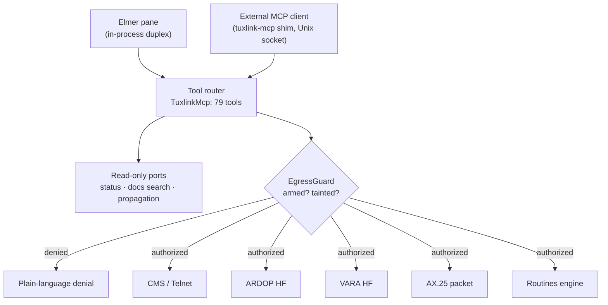

# Elmer: the in-app agentic assistant

This document describes Elmer, Tuxlink's in-app AI assistant, for an
engineering audience evaluating the agentic capability set. It covers the
architecture, the security model, what the assistant can do, model support,
and its plainly stated limits. Every architectural claim below cites the
source file or spec it derives from.

## 1. What Elmer is

Elmer is the in-app assistant docked in the Tuxlink shell. It is not a chat
overlay bolted onto the product; it is an operator of the product, working
through the same 79-tool surface that an external AI agent reaches over the
Model Context Protocol (MCP). Elmer and an external MCP client are two entry
paths into one router, gated by the same security model. There is no
Elmer-only shortcut and no external-agent-only capability: whatever tool
exists, both paths call it, and both paths are subject to the same
authorization gate described in [§3](#3-security-model).

An amateur radio operator remains the control operator of record for every
transmission. Elmer assists with drafting, diagnosis, and station operation;
it does not carry any authority the operator has not explicitly and
temporarily granted (see [§3.1](#31-operator-armed-egress)).

## 2. Architecture

### 2.1 Two entry paths, one router

Two callers reach the tool surface:

- **Elmer**, the docked in-app assistant, calls the router in-process. The
  `InProcessMcpInvoker` constructs a real `TuxlinkMcp` router instance over a
  `tokio::io::duplex(256 * 1024)` in-memory byte-stream pair: a server half
  serves the router, a client half calls it, and both halves share the same
  `Arc<McpState>` (and therefore the same `Arc<EgressGuard>`). This is a real
  duplex-served router, not a re-implementation of one. The module doc states
  the invariant plainly: calling ports directly instead of going through the
  router would read mailbox content without tainting it, which the doc calls
  a silent security collapse.
  ([`src-tauri/src/elmer/executor.rs:1-24,87-121`](../src-tauri/src/elmer/executor.rs))
- **External MCP clients** (Claude Code, Codex, Gemini CLI, or any
  MCP-capable agent) reach the same router over a Unix-domain socket at
  `$XDG_RUNTIME_DIR/tuxlink/mcp.sock` (or a private fallback when the runtime
  directory is not private to the user), bridged by the bundled `tuxlink-mcp`
  stdio shim.
  ([`src-tauri/tuxlink-mcp-core/src/transport_uds.rs`](../src-tauri/tuxlink-mcp-core/src/transport_uds.rs),
  [`src-tauri/tuxlink-mcp/src/main.rs`](../src-tauri/tuxlink-mcp/src/main.rs),
  [`docs/user-guide/35-agent-mcp.md:95-99`](user-guide/35-agent-mcp.md))

No network port is ever opened for either path. The in-process path never
touches the filesystem or a socket at all; the external path is a local
Unix-domain socket, not a TCP listener.

### 2.2 One router, one tool surface

Both paths dispatch into the same `TuxlinkMcp` router
([`src-tauri/tuxlink-mcp-core/src/router.rs`](../src-tauri/tuxlink-mcp-core/src/router.rs)),
which registers **79 tools**, each declared with `#[tool(name = "...")]` and
implemented once. `router.rs` is the only file in `src-tauri/` carrying a
`#[tool(` registration; the entire agent-facing surface lives in one place,
from `server_info` near the top of the file to `routines_journal_get` near
the bottom.

The in-process invoker exposes this full surface unfiltered to Elmer,
including egress-marked tools. Arming is enforced at the point each tool
calls into its port implementation, not by hiding tools from the list: a
disarmed or tainted Elmer sees every tool name but has most of them denied at
call time, with a plain-language reason. The router's own module doc
codifies this as a design decision, not an oversight: "gate at the operation,
not the list."
([`src-tauri/src/elmer/executor.rs:22,114`](../src-tauri/src/elmer/executor.rs))

### 2.3 Entry paths, guard, transports

Read-only calls (station status, documentation search, propagation
prediction) never touch the guard. Every transmit-capable call, whether it
originates from Elmer or an external agent, passes through the same
`EgressGuard::authorize` decision before it reaches a transport.

## 3. Security model

This is the centerpiece of Elmer's design: an agent, local or remote, gets a
bounded and revocable grant to act, and any untrusted content it reads locks
that grant until the operator explicitly clears it. The station licensee
remains the control operator of record for every transmission; Elmer's grant
is a delegation, not a transfer, of that authority.

### 3.1 Operator-armed egress

Send-authority is off by default. The **Agent send** control in the
dashboard ribbon has three states: **OFF** (the default; every transmit,
connect, and configuration-write tool is denied), **ON** (armed, with a live
countdown and a **Disarm** button), and **LOCKED** (tainted; see
[§3.2](#32-taint-containment)).
([`docs/user-guide/35-agent-mcp.md:30-42`](user-guide/35-agent-mcp.md))

Arming is bounded to fixed presets, not an arbitrary duration the agent or
operator can extend at will: 15 minutes, 1 hour, or 4 hours
([`src/security/egressTypes.ts:33-37`](../src/security/egressTypes.ts)). The
backend implementation is a deadline, not a token bucket: `arm(duration_secs)`
sets `armed_until` to now plus the requested duration, `disarm()` clears it,
and `armed_remaining()` reports the seconds left or zero
([`src-tauri/tuxlink-security/src/lib.rs:149-157,200-206`](../src-tauri/tuxlink-security/src/lib.rs)).
The ribbon renders this live: an `EgressArmControl` component shows the three
states and a `CountdownCell` that ticks locally every second and re-seeds
from each backend poll
([`src/shell/EgressArmControl.tsx:1-58`](../src/shell/EgressArmControl.tsx)).
Nothing the agent does extends an armed window; only the operator can arm,
disarm, or let it expire.

### 3.2 Taint containment

Reading any untrusted content, a message body, a search result, or a session
log, taints the session. Taint is first-reason-wins and idempotent: the
first read that triggers it records why, and later reads cannot overwrite
that reason
([`src-tauri/tuxlink-security/src/lib.rs:159-168`](../src-tauri/tuxlink-security/src/lib.rs)).
This exists to contain prompt injection: an instruction hidden in a received
message or a wire capture cannot become a transmission in the same session,
because reading it locks the transmit path shut.

Taint is designed to survive arming, not to be a race the agent can win by
arming first. A regression test asserts this directly: arming after taint
leaves `is_tainted()` true and an agent-authority call still denied with
`Tainted`
([`src-tauri/tuxlink-security/src/lib.rs:376-382`](../src-tauri/tuxlink-security/src/lib.rs)).
The only sanctioned path back to a working send-authority is
`quarantine_and_rearm()`, which atomically clears taint and sets a fresh arm
deadline in one locked act
([`src-tauri/tuxlink-security/src/lib.rs:176-188`](../src-tauri/tuxlink-security/src/lib.rs)).
Precisely: clearing taint is not a background timeout and not an application
restart. It requires the operator to explicitly re-arm through the
quarantine path, and that re-arm discards the current conversation rather
than resuming it, per the router's own remedy text for a denied,
tainted call
([`src-tauri/tuxlink-mcp-core/src/router.rs:72-85`](../src-tauri/tuxlink-mcp-core/src/router.rs)).
The operator trades the in-progress chat for a clean send-authority grant; the
two do not coexist.

`EgressGuard::authorize` is the single gate both entry paths pass through.
An operator-authority call (a button the human physically clicked) is
answered before any lock is taken and is always allowed. An agent-authority
call reads the live armed/tainted state and is denied on a poisoned lock as
well as on an explicit taint or expiry, treating an inconsistent internal
state as untrusted rather than risking a false allow
([`src-tauri/tuxlink-security/src/lib.rs:208-229`](../src-tauri/tuxlink-security/src/lib.rs)).

### 3.3 Typed-callsign validation against modem-command injection

On the VARA path, every callsign passes through `validate_wire_callsign`
before it reaches the modem's command channel: a base of 3-7 alphanumeric
characters, with an optional `-1`..`-15`, `-T`, or `-R` SSID suffix
([`src-tauri/src/winlink/callsign.rs:32-55`](../src-tauri/src/winlink/callsign.rs)).
The check is applied to both the station's own MYCALL registration and the
agent-supplied connect target before either is written to the wire
([`src-tauri/src/winlink/modem/vara/commands.rs:2814,2818`](../src-tauri/src/winlink/modem/vara/commands.rs)),
so a malformed or crafted string, such as one carrying embedded control
sequences or attempting to inject additional modem commands, is rejected
before it becomes a wire-level command rather than sanitized after the fact.

The scope of this validation is the VARA path only. The ARDOP and AX.25
packet connect targets do not pass an equivalent callsign-grammar check
before reaching their wire grammars; that gap is stated in
[§6](#6-honest-limits).

### 3.4 Real per-transport aborts

Stopping a connection is always available, independent of arm state, and it
is a real abort at the transport, not an advisory flag the agent hopes a
backend loop checks. The `AbortPort` trait exposes three methods:
`cms_abort`, `ardop_disconnect`, and `vara_stop_session`, covering the CMS
(Telnet) connection, an ARDOP HF session, and a VARA HF session
respectively.
([`src-tauri/tuxlink-mcp-core/src/ports.rs:987-993`](../src-tauri/tuxlink-mcp-core/src/ports.rs))
The AX.25 packet transport does not yet have an equivalent abort tool; that
gap is stated plainly in [§6](#6-honest-limits).

### 3.5 Plain-language denials

A denied tool call does not fail silently or return an opaque error code. It
returns a plain-language reason, not armed or session tainted, that the
calling agent can relay to the operator directly
([`docs/user-guide/35-agent-mcp.md:27-28`](user-guide/35-agent-mcp.md)).

## 4. What the agent can do

### 4.1 The agent-send loop

An armed, untainted agent can run a full connect-and-send cycle inside one
arm window: predict which path (band, mode, gateway) is likely to work with
`predict_path`
([`src-tauri/tuxlink-mcp-core/src/ports.rs:844`](../src-tauri/tuxlink-mcp-core/src/ports.rs)),
dial a station with an agent-chosen target, and, for ARDOP and VARA, an
agent-chosen frequency and a list of QSY candidates to try in order. Both
`ardop_connect` and `vara_b2f_exchange` accept a `target: String`, a
`freq_hz: Option<u64>`, and `qsy_candidates: Option<Vec<QsyCandidateDto>>`
as shipped parameters, not a design intent; `vara_b2f_exchange`
additionally takes a `SessionIntentDto` and an optional `VaraEngineDto`
selecting which VARA engine the target uses
([`src-tauri/tuxlink-mcp-core/src/ports.rs:930-935,953-960`](../src-tauri/tuxlink-mcp-core/src/ports.rs)).
AX.25 packet dial is also live, taking `call: String, path: Vec<String>`
for the target and digipeater path
([`src-tauri/tuxlink-mcp-core/src/ports.rs:979`](../src-tauri/tuxlink-mcp-core/src/ports.rs)),
though see [§6](#6-honest-limits) for what packet's agent surface does not
yet cover. From there the agent composes and queues a message; transmitting
it requires the same armed, untainted session.

### 4.2 VARA HF, full lifecycle

The tool surface covers VARA HF end to end, under the same authorization
model as everything else:

- **Setup**, without armed send-authority, because installing software is
  not a transmission: `vara_engine_available` and `vara_install_status`
  report whether the build carries the guided Wine install engine (x86-64
  Linux only) and how far an install has progressed, and
  `vara_install_start` runs the guided installer against a VARA `.exe` the
  operator already downloaded. The install still prompts for the OS password
  at the machine, so it cannot run fully unattended.
- **Diagnostics**, always available: `vara_status` and `vara_probe`, the
  latter opening VARA's command port read-only to classify what answered.
- **Configuration**, requiring armed send-authority: `config_set_vara` sets
  the VARA bandwidth (500, 2300, or 2750 Hz).
- **Operation**, requiring armed and untainted send-authority:
  `rig_tune`, `vara_open_session`, and `vara_b2f_exchange`.
  `vara_stop_session` stops the session and, like every stop, is always
  allowed.

([`docs/user-guide/35-agent-mcp.md:65-89`](user-guide/35-agent-mcp.md))

### 4.3 Routines: authoring, validating, running

Elmer can author, validate, and run Routines, Tuxlink's flowchart-based
automation, through a ten-tool family: `routines_list`, `routines_get`,
`routines_validate`, `routines_save`, `routines_enable`, `routines_disable`,
`routines_run`, `routines_dry_run`, `routines_run_status`, and
`routines_journal_get`
([`src-tauri/tuxlink-mcp-core/src/router.rs`](../src-tauri/tuxlink-mcp-core/src/router.rs)).

A routine's `TransmitMode` is `Attended` or `Automatic`
([`src-tauri/tuxlink-routines/src/types.rs:17-21`](../src-tauri/tuxlink-routines/src/types.rs)).
An `Automatic` routine with a non-empty transmit step requires a recorded
`TransmitAck { by, at }` at design time; the validator rejects an unacked
automatic-transmit routine with `AUTO_TX_UNACKED` rather than letting it save
silently
([`src-tauri/tuxlink-routines/src/validate/consent.rs:1-37`](../src-tauri/tuxlink-routines/src/validate/consent.rs)).
This models Part 97 consent directly in the product: an attended routine
still pauses for a per-transmit confirmation, and an automatic one carries an
explicit, dated acknowledgment that the operator made that decision in
advance, not a silent default. "Schedule" is not a separate UI surface; it is
one of a routine's trigger kinds
(`Trigger::Schedule`,
[`src-tauri/tuxlink-routines/src/types.rs:67`](../src-tauri/tuxlink-routines/src/types.rs)),
configured inside the same designer that builds the routine's flowchart. The
designer, the dashboard, a run-history view, and the consent gate are the UI
surfaces
([`src/routines/designer/`](../src/routines/designer/),
[`src/routines/RoutinesDashboard.tsx`](../src/routines/RoutinesDashboard.tsx),
[`src/routines/ConsentGate.tsx`](../src/routines/ConsentGate.tsx)).

### 4.4 Documentation retrieval

`docs_search` ranks the user guide, troubleshooting playbooks, and the
knowledge corpus on other Winlink clients by BM25 relevance over an FTS5
full-text index, returning short snippets; `docs_read` then returns one page
in full by the slug a search hit named. The tool descriptions themselves warn
the agent not to answer from a snippet alone and to read the full page first
([`src-tauri/tuxlink-mcp-core/src/router.rs:335-360`](../src-tauri/tuxlink-mcp-core/src/router.rs);
BM25/FTS5 ranking:
[`src-tauri/src/search/docs_index.rs:66,198,225`](../src-tauri/src/search/docs_index.rs)).
Neither tool taints the session; both are read-only over app-owned content.

### 4.5 UI spotlight

`point_at` highlights a named anchor in the running UI so the agent can show
the operator exactly where a setting or control lives, without navigating
away from what the operator is looking at, opening a dialog, or mutating any
state
([`src-tauri/tuxlink-mcp-core/src/ports.rs:714-723`](../src-tauri/tuxlink-mcp-core/src/ports.rs)).
It never touches the egress guard, because it is a display-only spotlight
with nothing to authorize
([`src-tauri/tuxlink-mcp-core/src/lib.rs:844-849`](../src-tauri/tuxlink-mcp-core/src/lib.rs)).

## 5. Models

Elmer treats a local Ollama instance and cloud providers as equal peers,
all reached through an OpenAI-compatible chat-completions endpoint. Seven
presets ship out of the box: `localOllama` (loopback, no key required),
`openai`, `anthropic`, `openrouter`, `gemini`, `groq`, and `custom` for any
other OpenAI-compatible endpoint
([`src/elmer/elmerModelConfig.ts:97,123-185`](../src/elmer/elmerModelConfig.ts)).
`gemini` and `groq` are free-tier cloud presets specifically chosen to give a
non-developer operator a capable cloud model with no billing card.

An API key is stored per origin in the OS keyring under the canonical
`tuxlink` service, keyed as `elmer-agent-api-key::<origin>`; cross-origin
reuse is structurally impossible because each origin gets its own entry, and
a keyring-backend error is never silently collapsed into "no key present," to
avoid firing an unauthenticated request at a cloud provider
([`src-tauri/src/elmer/keyring.rs:1-24,41-45`](../src-tauri/src/elmer/keyring.rs)).
No key is ever written to a config file on disk.

Switching models is live: `elmer_config_set` mutates the running model
configuration without an application restart
([`src-tauri/src/elmer/config_commands.rs:864-878`](../src-tauri/src/elmer/config_commands.rs)).
The onboarding flow is tile-based: `ModelTilePicker` groups the seven presets
by pricing tier (free, pay-as-you-go, local, other) so the operator picks a
provider visually rather than filling in an endpoint URL from memory
([`src/elmer/ModelTilePicker.tsx`](../src/elmer/ModelTilePicker.tsx)).

## 6. Honest limits

**Agent-initiated transmission inherits the validation state of the
transport it targets, not a uniform "Elmer level" of trust.** Dockable
surfaces and Routines enter as built and CI-tested, with field validation
pending at the next release cut. APRS beacon transmit remains
operator-pending. VARA P2P remains pending. FT8 is receive-only by design,
so it carries no transmit surface for Elmer to reach at all. Telnet CMS
remains validated-internet: proven over the internet, not proven on air,
because it is not an on-air transport. An armed, untainted agent call
reaches exactly the maturity the underlying transport already carries;
arming does not upgrade an unproven transport to a proven one.

**Packet's abort tool does not exist yet.** [§3.4](#34-real-per-transport-aborts)
named the three abort methods that do exist: `cms_abort`,
`ardop_disconnect`, `vara_stop_session`. There is no `packet_abort`. The
agent-send design spec documents this as open, not shipped, work: "Add
`packet_abort` to the `AbortPort` trait ... it does not exist today"
([`docs/superpowers/specs/2026-07-01-elmer-agent-send-design.md:39,85`](superpowers/specs/2026-07-01-elmer-agent-send-design.md)).
Until it lands, an agent that opens a packet connection has no dedicated stop
tool for that transport the way it does for CMS, ARDOP, and VARA.

**Callsign-grammar validation covers the VARA path only.** The ARDOP connect
target goes into the modem's `ARQCALL <target> <repeat>` command line, and
the AX.25 packet connect target into its address field, without the
`validate_wire_callsign` check that gates the VARA MYCALL and connect target
([§3.3](#33-typed-callsign-validation-against-modem-command-injection);
ARDOP wire line at
[`src-tauri/src/winlink/modem/ardop/session.rs:429`](../src-tauri/src/winlink/modem/ardop/session.rs)).

**Two tools were removed from the agent surface entirely, not merely
undocumented.** `packet_listen` and `telnet_p2p_connect` are absent from the
current 79-tool router; the design spec records why they were pulled: a
prior defect where their abort path was advisory rather than real (a
"fake-abort defect")
([`docs/superpowers/specs/2026-07-01-elmer-agent-send-design.md:91`](superpowers/specs/2026-07-01-elmer-agent-send-design.md)).
Neither Elmer nor an external agent can drive those two workflows on the
current tool surface.

**Elmer refuses unarmed egress and tainted send authority, on principle, not
as a bug to route around.** A disarmed session cannot connect, transmit, or
change configuration no matter how the request is phrased; a tainted
session cannot regain send authority except through the operator's explicit
quarantine-and-rearm action, which costs the current conversation
([§3.2](#32-taint-containment)). These are not rough edges to smooth over in
a future release; they are the design.

**Known rough edge:** the first real on-air VARA dial required five manual
hand-configurations Tuxlink does not yet automate for the operator, dialout
group membership, the CAT serial port, the VARA.ini soundcard device names,
the PipeWire device profile, and the ALSA mixer level, even though Tuxlink
provisions the VARA engine itself. The dial, keying, and exchange code is
proven on air; the setup half of the onboarding experience is open work
(bd issue `tuxlink-0nfe2`, status open, filed 2026-07-09).

## 7. Pointers

- [User guide page 35: AI agent integration (MCP)](user-guide/35-agent-mcp.md)
  is the operator-facing counterpart to this document: what an agent can and
  cannot do, arming, taint, and connecting an agent, written for the person
  running the station rather than the engineer evaluating it.
- The server's own first read for any connecting agent is the
  `tuxlink://agents/guide` MCP resource, which describes the full tool
  surface, the authorization model, and common workflows, live from the
  running application rather than a static document
  ([`src-tauri/tuxlink-mcp-core/src/content.rs:44`](../src-tauri/tuxlink-mcp-core/src/content.rs)).
- To connect an external agent, use **Tools -> Connect an AI agent...** in
  the app, which prints a ready-to-paste connect command for Claude Code,
  Codex, Gemini CLI, or any MCP client with this station's socket path
  already filled in
  ([`docs/user-guide/35-agent-mcp.md:91-99`](user-guide/35-agent-mcp.md)).
