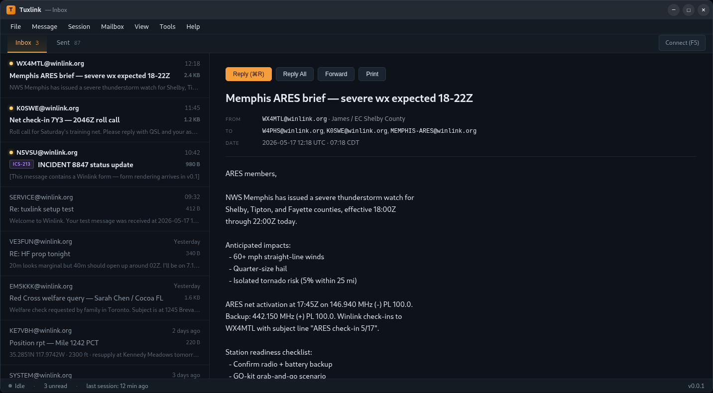
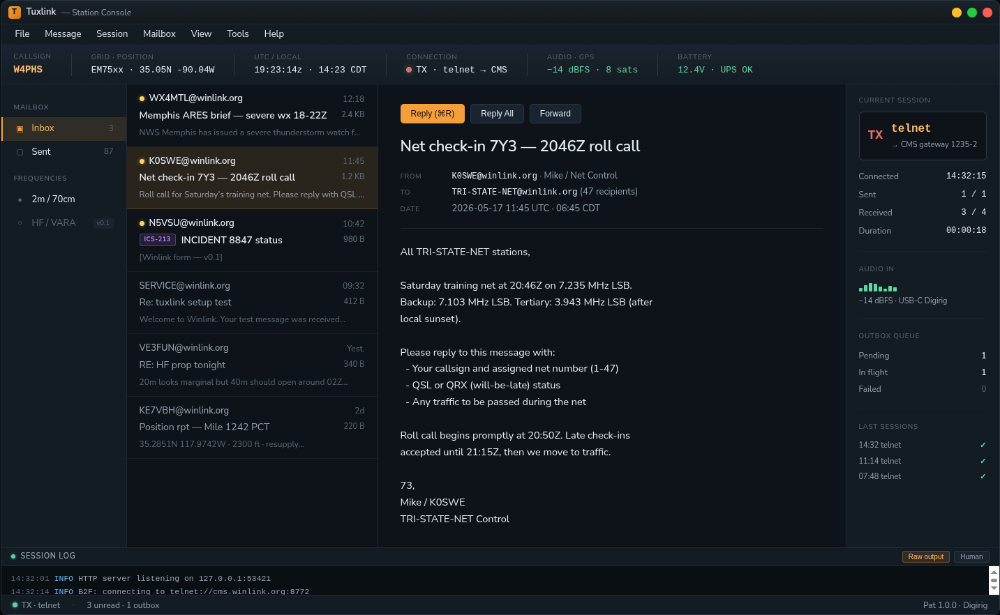
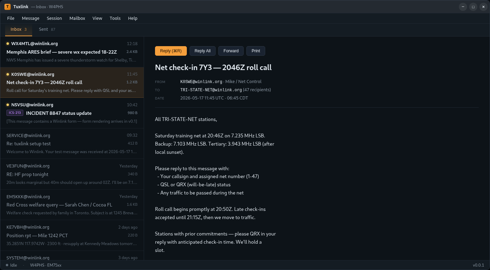
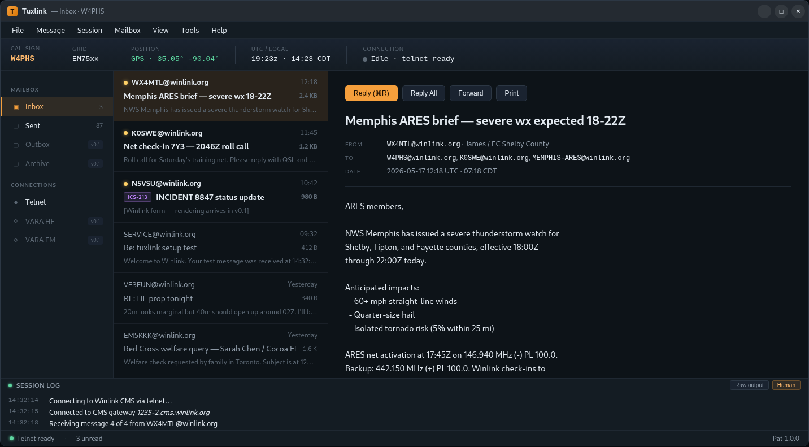
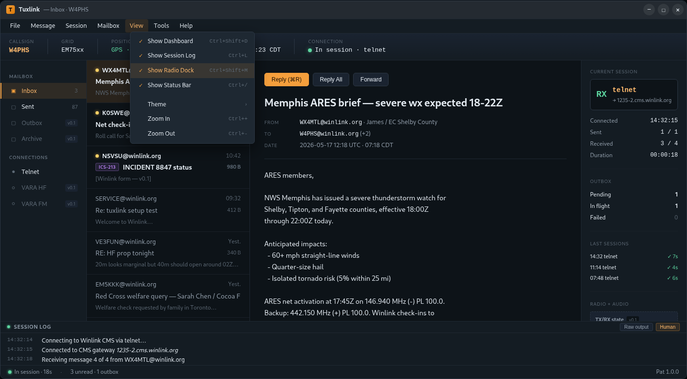
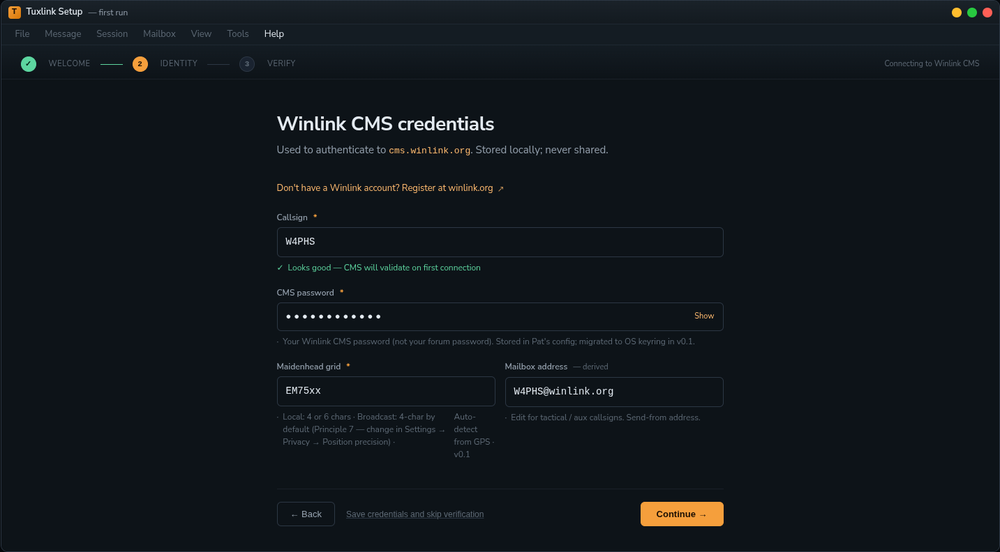
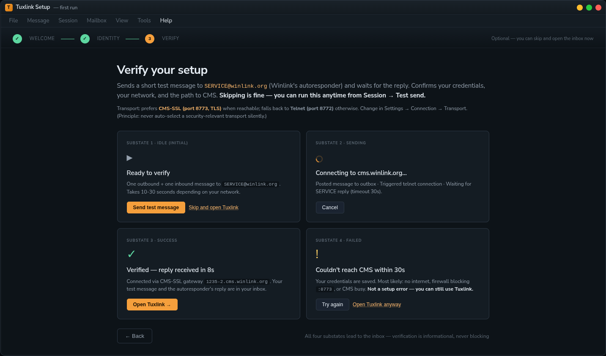
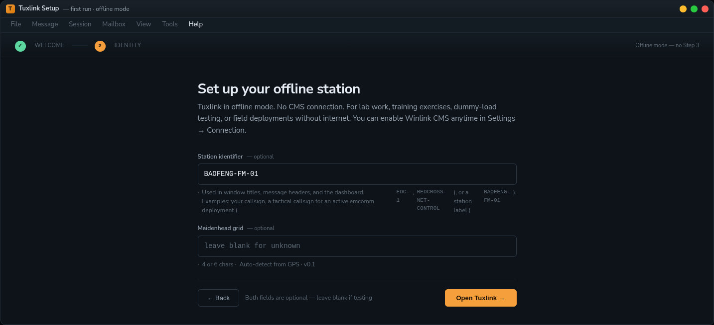
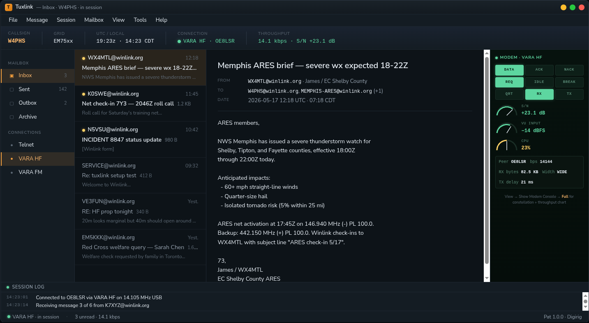
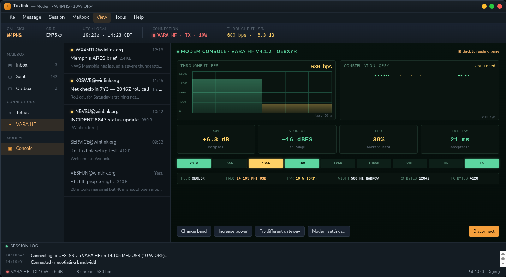

# Tuxlink UX mockup gallery

Dark-mode HTML mockups of the v0.0.1 (and forward-looking v0.5+) interface, generated during the **2026-05-17 UX brainstorm session** (agent `plover-pine-finch`, bd issue `tuxlink-x5p`, branch `bd-tuxlink-x5p/ux-brainstorm`) per the kestrel-handoff gate before any UI implementation begins on Tasks 9-16.

> **Status:** These are pre-implementation design artifacts. The canonical spec (forthcoming as `docs/design/v0.0.1-ux-mockups.md`) carries the design DECISIONS; these HTML files carry the visual demonstrations that informed them. If the spec and a mockup disagree, the spec wins.

Each file is fully self-contained — no external CSS, no JS dependencies, no images. Open any in a browser to view; screenshot for embedding in slides / chat / email.

---

## Files in this directory

### `2026-05-17-mocks-v1-four-directions.html`

Four full-fidelity directions for the v0.0.1 primary window, each embodying a different resolution to the open tensions identified at brainstorm-time. Realistic Winlink content throughout (Memphis ARES brief, tri-state net check-in, ICS-213 form placeholder, SERVICE@winlink.org autoresponder, PCT position report, Red Cross welfare query, password expiry, autoresponder reply) — same content across all four so the comparison is apples-to-apples.


*Mock A · Plan-conservative — strict reading of the v0.0.1 plan. Tabs (Inbox/Sent), 2-pane below, thin status bar.*


*Mock B · Principles-faithful — dashboard ribbon (callsign · grid · GPS · UTC+local · connection), sidebar with v0.1-disabled items, separate-window compose floating bottom-right, human-shaped session log.*


*Mock C · Emcomm-dense — Codex's "station readiness console" framing. Heavy dashboard with audio/battery/TX-RX, 4-pane with persistent radio dock, raw Pat log default-visible. v0.1+ territory.*


*Mock D · Mail.app-minimal — strict Mail.app polish read. Tabs + 2-pane, no dashboard, no session log surface.*

**Decision:** "Somewhere between B and C is the right shape." See the synthesis below.

### `2026-05-17-mocks-v2-synthesis.html`

The synthesis — B's structure as default, with C's radio dock as a configurable 4th pane (View → Show Radio Dock).


*Default state · radio dock OFF — same as Mock B; what daily-driver users see.*


*Radio dock ON · same window with View → Show Radio Dock toggled — dock visible on the right showing session timer / outbox queue / last-sessions log, with a v0.5+ placeholder block for the eventual modem console.*

Decisions captured here:
- B's structure wins as default
- C's dock becomes togglable (Ctrl+Shift+M)
- Dashboard ribbon stays compact in v0.0.1 — heavier C-style signals live in the dock
- Compose-as-separate-window (per Mock B) — plan Task 14 amendment recorded; surveyed native desktop email clients (Apple Mail, Thunderbird, Spark, Mimestream, Mailspring, Airmail, Geary, Evolution) all use separate windows; Radix Dialog (current plan spec) is the outlier

### `2026-05-17-wizard-wireframes.html`

First-run wizard wireframes — covers plan Tasks 9-11 (and a new Task 11.5 offline branch). Branching tree: CMS-optional, offline-friendly, tactical-callsign-friendly, test-send-never-blocking. Reflects [Principle 7](../v0.0.1-ux-principles.md) (position privacy via precision reduction) and the [transport-visibility anti-pattern](../../ux-anti-patterns.md) (operator sees + controls Telnet vs CMS-SSL).


*Mock A · Welcome — reframed question is "Will this installation connect to the Winlink CMS?" with two choice cards (CMS yes / offline). Offline card calls out radio-only emcomm deployment (Winlink Hybrid Network), ARES drills, EOC tabletops, and lab work as legitimate operational modes.*


*Mock B · Credentials (CMS path) — combines plan Tasks 9+10. Register link inline at top (no separate sub-step). Loose validator accepts standard amateur callsigns + tactical-style strings (`EOC-1`, `BAOFENG-FM-01`, etc.) — CMS authoritates server-side. "Save credentials and skip verification" button for offline-now setup. Grid field reflects Principle 7 (4-char broadcast default, opt-in to 6-char in Settings → Privacy).*


*Mock C · Verify — 4 substates rendered inline (idle / sending / success / failed). Every state has a path to the inbox; verification is informational, never blocking. Failed state uses warning yellow not error red and names likely causes inline (no internet, firewall blocking `:8773`, CMS busy). Transport paragraph above explains CMS-SSL (port 8773, TLS) preferred over Telnet (port 8772) — per transport-visibility anti-pattern.*


*Mock D · Offline path — minimal form. Field is "Station identifier" not "Callsign" (accommodates lab equipment naming + tactical callsigns + station labels). Both fields optional; footer explicitly invites blank submission. Step indicator collapses to 2 steps; "no Step 3" note explains the shorter flow. Grid field reflects Principle 7 (4-char broadcast default).*

Plan amendments queued from these wireframes (the canonical design doc will carry them):
- **Task 9** — change "Do you have a Winlink account?" question to "Will this installation connect to the Winlink CMS?" with branching to credentials-or-offline. Register link moves to Step 2 as inline reference.
- **Task 10** — loosen callsign validator from `^[A-Z0-9]{3,6}$` to permissive (non-empty + no whitespace + ≤32 chars). Add "Save credentials and skip verification" button.
- **Task 11** — make test-send informational not blocking. Add 4-substate UI with paths to inbox from every state. Add Session → Test send menu item for post-wizard re-run.
- **NEW Task 11.5** — offline-path Step 2-offline component, minimal identity form, no test-send.
- **Schema** — `connect_to_cms: bool` field; optional `identifier: String` for offline path; callsign optional when `connect_to_cms: false`.
- **NEW menu items** — Session → Test send; Tools → Settings → Connection (toggle CMS-on/off post-wizard); Tools → Settings → Privacy → Position precision.
- **v0.1+ deferred** — MPS (Message Pickup Station) registration UI for radio-only mode (per ARSFI's Radio_Only_Winlink reference); GPS auto-detect (matches Express's `Update grid square from GPS=True`).

### `2026-05-17-modem-placements-v05.html`

**v0.5+ modem-console placement** — once VARA-native ships, where does the equivalent of [the VARA FM v4.1.2 console](https://winlink.org/sites/default/files/oe8xyr_vara_fm_v4.1.2.jpg) (analog gauges, throughput chart, OFDM constellation, protocol-state lights) live in tuxlink?


*Compact · modem inside the right dock (~240 px) — for **Mode-1 operators** (high-volume, good conditions). Protocol-state lights + mini analog-arc gauges (S/N, VU, CPU) + status strip. Drops the constellation and throughput chart. Scenario: solid +23 dB VARA HF link, 14.1 kbps, working through a stack of messages.*


*Full overlay · modem replaces the reading pane — for **Mode-2 operators** (marginal conditions, QRP, troubleshooting). Full throughput chart with 60s history (color-shifts as conditions degrade), constellation diagram with scatter + outlier dots, four big gauges, full 9-wide protocol state lights, comprehensive status strip, troubleshooting action row (Change band / Increase power / Try different gateway / Modem settings / Disconnect). Scenario: 10W QRP deployment, S/N degraded from +18 to +6 dB, bandwidth renegotiated to NARROW 500 Hz, throughput collapsed.*

Decisions captured here:
- View → Show Modem Console is **3-state** (Off / Compact / Full), not binary
- Both operator modes served by the same toggle
- Aesthetic split is intentional and clean: instrument-panel green-on-dark inside the modem pane, Mail.app polish everywhere else, transition at the pane border
- Same modem data, different presentation density
- v0.5+ surface — v0.0.1's dock placeholder section labeled "v0.5+" reflects this

---

## Status of the design conversation

| Tension | Status |
|---|---|
| Dashboard scope (#1) | **Locked** — compact ribbon up top (callsign · grid · GPS · UTC+local · connection); heavier signals live in the togglable dock |
| Compose dialog vs window (#2) | **Locked** — separate Tauri window (Gmail / Apple Mail / Thunderbird pattern; Radix Dialog was outlier) |
| Session log raw vs human (#3) | **Locked** — human-shaped default, raw toggle available; both modes for the same log ring |
| Layout architecture (#4) | **Locked** — sidebar + 2-pane default, with togglable 4th pane for radio dock |
| Modem-console placement (v0.5+) | **Captured** — 3-state toggle (Off / Compact / Full); both operator modes served |

Outstanding before the canonical spec gets written:
- ~~Wizard screens (Tasks 9-11) at dark-mode polish~~ — **LANDED** in `2026-05-17-wizard-wireframes.html` (this PR / a later commit)
- Compose-window high-fidelity mock (separate window confirmed; needs interior design)
- Error / empty / connecting states (CMS unreachable, credentials rejected, mid-session disconnect)
- WINE-Express walkthrough (firsthand audit of the dominant client's first-run flow + validator behavior + test-send blocking semantics) — runbook drafted at `dev/winlink-reference/research/Winlink_Express_WINE_walkthrough.md` (gitignored)

---

## Plan amendments recorded for the design doc

- **Task 14 (Compose)** — current plan specifies Radix Dialog (modal). Brainstorm-decision: **separate Tauri window**. The Dialog implementation is the outlier across native desktop email clients (every major client surveyed uses a separate window). Amendment text and IPC implications to be authored in the design doc.
- **Task 16 (Status bar)** — current plan scopes status bar narrowly (connection-state + unread + last-session). Brainstorm-decision: **expand to include a dashboard ribbon ABOVE the panes** with callsign / grid / GPS / UTC+local / connection. Status bar at the bottom stays minimal. Amendment specifies the dashboard component as new scope.
- **New v0.0.1 surface — togglable Radio Dock pane** — not in current plan. Add as a task between current Tasks 16 and 17 (lightweight in v0.0.1: session timer / outbox / last sessions; v0.5+ unlocks the full modem console).

---

## How to view

Open any file in any modern browser:

```bash
xdg-open docs/design/mockups/2026-05-17-mocks-v2-synthesis.html       # Linux
open docs/design/mockups/2026-05-17-mocks-v2-synthesis.html           # macOS
start docs/design/mockups/2026-05-17-mocks-v2-synthesis.html          # Windows
```

Or serve the directory:

```bash
python3 -m http.server 8000 -d docs/design/mockups/
# then http://localhost:8000/<filename>
```

---

## Reference

- **Anchor doc:** [`docs/design/v0.0.1-ux-principles.md`](../v0.0.1-ux-principles.md)
- **Plan:** [`docs/plans/2026-04-22-tuxlink-v0.0.1-plan.md`](../../plans/2026-04-22-tuxlink-v0.0.1-plan.md)
- **UX anti-patterns:** [`docs/ux-anti-patterns.md`](../../ux-anti-patterns.md)
- **System design doc** (external, gstack project): `~/.gstack/projects/cameronzucker-tuxlink/cameronzucker-main-design-20260422-200809.md`
- **Brainstorm bd issue:** `tuxlink-x5p`
- **Brainstorm session:** 2026-05-17, agent `plover-pine-finch`, branch `bd-tuxlink-x5p/ux-brainstorm`
