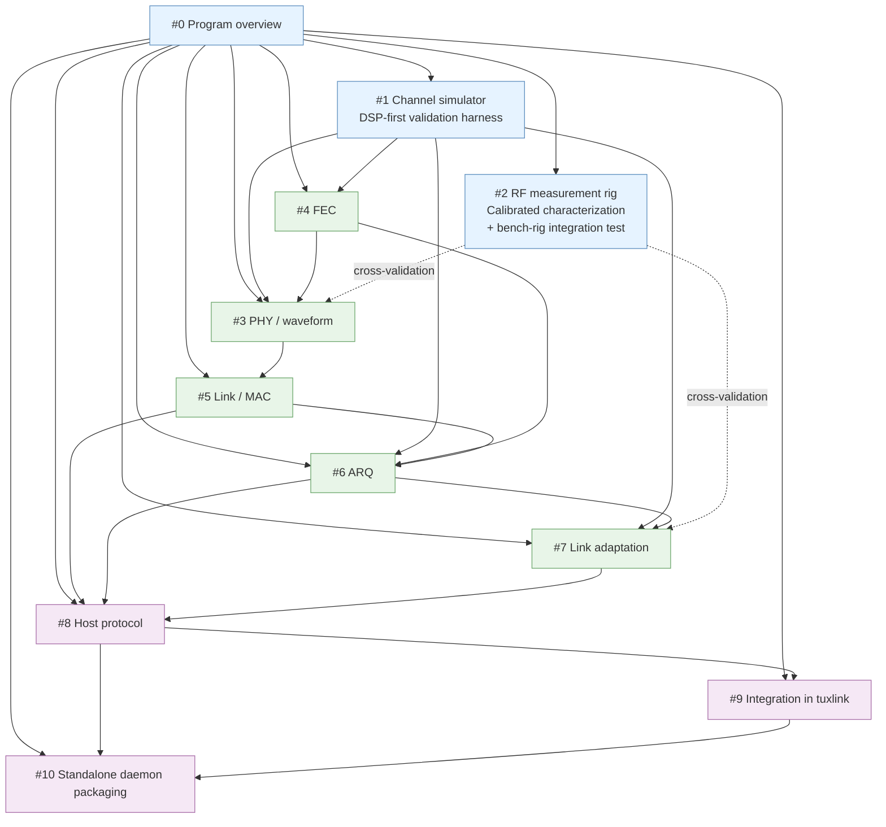

# Clean-sheet HF modem program — overview

> **Status: Canonical** (renamed from `-DRAFT` after the 2026-05-31 brainstorm).
> Approved by Cameron Zucker (operator); brainstorm walked by Cameron +
> mink-swallow-kite (agent) on 2026-05-31. The eight open questions originally
> enumerated in this doc's draft are now resolved; the resolutions are
> incorporated into §0 (success-criterion shape) and §5 (architectural
> decisions). The seven subsystem STUBs that were subordinate to this doc are
> renamed off their `-STUB` suffix in the same commit.

## §0. Program scope

This is the **umbrella overview** for the v0.5+ clean-sheet HF modem program.
The program is too large for a single spec; this overview decomposes it into
sub-projects, names their relationships, and proposes their development order.
Each sub-project gets its own spec → plan → implementation cycle under this
umbrella.

**What the program is:**

A from-scratch HF data modem replacing VARA for tuxlink. Operationally usable
on amateur HF equipment representative of the operator's reference radios
(Xiegu G90 + Yaesu FT-818, per the bench-rig spec). Eventually packageable as
a standalone open-source TCP modem daemon (per ADR 0015) usable by non-tuxlink
clients (Pat / ARIM / etc.).

**What the program is NOT:**

- Not VARA-compatible. No bit-for-bit waveform interop. (ADR 0014; `project_v05_modem_design_posture` memory.)
- Not informed by examination of VARA's internals from any source — decompilation, leaked source, RE write-ups, black-box on-air. (ADR 0014, bright line.)
- Not constrained by a community-adoption migration story. Optimize for technical merit only; operator has community reach to drive adoption of a technically-superior alternative. (`project_v05_modem_design_posture` memory.)
- Not a bridge or interop layer. Full replacement.

**Success-criterion shape (settled 2026-05-31):**

The success criterion is **multi-axis**, not single-metric. Sonde is not
trying to be the technically-best HF modem on raw performance alone — that bar
is "VARA + 5 years of operational tuning" and an architectural-only assault on
it is unlikely to win cleanly. Instead, sonde aims to be a **compelling
alternative** along axes the closed-source incumbent cannot match. Specifically:

- **Performance: competitive with VARA, not strictly exceeding.** The modem
  should deliver close-to-VARA throughput at close-to-VARA SNR floors under
  ITU-R F.520 conditions, with the gap small enough that operators find it a
  reasonable choice. The bit-adaptive OFDM family (§5.A.1) is architecturally
  sound for the comparison; modern FEC (LDPC short-block, polar) gives credible
  margin. But "close to" is the goal, not "strictly beat." If subsystem #1
  measurements show, say, 80% of VARA's throughput at the same SNR floor,
  that's a usable result given the differentiation below.
- **Differentiation: open source + well-documented + AI-native for
  improvement.** This is where sonde competes:
  - **Open source (AGPLv3-only):** legally accessible, forkable, auditable.
    VARA can't be.
  - **Well-documented:** architectural docs, subsystem specs, foundations
    bibliography, design provenance — all in the repo. Operators and
    contributors can understand what the modem is doing and why.
  - **AI-native for improvement:** the codebase, architecture, and
    documentation are designed to be productive substrate for AI-collaborative
    development. Subsystem decomposition is agent-scopeable; the channel
    simulator (#1) provides agents with a deterministic validation harness;
    the bench rig provides operator-validated ground truth. This isn't just
    "we use AI tools" — it's "the project's evolution velocity is faster
    than legacy modems *because* the substrate is AI-friendly." Per the
    project ethos (Tuxlink is Cameron's learning sandbox for transferable
    AI-assisted development techniques), this is a first-class success
    criterion.
- **Decode threshold — beat ARDOP at the noise-floor case.** Sonde's
  wide-band noise-floor mode (§5.A.1) targets stronger SNR-floor performance
  than ARDOP's narrowest mode at the same per-Hz noise floor. Specific dB
  number is to be measured against ITU-R F.520 in the channel simulator;
  brainstorm-time commitment is to the strategic posture (be a meaningful
  improvement over the open-source reference, validated empirically).
- **ARQ-corrected end-to-end reliability** — applies above the noise-floor
  family; floor modes may operate ARQ-disabled with retransmit-the-whole-
  message semantics (FT8-pattern). Specific reliability target set per-
  subsystem during implementation.
- **Compatibility with reference radios:** works on G90 + FT-818 over the
  bench rig (`docs/hardware/bench-rig-two-host-topology.md`).
- **Independent-creation defense preserved per ADR 0014** throughout the
  project lifecycle.
- **License posture: AGPLv3-only** for sonde (the modem itself + the
  channel-simulator crate). Tuxlink-the-client license is a separate
  workstream not settled here.
- **Compute target: best-effort** — anything that runs Rust + ALSA cleanly.
  Pi 5 is primary dev target; no pre-committed minimum.

**Reframing rationale (2026-05-31 operator-confirmed):** The earlier "exceed
VARA" framing set an aggressive bar that's risky to gate the program on (VARA
has years of on-air tuning we won't replicate quickly). The reframed
criterion — be a *compelling alternative*, not necessarily the technically
best — gives the program a credible path to the "make something besides Yet
Another Open Source Radio Modem" outcome: close-enough performance, open
source, documented, and uniquely positioned for AI-collaborative evolution.

## §1. Subsystem decomposition

The program decomposes into ten sub-projects. Each is independently spec-able,
plan-able, and ship-able; cross-subsystem dependencies are explicit. Numbering
matches the bench-rig spec's references and the foundation doc's
`Relevance:` tags.

| # | Sub-project | One-line role |
|---|---|---|
| 0 | **Program overview** (this doc) | Goals, success criteria, design discipline, sequencing, decomposition itself. |
| 1 | **Channel simulator** | Software HF ionospheric channel emulator (Watterson-class). DSP-first validation harness — every PHY candidate is tested against it offline before RF. |
| 2 | **RF measurement rig** | Calibrated hardware. SDR + directional coupler + step attenuator topology, per `project_rf_measurement_rig_design`. Validates real radios + characterizes the real channel. **Distinct from the integration-test bench rig** in `docs/hardware/bench-rig-two-host-topology.md`, which uses incidental near-field coupling without calibration. |
| 3 | **PHY / waveform** | Modulation, sub-carrier structure (if OFDM-family), sync, frame detection. The "what does it sound like on air" layer. |
| 4 | **FEC** | Forward error correction. Could fold into #3 or stay separate depending on architecture choice. |
| 5 | **Link / MAC** | Frame format, framing, headers, addressing, station identification. |
| 6 | **ARQ** | Retransmission strategy, selective-repeat vs. go-back-N vs. hybrid, ACK design, window sizing. |
| 7 | **Link adaptation** | Mode-stepping based on observed channel quality (SNR, BER, throughput). |
| 8 | **Host protocol / control plane** | API between client and modem. ADR 0015's "open question" — must be settled before subsystems #5/#6 freeze. |
| 9 | **Integration in tuxlink** | `ModemTransport` plugin per ADR 0015. Supervised process lifecycle, sound-card-contention enforcement, audio-device handoff. |
| 10 | **Standalone daemon packaging** | Spin-off as open-source TCP modem usable by Pat / ARIM / etc. Per ADR 0015's preserved optionality. |

### §1.1 Subsystem dependency graph

**Reading the graph:**
- **Solid arrows** = direct dependency: the downstream subsystem cannot be
  built (or its spec finalized) without the upstream one.
- **Dashed arrows** = cross-validation dependency: the downstream uses the
  upstream as a verification oracle, not as a build-time dependency.
- **Color coding:** blue = foundation, green = modem stack, purple = integration.

**Sequencing implication:** the longest dependency chain is
`#0 → #1 → #3 → #4 → #5 → #6 → #7 → #8 → #9 → #10`. Subsystem #2 (RF
measurement rig) develops in parallel from when there's a candidate PHY to
cross-validate. This is the rationale for §3's DSP-first sequencing.

## §2. Per-subsystem descriptions

### §2.0 Program overview (this doc) — the umbrella

Establishes the program's scope, goals, success criteria, design discipline,
and sequencing. Cited by every downstream subsystem spec as the canonical
"why." Lives at `docs/superpowers/specs/<date>-clean-sheet-modem-overview.md`
once approved.

### §2.1 Channel simulator — the validation harness

A software implementation of the ITU-R standardized HF ionospheric channel
model (Watterson-class — Watterson, Juroshek, Bensema 1970; ITU-R F.520 +
F.1487 standardized channel parameters). Takes baseband I/Q + channel-condition
parameter set ("good" / "moderate" / "poor" / "flutter") and produces channel-
impaired baseband I/Q.

**Why this is sub-project #1:** standard DSP-first development methodology.
Every PHY candidate (#3), every FEC choice (#4), every link adaptation strategy
(#7) is validated against the channel simulator in software-only loops before
any RF rig is needed. BER-vs-SNR curves under standardized channel conditions
become the comparable performance metric across design iterations.

**What it produces:** a Rust crate (or similar) callable from tests; runs in
CI; produces BER/throughput characterization reports for any candidate PHY.

**Inputs from upstream:** none (foundational).
**Consumers:** #3, #4, #6, #7 — all DSP subsystems.

### §2.2 RF measurement rig

Calibrated hardware for characterizing real radios and the real channel.
Topology and component plan are in `project_rf_measurement_rig_design`
memory + the bench-rig spec. RTL-SDR V4 first-slice, RX-888 MkII upgrade path,
directional coupler + step attenuator chain.

**Why this is parallel-track:** doesn't gate the modem design (software
channel sim does that), but it's the ground-truth verifier for any claim about
how the modem actually performs on real radios. Built alongside #1 once
hardware acquisition lands.

**What it produces:** calibrated measurement capability for TX characterization
of the operator's radios (per ADR 0014 §4, explicitly in-scope), and an
independent RF capture path for cross-validation of the bench rig.

**Inputs:** hardware acquisition.
**Consumers:** #3, #9 (integration testing).

### §2.3 PHY / waveform

The physical-layer modem: what the modem sounds like on air. Modulation choice
(constellation density vs. SNR requirement tradeoff), sub-carrier structure
(if OFDM-family — primitive concept per OFDM foundations §2.3 of foundation
doc), synchronization (carrier offset, symbol timing, frame sync), framing
detection.

**Forcing functions:**
- Total occupied bandwidth ≤2300 Hz [open: confirm].
- Operable on G90 + FT-818 (per bench rig). FT-818 specifically constrains
  audio passband shape, dynamic range, AGC interaction.
- Performance against Watterson-channel-simulated impairment under ITU-R F.520
  "moderate" conditions [open: SNR / BER target].

**What it produces:** a PHY implementation, BER/SNR characterization reports
from the channel simulator, RF-validated performance reports from the bench
rig.

**Inputs:** #1 (validation), #4 (FEC layer below it), #8 (host-protocol API
for upper-layer interface).
**Consumers:** #5, #9.

### §2.4 FEC

The forward error correction layer. Choice between block codes (Reed-Solomon),
convolutional codes (Viterbi-decoded), modern codes (LDPC, polar, turbo).
Code-rate flexibility. Soft-decision vs. hard-decision decoder. Decoder
complexity budget.

**Forcing functions:**
- Decoder complexity must run in real time on the deployment target hardware
  (Pi 5 or similar) [open: define deployment-target compute budget].
- Code structure compatible with the PHY's frame layout.
- Performance margin against Watterson-channel error patterns.

**What it produces:** an FEC implementation (encoder + decoder), BER-vs-SNR
characterization with and without the FEC, runtime performance benchmarks.

**Inputs:** #1.
**Consumers:** #3 (folded into the PHY waveform), #6 (FEC interacts with ARQ
in hybrid-ARQ designs).

### §2.5 Link / MAC

Frame format, framing, headers, addressing. Station identification. Frame
sequence numbering. Connection-state machine (if connection-oriented).

**Forcing functions:**
- Station ID per Part 97 — every transmission must identify the licensed
  station. (Operator-level requirement; spec must reflect.)
- Frame structure aligned with PHY frame detection.
- Header overhead vs. payload tradeoff [open: target overhead percentage at
  typical message size].

**What it produces:** frame layout spec, addressing scheme, link state machine.

**Inputs:** #3 (PHY frame structure constrains this).
**Consumers:** #6, #7, #8.

### §2.6 ARQ

Reliable-delivery mechanism above the lossy PHY+FEC layer. Selective-repeat
vs. go-back-N vs. hybrid. ACK / NACK scheme. Window sizing. Retransmission
backoff. Hybrid ARQ (combining FEC redundancy + retransmission) — Type-I,
Type-II, or Type-III if applicable.

**Forcing functions:**
- Round-trip-time budget for HF (multi-second RTT typical) → large windows
  required for throughput.
- Channel-burst-error pattern (channel sim characterization) → selective-
  repeat preferred over go-back-N at high BER.
- Memory budget for held-but-unACKed frames.

**What it produces:** ARQ implementation, throughput-vs-channel characterization.

**Inputs:** #1, #4, #5.
**Consumers:** #7, #8, #9.

### §2.7 Link adaptation

Dynamic mode-stepping based on observed channel quality. The modem starts
optimistically (highest-density modulation, lowest FEC overhead) and steps
down to robust modes as SNR / BER degrades. Could be operator-commanded or
fully automatic.

**Forcing functions:**
- Number of discrete modes (typically 2–4 in HF data systems).
- Mode-switching latency.
- Hysteresis (avoid rapid mode-flapping under marginal channel).

**What it produces:** link-adaptation policy implementation, channel-quality
metric definitions, mode-switch threshold parameters.

**Inputs:** #1, #3, #4, #6.
**Consumers:** #9.

### §2.8 Host protocol / control plane — ADR 0015's open question

The API between the modem (process or library) and the client (tuxlink or
any other consumer of the standalone modem daemon). ADR 0015 explicitly
defers this:

> "Open (deferred): Host-protocol / clean-sheet line for the eventual standalone
> modem (the on-air protocol is clean-sheet per ADR 0014; the host-side control
> API is argued: NOT bound by clean-sheet — settle before the modem spec)."

**The argument from ADR 0015** is that the on-air protocol is bound by ADR 0014's
clean-sheet rule, but the host-side control API is not — because the host API
is a software interface design choice rather than a transmitted waveform that
faces the IP-defense question.

**Key open questions for §2.8 design (decision needed before #5/#6 freeze):**

- TCP / Unix-domain-socket / stdio / shared-memory / D-Bus / etc.?
- Command protocol style — textual (KISS-like, KENWOOD-AT-style, or new) vs.
  binary?
- Standardize against any prior art (`hostmode`, KISS, `direwolf` interface,
  ardopcf protocol) for cross-implementation portability? This is the
  ADR-0015-flagged question: yes/no, and if yes, which?
- Versioning + capability negotiation discipline.

**What it produces:** host-protocol specification, reference parser/serializer,
integration test fixtures.

**Inputs:** #5 (frame structure constrains naming), #6 (ARQ state must be
addressable from the API).
**Consumers:** #9, #10.

### §2.9 Integration in tuxlink

The `ModemTransport` plugin per ADR 0015: managed spawn of the modem process,
supervised lifecycle (SIGINT-clean-stop, confirm-audio-device-released-before-
swap), generic abstraction so the same code path drives sonde and existing
external modems (ardopcf, Dire Wolf, future others).

**Forcing functions:**
- ADR 0015's lifecycle ownership.
- Existing `ModemTransport` trait (already defined for ardopcf integration).
- Consent-gate alignment with RADIO-1.

**What it produces:** new `ModemTransport` implementation for sonde,
integration tests against the ARDOP-pattern test suite.

**Inputs:** #8.
**Consumers:** end-users.

### §2.10 Standalone daemon packaging

Spin off sonde as a standalone open-source TCP modem usable by clients
other than tuxlink (Pat / ARIM / etc.). Inverts who owns rig control (the
client owns rig control, the daemon owns the modem). Per ADR 0015's preserved
optionality.

**Forcing functions:**
- API stability commitment (versioning, deprecation window).
- License choice (likely permissive: MIT, Apache 2.0, or similar — to maximize
  adoption — but operator-decision).
- Packaging discipline (Debian + RPM at minimum, ideally Homebrew + Windows
  installer eventually).

**What it produces:** standalone daemon release, public repository, packaging.

**Inputs:** #8, #9.
**Consumers:** external software.

## §3. Sequencing rationale — DSP-first

**Recommended development order:** 0 → 1 → 3 → 4 → 5 → 6 → 7 → 8 → 9 → 10,
with #2 (RF rig) developed in parallel from when there's a candidate PHY to
validate.

**Why DSP-first (#1 before #3):** standard SDR-development practice. The
channel simulator is the validation harness; building it first means every
later PHY iteration, FEC choice, and adaptation policy is measurable against
a standardized, reproducible, software-only test. Without the simulator, PHY
iteration depends on RF-rig availability, which throttles iteration speed by
orders of magnitude.

**Why #4 (FEC) before #5 (MAC):** the FEC's frame structure constrains what
the MAC layer's framing can look like. If FEC is folded into the PHY (likely),
then #4 and #3 ship together.

**Why #6 (ARQ) before #7 (link adaptation):** link adaptation needs channel-
quality observations the ARQ layer naturally surfaces (frame error rate,
retransmission count). Building #7 against #6 means link adaptation policy
sees real protocol-level signals, not just PHY-level demod metrics.

**Why #8 (host protocol) is timed where it is:** must be settled before #5 /
#6 freeze, because frames + ARQ state must be addressable from the API. But
the protocol *choice* (TCP / Unix socket / etc.) doesn't gate #1 / #3 / #4 —
those subsystems run in pure software loops without needing an external API.

**Why #2 (RF rig) is parallel:** the rig characterizes real radios, not the
modem itself; it's needed for ground-truth validation of #3 once a candidate
PHY exists, but it doesn't gate the early subsystem builds. Hardware
acquisition and rig assembly happen on a separate timeline.

**Why #9 / #10 are last:** integration and packaging happen after the modem
is technically working. Premature integration churns the integration layer
against an unstable substrate.

## §4. Design discipline — operationalizing ADR 0014

ADR 0014 establishes the clean-sheet posture. This overview operationalizes it
in five rules every subsystem spec must follow:

1. **Source provenance discipline.** Every design choice cites at least one
   open-source reference from `docs/research/modem-foundations.md`. The
   citation isn't bureaucracy — it's the contemporaneous record that the
   choice came from open sources, which is what the independent-creation
   defense rests on.

2. **No VARA in the citation chain.** If a subsystem reference depends on a
   citation that depends on VARA-internal material, the chain is broken at the
   point of dependency. The chain stops; the alternative path is found.

3. **Operator-confirmed observables are background only.** Per ADR 0014 §3,
   what the operator already knows from licensed operation of VARA (≈2300 Hz
   bandwidth, OFDM-based) is background — informs the design space framing
   but is NOT cited as design input. Specific parameters from operator's
   observations are NOT inherited into sonde.

4. **Own-equipment characterization is in-scope.** Per ADR 0014 §4, the
   RF measurement rig characterizes the operator's own radios + the HF
   channel; this is explicitly permitted and informs the modem design.
   Pointing measurement at any VARA emission is the forbidden activity.

5. **The "I'll just check how VARA does it" temptation has a STOP rule.**
   Per ADR 0014 §2 + `project_v05_modem_design_posture` memory: that single
   act forfeits the independent-creation defense. If a contributor — human or
   AI — feels the urge, the discipline is STOP. Subsystem specs must include
   the watched-failure-mode entry "this section's framing might tempt
   investigation of prior art; stop instead."

6. **AI-native development substrate is a first-class success criterion**
   (per the §0 multi-axis success criterion and the project ethos —
   tuxlink is operator's learning sandbox for AI-collaborative development
   techniques transferable to high-stakes work). This means the design
   is explicitly evaluated on whether it makes AI-collaborative
   contribution *easier*, not just whether it would make sense to a
   human-only team. Concretely:

   - **Subsystems are agent-scopeable.** Each subsystem spec is the
     contract an agent can take on as a discrete unit of work. The
     subsystem boundaries respect what fits in an agent's context
     window without losing coherence.
   - **The channel simulator (#1) is the agent's validation harness.**
     Deterministic, reproducible, scriptable — an agent can verify
     candidate PHY changes against F.520 conditions without operator-
     in-the-loop validation. This is the substrate that converts modem
     development from "ham-radio-expert-only" work into "any competent
     AI agent with the brief can iterate productively."
   - **Documentation is substrate, not artifact.** Architectural specs,
     subsystem specs, foundations bibliography, design provenance —
     each is written to be a productive input for AI agents iterating on
     the relevant layer. Cross-references are explicit + dense enough
     that an agent landing in any subsystem spec can find related
     context without expensive exploration.
   - **The contribution / improvement cadence is faster than legacy
     modems precisely because the substrate is AI-friendly.** This is
     where sonde can credibly out-evolve closed-source alternatives
     over time even if it lands slightly behind on per-test-case
     performance at v0.5+.

## §5. Architectural decisions from the 2026-05-31 brainstorm

The eight open questions from the draft are resolved here. Each decision
defines a constraint or architectural commitment that downstream subsystem
specs must honor. Subsystem-level open questions remain inside the individual
subsystem specs (per their own §4 sections), subordinate to these.

### §5.A. Architectural commitments

#### §5.A.1 — Multi-mode PHY ladder with two architecturally-distinct families

The PHY is **not a single waveform with variable parameters**. It is a ladder
of operator-selectable + link-adaptation-selectable modes spanning two
architecturally-distinct families:

- **Bit-adaptive OFDM family** (main throughput modes). DSL/xDSL-derived
  pattern: orthogonal sub-carriers covering the radio's audio passband, each
  sub-carrier individually bit-loaded based on observed per-sub-carrier SNR.
  High-SNR sub-carriers carry more bits per symbol (16-QAM, 64-QAM, possibly
  higher); low-SNR sub-carriers carry fewer bits (QPSK, BPSK) or are turned
  off. Throughput emerges from the bit-loading curve × bandwidth × channel
  conditions, not from a pre-committed numeric target.

- **Robustness modes family** (bottom of the ladder). A small set of modes
  parameterized by what's limiting the link. NOT a single waveform — the
  right floor strategy depends on the limiting condition:

  - **Default: wide-band low-density-constellation OFDM.** When the limiting
    condition is per-Hz noise floor with bandwidth available (typical
    sonde case — own-frequency point-to-point or point-to-gateway, no
    crowding), use BPSK per sub-carrier across the full available passband
    with very strong FEC (rate-1/4 LDPC short-block or similar). Aggregate
    throughput scales with sub-carrier count because each sub-carrier
    independently sits above its (low-density) Shannon threshold. **This
    significantly outperforms FT8-class narrow-FSK at the same SNR floor**
    by leveraging wider bandwidth — at -5 dB per-sub-carrier SNR with
    rate-1/4 LDPC, BPSK is comfortably decodable; higher-density
    constellations are below Shannon and cannot decode regardless of FEC
    sophistication (the rationale recap: Shannon's capacity bound is a
    hard wall; below the per-constellation threshold, no FEC recovers
    data; the win comes from going *wider*, not denser).
  - **Situational: narrow-FSK** (FT8-class 8-FSK conceptual primitive).
    Reserved for the rare-for-sonde case where the assigned frequency
    is genuinely bandwidth-constrained (crowded emcomm net during a major
    event, narrow available spectrum slice). Borrows the conceptual
    primitive of FT8/JS8 weak-signal design (foundation doc §6.1, per
    `feedback_clean_sheet_concepts_only` — primitive only, not specific
    protocol parameters).

  Both robustness-family modes may operate ARQ-disabled with
  retransmit-the-whole-message semantics for short critical payloads.
  Explicit design goal: **beat ARDOP's narrowest-mode SNR floor at the
  noise-floor case** (default wide-band low-density mode).

**Clean-sheet provenance:** Bit-adaptive OFDM with per-sub-carrier bit-loading
is openly documented in ITU-T G.992 (ADSL) and G.993 (VDSL) standards plus
extensive academic literature. Applying this DSL technique to HF audio-band
is a clean derivation from public DSP foundations, not a copy of any HF
prior-art protocol. The narrow-FSK situational mode draws on the *conceptual
primitive* of FT8/JS8 weak-signal design (foundation doc §6.1) — primitive
only, not specific parameters. Wide-band low-density OFDM at the noise floor
is a textbook DSP design choice driven by Shannon's per-constellation
capacity bound; the architecture is dictated by physics, not by any prior-art
modem's choices.

#### §5.A.2 — Payload-size-aware MAC routing

The MAC layer routes outgoing frames into different PHY-family paths based on
payload size + observed channel conditions:

- **Short critical payloads** (status reports, position beacons, ICS-213
  message classes, etc.) route to the robustness-modes-family floor when
  channel conditions degrade past the OFDM family's usable envelope. The
  default robustness mode is wide-band low-density OFDM (not narrow-FSK)
  for typical own-frequency sonde operation; the narrow-FSK mode is
  reserved for crowded-band situations.
- **Long messages** stay in the bit-adaptive OFDM family with ARQ;
  link-adaptation selects which OFDM mode within the family.

This makes link adaptation (subsystem #7) a two-dimensional policy:
(channel-quality, payload-size) → (mode-family, mode-within-family,
ARQ-strategy).

**Practical implication:** ARQ (subsystem #6) is mode-conditional — the FSK
floor doesn't use ARQ; the OFDM family does. ARQ-applicability is a
per-mode attribute.

#### §5.A.3 — TCP host protocol via existing `ModemTransport` abstraction

Settled by ADR 0015 prior to this brainstorm. Sonde plugs into the same
abstraction ardopcf already uses and (eventually) VARA-over-network will use:
TCP-reachable, two-port (cmd + data), process-supervised. The protocol
*vocabulary* (what specific commands sonde exposes for bit-loading
control, robustness-modes-family mode selection, payload-size-aware routing) becomes a
subsystem #8 implementation detail.

#### §5.A.4 — AGPLv3-only license posture

Sonde (the modem itself) and its channel-simulator crate ship under
**AGPLv3-only**. AGPLv3 was chosen over GPLv3 to close the network-service
loophole: anyone running a modified sonde as a TCP-accessible service
must offer source to its users. Section 13 of AGPL is load-bearing for a
TCP-server modem daemon.

License compatibility note: AGPLv3 permits linking with GPLv3 code (via
AGPL's explicit Section 13 paragraph 2 clause). It is NOT compatible with
permissive-only-licensed downstream incorporation that disallows copyleft.
Earlier subsystems must avoid runtime library dependencies on GPL-only or
non-AGPL-compatible code. Pure-Rust libraries (typically MIT-or-Apache-2.0)
are AGPL-compatible. GNU Radio (GPL) is consultable for cross-validation
but is NOT a runtime dependency.

Tuxlink-the-client license is a **separate** workstream: current-state
verification + CLA / contributor-consent analysis happens as its own PR,
not in this brainstorm.

#### §5.A.5 — Channel simulator as standalone AGPLv3 public crate

Subsystem #1 is published as a standalone public Rust crate from day one
(not in-tree-then-extracted). AGPLv3 license matches sonde. Standalone
publication:

- Makes the citation chain visible (the simulator's own repo carries the
  foundational-paper citations directly; dated commits document the
  clean-sheet provenance independently of sonde).
- Creates a public research contribution beyond sonde itself — a
  pure-Rust Watterson-class HF channel simulator is genuinely useful to the
  broader SDR / HF / academic community.
- Gives the program a credibility artifact independent of the modem's
  on-air-protocol success.

Crate name TBD (suggested working names: `hf-channel-sim`, `watterson-rs`).

#### §5.A.6 — Compute target is best-effort

No pre-committed minimum compute envelope. Primary dev target is Raspberry
Pi 5 (matches the bench-rig spec's Host A configuration). Lower-end (Pi 4,
older ARM) and higher-end (modern x86) targets are best-effort. This
posture does NOT pre-constrain subsystem-level decisions on FFT size
(subsystem #3), LDPC iteration count (subsystem #4), or equalizer
complexity (subsystem #3 / #7).

Implementation discipline: profile under representative workloads; optimize
where bottlenecks appear in actual measurement.

#### §5.A.7 — Bench-rig Host B is a second Pi 5

Settled separately from the architecture decisions, but documented here for
completeness. The bench rig's Host B is a second Raspberry Pi 5 already in
operator inventory. Matches Host A's hardware family verbatim — same
userspace, same DigiRig CM108B / ALSA / HID setup, no per-host divergence
in the bench-rig spec.

### §5.B. Subsystem implication map (which §5.A decision affects which subsystem)

| Decision | Affects subsystems |
|---|---|
| §5.A.1 multi-mode PHY ladder + two families | #3 (PHY), #4 (FEC — per-family strategies), #7 (link adaptation), #1 (channel sim must expose per-sub-carrier SNR estimation for bit-loading characterization) |
| §5.A.2 payload-size-aware MAC routing | #5 (MAC), #6 (ARQ mode-conditional), #7 (link adaptation 2D policy) |
| §5.A.3 TCP host protocol via `ModemTransport` | #8 (vocabulary), #9 (integration) |
| §5.A.4 AGPLv3-only | All subsystems (no GPL-only or proprietary runtime dependencies); #10 (standalone daemon packaging) |
| §5.A.5 channel sim as standalone crate | #1 (channel sim) |
| §5.A.6 best-effort compute | #3 (PHY DSP complexity choices), #4 (FEC decoder complexity choices), #7 (link adaptation complexity) |
| §5.A.7 bench-rig Host B = Pi 5 | bench-rig spec only (no subsystem implication) |

### §5.C. Open at the subsystem level

These remain open *inside* the per-subsystem specs, subordinate to §5.A.
They settle during subsystem implementation rather than at brainstorm time:

- **Specific dB number for the noise-floor robustness mode's SNR threshold** —
  measured empirically against ITU-R F.520 "moderate" in subsystem #1 once
  the candidate wide-band low-density OFDM PHY exists. Strategic posture:
  "beat ARDOP's narrowest mode at the noise-floor case" is the acceptance
  criterion; the specific number falls out of measurement.
- **Specific code family within FEC** — LDPC short-block vs. polar codes
  for the robustness modes; per-sub-carrier strategy for the OFDM main
  family. Settle in subsystem #4's canonical spec, informed by channel-
  simulator runs.
- **Robustness-family mode count + parameters** — at minimum the default
  wide-band low-density mode + one situational narrow-FSK mode. Settle in
  subsystem #3 (PHY) informed by which limiting-conditions sonde
  actually targets in practice.
- **OFDM mode count + bandwidths in the ladder** — how many discrete modes
  in the OFDM family, and what bandwidths each occupies. Settle in
  subsystem #3 informed by audio-passband measurements on the bench-rig
  radios.
- **Host-protocol command vocabulary** — what specific commands sonde
  exposes for bit-loading control, robustness-modes-family mode selection, payload-size
  routing. Settle in subsystem #8 once subsystem #5 / #6 freeze.
- **Channel-simulator cross-validation reference** — ITS, GNU Radio OOT,
  or both. Settle in subsystem #1 as part of the simulator's quality gate.

## §6. References

### Internal — ADRs

- ADR 0014 — Clean-sheet modem; no prior-art examination.
- ADR 0015 — Modem integration and rig-control foundation.

### Internal — hardware

- `docs/hardware/modem-test-rig.md` — VHF/UHF FM modem hardware chain (CDM-1550LS+).
- `docs/hardware/bench-rig-two-host-topology.md` — HF bench rig (G90 + FT-818,
  two hosts; incidental near-field RF coupling validated by external RF
  engineering review 2026-05-31).

### Internal — research

- `docs/research/modem-foundations.md` — Annotated bibliography (citation library)
  for the program. 40+ entries across HF channel modeling, modem theory, FEC,
  ARQ, SDR/DSP methodology, open amateur protocols. Updated 2026-05-31.

### Internal — subsystem specs (subordinate to this overview)

These are subordinate to this overview and incorporate the §5 architectural
decisions:

- `docs/superpowers/specs/2026-05-31-clean-sheet-modem-1-channel-simulator.md`
- `docs/superpowers/specs/2026-05-31-clean-sheet-modem-3-phy-waveform.md`
- `docs/superpowers/specs/2026-05-31-clean-sheet-modem-4-fec.md`
- `docs/superpowers/specs/2026-05-31-clean-sheet-modem-5-link-mac.md`
- `docs/superpowers/specs/2026-05-31-clean-sheet-modem-6-arq.md`
- `docs/superpowers/specs/2026-05-31-clean-sheet-modem-7-link-adaptation.md`
- `docs/superpowers/specs/2026-05-31-clean-sheet-modem-8-host-protocol.md`

Subsystems #2 (RF measurement rig), #9 (integration), and #10 (standalone
daemon packaging) do not have specs in this initial pass — #2 is substantially
scoped in the `project_rf_measurement_rig_design` memory entry; #9 / #10 are
integration / packaging concerns that should be specced after the modem-stack
subsystems concretize.

### Memory

- `project_v05_modem_design_posture` — full-replacement, no-VARA-interop, technical-merit-only.
- `project_rf_measurement_rig_design` — SDR + directional coupler + step attenuator characterization rig (distinct from the integration-test bench rig).
- `project_g90_vara_standard_works_firsthand` — G90 + VARA HF Standard works operationally; G90 is the known-good radio in the bench rig.
- `feedback_clean_sheet_concepts_only` — research surfaces conceptual primitives + failure modes, not specific protocol choices.
- `feedback_ai_amateur_radio_reliability` — AI output in ham radio is structurally unreliable; verify against ground-truth sources.

### External

See `docs/research/modem-foundations.md` for the full annotated bibliography.
This overview cites specific sources by name where directly relevant; the
foundation doc is the canonical pointer set.

---

Agent: mink-swallow-kite
