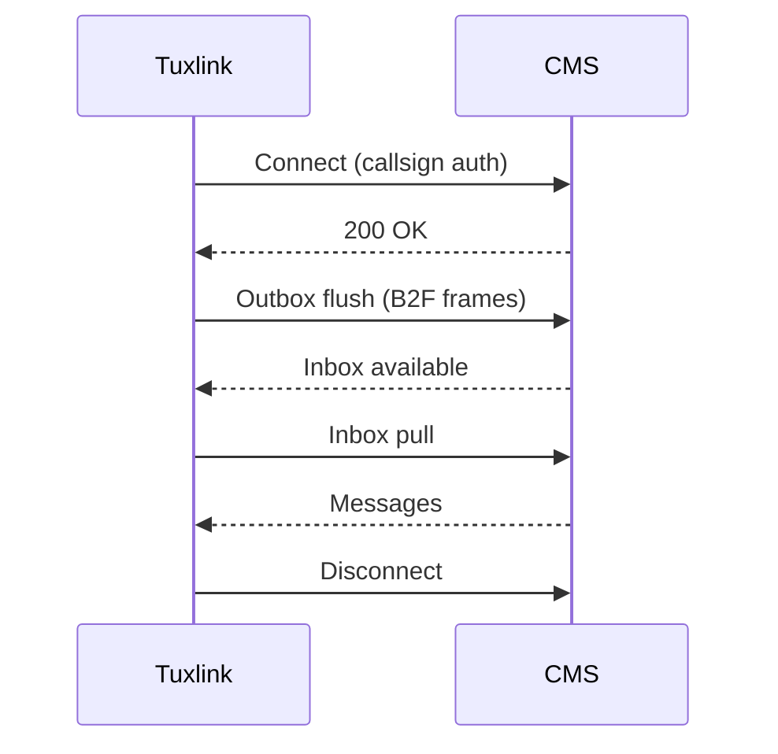

# Docs knowledge base design — AREDN-quality reference for tuxlink

> **Status:** Draft, pending operator review.
> **Date:** 2026-06-03 · **Author:** willow-yew-esker · **Issue:** tuxlink-ymiv
> **Brainstorm source:** `.superpowers/brainstorm/3385249-1780527240/content/01-08-*.html`
> **Supersedes scope of:** tuxlink-m38d (Docs Phase 2), tuxlink-v8lw (Docs Phase 3). Phase 1 (tuxlink-s8qu polish, PR #336) remains the foundation this spec builds upon.

## 1. Motivation

PR #336 polished the existing 10 user-guide topics for voice and accuracy. That work was deliberately scoped narrow — operator framing at the time was "fairly bare-bones" by design. The operator's subsequent direction reframes the docs as a strategic investment:

> "I'd really like our docs to consider user flow outside of just the product. A lot of running Winlink successfully isn't just in the software itself — it's in plugging that to a radio, getting the radio set, concepts about how it connects to gateways, the different modes and what they offer."
>
> "We could really build something good here with screenshots, mermaid flowcharts, diagrams, etc. I'd like to put a lot of effort into this, which is the opposite of basically all modern ham projects except AREDN, which has exceptional docs."

This spec defines a comprehensive in-app knowledge base for tuxlink that aims for AREDN-level quality — polished, opinionated, dense with diagrams and screenshots, deep across the full operating stack (radio integration + protocol concepts + tuxlink-specific surfaces + operating practices). The target is a single artifact a licensed amateur can open on a disconnected laptop in an EOC and find what they need.

## 2. Audience & scope

The docs target two reader profiles, layered into one tree:

### Tier B — Licensed ham who's never done Winlink
The primary persona. General-class or higher. Comfortable with HF, antenna tuning, audio chains, PTT, and soundcards. Reads schematic-level docs without getting lost. Has heard Winlink mentioned for ARES nets and wants to actually use it. Doesn't know the Winlink ecosystem (CMS, RMS, B2F), when to pick ARDOP versus VARA versus Packet, how a gateway behaves, or how to plug tuxlink into a working radio.

### Tier C — Winlink operator switching from Express or Pat
The migration persona. Runs Winlink Express on a Windows tablet or Pat on Linux. Knows CMS endpoints, has used ARDOP + VARA + Packet, has a working radio chain. Wants to migrate to tuxlink without losing operational fluency. Needs settings-mapping, conceptual diffs, and parity-gap honesty.

### Out of scope — Tier A
Brand-new hams who have never operated digital modes are explicitly out of scope. Covering RF basics, antenna theory, license study, repeater operating, Part 97 fundamentals, or the phonetic alphabet would over-scope the docs without earning their keep. The docs assume a licensed operator who reads schematic-level content fluently.

### What "generous slice" means
Within Tier B + C, the docs are generous. Every Winlink concept gets explained from first principles. Every radio-integration step gets a working example. Every digital mode gets a use-case framing. The frugality is in audience, not in depth.

## 3. Information architecture

Section-based with numeric prefixes within each section. The current 10-topic shape extends to ~31 topics across 8 sections. The existing `src/help/topics.ts` SECTIONS array gets a new section list; numeric prefixes carry through.

### 3.1 Section list with topic outline

```
01 — Quickstart
  01-what-is-tuxlink.md        — Two-paragraph intro, who tuxlink is for, what it does and doesn't try to do
  02-first-launch-wizard.md    — Polished version of the current 01-getting-started content
  03-sending-your-first.md     — Walk through New Message → Send → Connect to confirm round-trip

02 — Winlink fundamentals
  04-the-winlink-ecosystem.md  — CMS, RMS gateways, user clients, the data flow at a high level
  05-cms-and-rms.md            — What CMS is, what RMS gateways are, the relationship, how the call routes
  06-the-b2f-protocol.md       — The framing protocol underneath every Winlink session
  07-mailbox-model.md          — Folder semantics, Outbox flush + Inbox pull two-pass model, persistence
  08-picking-a-transport.md    — When to pick Telnet vs Packet vs ARDOP vs VARA; bandwidth/conditions tradeoffs

03 — Radio integration
  09-ptt-overview.md           — The four PTT methods (VOX, COM serial, USB-CAT, hardware PTT line) survey
  10-digirig.md                — Canonical: DigiRig setup, audio routing, PTT method choice, common gotchas
  11-signalink-and-others.md   — Alternative: SignaLink, generic USB soundcards, BB6PRO, mic-jack soundcards
  12-cat-and-rigctld.md        — Hamlib's rigctld pattern, when CAT is necessary vs optional
  13-radio-specific-notes.md   — G90, FT-818, TS-590, IC-7300 — the working-config details for each

04 — Digital modes
  14-packet-on-ax25.md         — Packet's place, 1200-baud AX.25 framing, Dire Wolf KISS pattern
  15-ardop-deep-dive.md        — ARDOP's waveform, bandwidth choices, ardopcf operation, when to pick what
  16-vara-hf-deep-dive.md      — VARA's licensing tiers (Free/Tactical/Narrow), Wine setup, host:port wiring
  17-choosing-the-right-mode.md — Decision tree: band conditions, message size, license tier, gateway availability

05 — Using tuxlink
  18-the-mailbox.md            — Polished version of current 03-mailbox
  19-composing.md              — Polished version of current 04-composing
  20-html-forms.md             — Polished version of current 05-forms + WLE form workflow
  21-search.md                 — Polished version of current 06-search + token vocabulary deep-dive
  22-user-folders.md           — Creating/renaming/deleting + organizing strategies + sync semantics
  23-catalog-requests.md       — WLE inquiry messages, refreshing the catalog, what arrives

06 — Operating practices
  24-emcomm-and-ics.md         — Where Winlink fits in incident command; standard message types; net structure
  25-net-check-ins.md          — Position reports, ICS-213 net traffic, station identification
  26-position-and-privacy.md   — GPS state, broadcast precision, the 4-vs-6-character Maidenhead tradeoff

07 — Reference
  27-settings.md               — Polished version of current 07-settings (every preference) + absorbed color schemes
  28-keyboard.md               — Polished version of current 09-keyboard
  29-troubleshooting.md        — Polished version of current 10-troubleshooting + the new sections grow it
  30-glossary.md               — Definition list of every acronym in the docs (B2F, CMS, RMS, KISS, etc.)
  31-credits.md                — Featured creators, influences, standards references (see §5.3)

08 — Migration
  32-from-express-or-pat.md    — Settings-mapping table, conceptual differences, parity gaps with bd-issue refs
```

Topic count: 32 markdown files total across 8 sections.

### 3.2 Color schemes (current `08-color-schemes.md`) absorbed into Settings (27)
The current `08-color-schemes.md` standalone topic collapses into a sub-section of `27-settings.md`. Color schemes are a settings affordance; a standalone topic was right when there were 10 topics, but at 32 it doubles up. The current 08 file gets deleted; its content moves into 27 with section anchors preserved (`#picking-a-preset`, `#customizing`, `#light-vs-dark-mode`) so external bookmarks don't break.

### 3.3 Search-as-discovery
FTS5 indexes are already shipped (per `src-tauri/src/search/docs_bundle.rs` + `src-tauri/src/search/docs_index.rs`). The topic titles and section headings authored under this spec MUST be concrete operator keywords:

- ✅ "DigiRig setup", "VARA Standard bandwidth", "B2F protocol framing", "RMS gateway availability"
- ❌ "Getting started with hardware", "Understanding bandwidths", "The protocol layer", "Connectivity considerations"

The litmus test: would a licensed operator with no tuxlink experience type this phrase into the search bar when looking for the topic? If yes, the heading is right. If no, rewrite.

### 3.4 Topic numbering and renames
The current 10 topics need renumbering into the new sections. PR #1 of the rollout handles the renames (and updates `src/help/topics.ts` SECTIONS + `src-tauri/src/search/docs_bundle.rs` `include_str!` paths + `src/help/topics.test.ts` count assertions). New topics arrive empty-but-rendering as stubs in PR #1 so the IA is visible in the help window before content fills in.

## 4. Renderer architecture — Tier 3

### 4.1 Feature set

The Tier 3 renderer adds the following to the current minimal `markdownRender.ts`:

| Feature | Markdown syntax | Implementation cost |
|---|---|---|
| Images | `` | `marked` handles, plus `import.meta.glob` for image bundling |
| Mermaid diagrams | Fenced code block with `mermaid` lang tag | Lazy-load Mermaid lib on first use (~250 KB) |
| Heading anchors | Auto from heading text (slugified) | `marked` extension, ~20 lines |
| Callout boxes | `> [!NOTE]`, `[!WARNING]`, `[!TIP]`, `[!DANGER]` | `marked` extension, styled per theme |
| Tables | Pipe-delimited markdown tables | `marked` handles natively |
| Code blocks with syntax classes | `\`\`\`bash`, `\`\`\`rust`, etc. | `marked` adds language class; CSS does theme-respecting styling |
| Code-block copy button | (Automatic on every fenced block) | Render-time decoration, ~30 lines |
| Footnotes | `[^1]` syntax | `marked-footnote` extension |
| Definition lists | `Term\n:   Definition` | `marked-deflist` or custom |

### 4.2 Library choice — `marked`

The current hand-rolled `markdownRender.ts` (~150 LOC) gets replaced by `marked` with extensions. Rationale:

- **Eager bundle cost:** `marked` is ~50 KB minified. Acceptable for the value.
- **Extensions vs. hand-rolling:** every feature in the Tier 3 list either ships with `marked` or has a published extension. Maintaining a hand-rolled parser at this feature scale becomes its own cost center.
- **Test surface:** `marked` is battle-tested across thousands of projects. The current hand-rolled parser already had bug 5 (list continuation) and bug 6 (re-parse memoization) discovered late in PR #333. Each Tier 3 feature added to the hand-rolled parser would introduce equivalent bug surfaces.

The existing `src/shell/markdownRender.ts` becomes a thin wrapper around `marked` that:

1. Configures `marked` with the extension chain.
2. Returns the same `Block[]` shape the rest of the help window's renderer expects (or migrates the renderer to consume HTML directly — see §4.4).

### 4.3 Mermaid lazy-load

Mermaid is ~250 KB minified — too big to include in the eager bundle. Lazy-load on first Mermaid block render:

```typescript
// src/help/mermaidLoader.ts
let mermaidPromise: Promise<typeof import('mermaid').default> | null = null;

export function loadMermaid() {
  if (!mermaidPromise) {
    mermaidPromise = import('mermaid').then(m => m.default);
  }
  return mermaidPromise;
}
```

The first topic containing a Mermaid block triggers the lazy chunk; subsequent topics reuse the same loaded module. The `ReadingPane.tsx` component observes the rendered output for `pre code.language-mermaid` blocks and replaces them with rendered SVG.

### 4.4 Migration from `Block[]` to HTML

The current renderer parses markdown into a `Block[]` JSX structure (`{kind: 'heading' | 'paragraph' | 'list' | 'code' | 'link' | ...}`). The Tier 3 renderer outputs HTML (via `marked`) and renders via `dangerouslySetInnerHTML` inside a sanitized container.

The HTML approach is necessary because:

- Footnote rendering needs cross-references (back-links from footnote text to inline ref).
- Heading anchors need stable `id` attributes for FTS5 deep-linking + `#anchor` link nav.
- Callout box CSS is easier to author against a stable HTML shape (`<div class="callout callout-warning">`).

Sanitization via DOMPurify is required because we're rendering markdown-derived HTML. DOMPurify (~50 KB minified, eager-loaded) is the standard. The configuration allows the markdown-relevant subset (headings, paragraphs, lists, links, code, images, tables, the callout `div` shape) and forbids `<script>`, `<iframe>`, `<style>`, event handlers.

### 4.5 Link interceptor extension

`src/help/ReadingPane.tsx:25` currently intercepts `(\d{2}-[a-z-]+)\.md` links for topic navigation. The Tier 3 renderer requires extending the interceptor:

| Link form | Behavior |
|---|---|
| `02-connections.md` | Navigate to topic 02 (current behavior). |
| `02-connections.md#vara-hf` | Navigate to topic 02, then scroll to the `vara-hf` heading anchor. |
| `#vara-hf` | Scroll to the `vara-hf` anchor in the current topic. |
| `https://...` | Open in OS browser via Tauri `shell:open` (current behavior). |
| `../pitfalls/...` (out-of-bundle) | Banned. The reading-pane parser refuses to render such links — the build step verifies. |

### 4.6 Image bundling

Images live at `docs/user-guide/images/<topic-slug>/<name>.png`. The frontend bundles them via `import.meta.glob('/docs/user-guide/images/**/*.{png,svg}', { eager: true, query: '?url' })`. The Rust backend's `docs_bundle.rs` (used for FTS5 search) does NOT bundle images — search operates on markdown text only.

PNG paths in markdown resolve relative to the markdown file:

```markdown

```

The renderer rewrites the relative path to the bundler-resolved URL before emitting ``.

### 4.7 Renderer testing

The Tier 3 renderer needs end-to-end test coverage for:

- Every Tier 3 feature renders correctly given known markdown input.
- Heading anchors are deterministic and FTS5-compatible (lowercase, hyphen-separated).
- Image paths resolve through the bundler.
- Mermaid lazy-loading does NOT block initial topic render — first paint comes through, the diagram renders when the chunk arrives.
- Link interceptor handles all 4 link forms.
- DOMPurify configuration permits the markdown-relevant subset and rejects every forbidden element.

Existing `src/shell/markdownRender.test.ts` gets replaced by `src/shell/markdownRender.test.ts` covering the new renderer plus `src/help/mermaidLoader.test.ts` for the lazy loader.

## 5. Authoring workflow

### 5.1 Hamexandria research pattern

The six attribution disciplines from tuxlink-s8qu's bd description apply throughout:

1. **NEVER copy YouTube transcripts verbatim** into any topic file.
2. **USE Hamexandria as a research aid** to inform tuxlink's own (originally-written) explanations.
3. **Attribute prominently when a creator's framing is genuinely the right framing to cite** (creator name, video title, link to source video) and quote only what fair use plainly permits.
4. **Prefer linking out to the creator's video** rather than embedding their words.
5. **Get explicit permission** from creators for any substantial extract.
6. **Maintain a CREDITS / acknowledgments section** listing creators whose explanations shaped the docs.

### 5.2 Per-section research note workflow

Before authoring a section, run a Hamexandria sweep and write findings to:

```
dev/research/<section-slug>-research.md
```

This file is **committed to git** (tracked, pushed) but lives outside the bundled `docs/user-guide/` tree. It ships with the repo for future contributor reference. It does NOT bundle into the binary.

#### Research note template

```markdown
# Research note: <section name>

> Source pass: 2026-06-XX · Section: <section name>

## Hamexandria queries run

| Query | Top results | Notes |
|---|---|---|
| "ARDOP bandwidth choice" | Julian OH8STN's "ARDOP for Emcomm", K0SUN's "Picking ARDOP Bandwidth" | Julian's framing matches what we want; K0SUN has the practical SNR table |

## Creator contributions identified

- **Julian OH8STN** — His "ARDOP for Emcomm" frames mode choice around band conditions in a way the AREDN docs don't. Worth featuring in topic 17.
- **K0SUN** — Practical SNR data, not framing.

## Decisions logged

- Topic 15 (ARDOP deep dive) — frame around Julian's "what conditions favor ARDOP" decision tree (cited inline, with link).
- Topic 17 (choosing mode) — adopt the SNR-band-condition table from K0SUN as inspiration; rewrite from scratch with our own measurements.

## Open questions

- Is there a canonical reference for VARA Tactical licensing tiers as of 2026? Hamexandria's most recent video is from 2024.
```

### 5.3 CREDITS topic

A dedicated topic `31-credits.md` at the end of the Reference section (per §3.1). Credits is a polished operator-facing surface — not a buried footer — and earns its own topic in the IA.

The CREDITS structure:

```markdown
# Credits and acknowledgments

The tuxlink docs draw on the wider amateur radio community. Several creators'
explanations shaped specific topics in this guide.

## Featured creators

### Julian OH8STN
- "ARDOP for Emcomm" — framing in topic 17 on mode selection. Used with permission.
- Channel: https://www.youtube.com/@JulianOH8STN
- Permission granted on YYYY-MM-DD.

## Influences without explicit featuring

The following creators' work informed parts of the guide without rising to the
level of citable framing. Listed in alphabetical order by callsign.

- K0SUN — practical SNR observations contributed to the ARDOP/VARA mode comparison.
- (etc.)

## Standards and reference

- B2F protocol reference: ... (open standard)
- Winlink CMS endpoint registry: https://winlink.org/...
```

### 5.4 Permission-request template

For creators whose framing rises to the level worth featuring:

```
Subject: Permission request — tuxlink docs

<Greeting>,

I'm writing the user-facing documentation for tuxlink, a native Linux Winlink
client. Your explanation of <topic> in <video title> (<link>) frames the
concept exactly the way I'd want the docs to frame it for our readers.

I'd like to:
- Link to your video as the cited source for this framing.
- Quote no more than <N words> of your explanation.
- Attribute the section prominently (your callsign + channel link).

Are you willing to grant permission for this use? If you'd like to see the
draft chapter before deciding, I can share it.

73,
Cameron Zucker / <callsign>
tuxlink — https://github.com/cameronzucker/tuxlink
```

### 5.5 Screenshot toolchain

#### Capture path

The operator captures screenshots on-pandora via `grim` (per memory `reference_grim_realapp_validation_pandora`). The author (me) writes screenshot placeholders into the markdown:

```markdown
<!-- screenshot-needed: docs/user-guide/images/10-digirig/digirig-audio-routing.png
     Show: DigiRig USB-C connected to laptop, DIN cable to G90 mic jack,
     RJ45 to G90 ACC jack. Front view, both LEDs lit. ~1200x800 crop. -->
```

The operator walks a capture session per topic when ready:

1. Boot tuxlink (or set up the physical scene for a hardware shot).
2. Navigate to the UI state described in the placeholder.
3. Capture: `grim -g "$(slurp)" docs/user-guide/images/<topic>/<name>.png`.
4. Compress: `oxipng -o4 docs/user-guide/images/<topic>/<name>.png` (in-place lossless).
5. Replace the placeholder with the rendered markdown ``.

#### Cropping conventions

| Type | Dimensions | Notes |
|---|---|---|
| Full window | 1280×800 | Standard reading window size, matches the dev port |
| Sidebar detail | 300×600 | Just the folder sidebar |
| Modal detail | 500×400 | The settings inline panel, the wizard step |
| Reading pane | 700×500 | A message in the reading pane |

#### Annotation guidance

Avoid baked-in arrows or labels — the UI evolves and annotations rot the fastest. When pointing is genuinely necessary, use markdown captions:

```markdown

*The Sort control: click the active sort key to flip direction.*
```

For diagrams of physical objects (DigiRig wiring), prefer hand-SVG (see §5.6) over annotated photos.

#### Size budget

Target: ≤100 KB per screenshot at 1280×800 source resolution. `oxipng -o4` typically achieves this. Screenshots exceeding the budget get cropped tighter or rendered as SVG diagrams.

The full guide's image budget: ~50 screenshots × 100 KB = ~5 MB. Plus hand-SVG (~5-8 files × <20 KB = ~150 KB). Total renderer + images: ~5.5 MB added to the binary. Acceptable.

### 5.6 Diagram strategy

| Use case | Tool | Rationale |
|---|---|---|
| Protocol flow (B2F session, ARDOP handshake) | Mermaid sequence | Renders cleanly, version-controllable as text, theme-aware |
| State machines (mailbox folder lifecycle, connect state) | Mermaid state | Same |
| Topology (CMS + RMS + clients) | Mermaid flowchart | Works for ~10 nodes |
| Hardware wiring (DigiRig audio chain, PTT routing) | Hand-SVG (Inkscape) | Mermaid doesn't model physical connections well |
| Decision tree (which transport when?) | Mermaid flowchart | Clean for ~10 decision nodes |
| Simple sequential flow (signal path) | ASCII art in code block | Often clearer than a graphical equivalent |

#### Mermaid block example

```markdown

```

#### Hand-SVG example

Authored in Inkscape, saved as plain SVG, committed at `docs/user-guide/images/diagrams/<name>.svg`. The SVG uses `currentColor` for strokes so it adopts the theme:

```svg
<svg viewBox="0 0 400 200" xmlns="http://www.w3.org/2000/svg" stroke="currentColor" fill="none">
  <!-- DigiRig audio chain -->
  <rect x="20" y="60" width="80" height="80" />
  <text x="60" y="100" text-anchor="middle" fill="currentColor">G90</text>
  <line x1="100" y1="100" x2="180" y2="100" />
  <rect x="180" y="60" width="80" height="80" />
  <text x="220" y="100" text-anchor="middle" fill="currentColor">DigiRig</text>
  <line x1="260" y1="100" x2="340" y2="100" />
  <rect x="340" y="60" width="60" height="80" />
  <text x="370" y="100" text-anchor="middle" fill="currentColor">Pi 5</text>
</svg>
```

#### ASCII fallback example

Simple signal paths render well as ASCII in fenced blocks:

```markdown
```
Radio                 DigiRig              Tuxlink
[G90]  ── DIN cable ──[USB-C in]── USB-C ──[Pi 5]
       ── RJ45 ACC ──[CAT serial]── USB ──[/dev/ttyUSB0]
```
```

The fenced block carries no language tag (or `text`), so it renders as plain monospace.

### 5.7 Voice and style guide

The docs voice matches the existing 10 topics (the bar PR #336 polished to). Codified:

| Rule | Example |
|---|---|
| Declarative, present tense. No first person. | ✅ "The wizard collects identity in three steps." ❌ "We collect identity in three steps." |
| Second person for operator instructions. | ✅ "Press Ctrl+N to open the compose window." ❌ "One presses Ctrl+N." |
| Concrete referents — name the feature or state at every reference. | ✅ "The Sort control above the message list" ❌ "The control" |
| Short sentences. Aim for ≤25 words. | ✅ "The B2F protocol carries every Winlink session." ❌ "The B2F protocol, which we'll explore in detail below, is the framing layer that carries every Winlink session, regardless of which transport is doing the actual carrying." |
| Code, paths, commands in backticks. | ✅ "Stored at `~/.local/share/com.tuxlink.app/config.json`." |
| UI elements in **bold**. | ✅ "Click **New Message**." |
| Em dashes (`—`) are fine. | (Per existing voice. No restriction.) |

Voice violations get fixed inline during review; the spec doesn't add a separate review pass.

### 5.8 Link hygiene

All cross-links are bare `.md` refs or `#anchor` refs. No out-of-bundle `../` paths. The Tier 3 renderer + extended link interceptor enforces this at runtime; a build-time linter (~30 LOC) verifies it at commit time and runs in CI.

The build-time linter is added in PR #1 (renderer upgrade). It scans all markdown files under `docs/user-guide/` for link syntax and rejects any link that:

- Resolves outside `docs/user-guide/`.
- References a topic file that doesn't exist.
- References a heading anchor that doesn't exist in the target file.

## 6. Cross-cutting concerns

### 6.1 RADIO-1 callouts

Every on-air operating instruction in the docs MUST be wrapped in a `[!WARNING]` callout that includes:

- The licensee-consent gate (per memory `feedback_radio1_bounded_airtime_abort`).
- A reminder that the radio power switch is the emergency stop.
- A link to the troubleshooting topic for abort behavior.

Example markdown:

```markdown
> [!WARNING]
> **On-air operation.** Initiating a Connect transmits under your callsign.
> Confirm: (a) you're at the radio, (b) the abort path works, (c) the
> radio power switch is reachable. Per the project's RADIO-1 discipline.
```

This makes operator-policy carrying load visually load-bearing across the docs instead of relying on inline prose to carry weight. Tier 3 callouts (per §4.1) make this affordance possible.

### 6.2 Glossary as first-class topic

`30-glossary.md` (renumbered if credits also lives in Reference) contains a definition list of every acronym + project-specific term in the docs:

```markdown
B2F
:   The framing protocol Winlink sessions use to exchange messages. Stands
    for "Block Forwarding 2." Carries one or more messages per session.

CMS
:   Common Message Server. The central Winlink server cluster that holds
    operators' mailboxes and routes traffic between operators and RMS gateways.

RMS
:   Radio Mail Server. A gateway operated by a volunteer that bridges between
    HF/VHF radio links and the CMS. ARDOP and VARA HF gateways are RMS nodes.

(etc.)
```

The definition list rendering (per §4.1 Tier 3 feature) makes this read as a polished reference, not as a bulleted list of acronyms.

Every first use of a glossary term in any topic gets a link to its glossary entry. The build-time linter (per §5.8) verifies the link.

### 6.3 Migration topic structure

`31-from-express-or-pat.md` (or wherever it sits in final numbering) covers the operator switching from Winlink Express or Pat. Structure:

1. **Settings-mapping table** — for each Express/Pat setting, the equivalent tuxlink location.
2. **Conceptual differences** — where tuxlink's mailbox model, compose surface, or connection management differs and why.
3. **Parity gaps** — what's not yet implemented in tuxlink, with bd-issue references and tracking links.
4. **Migration sequence** — recommended order for transferring identity + config + mailbox.

The bd-issue references make this topic self-updating: as parity gaps close, the topic gets a docs PR that removes the resolved item.

### 6.4 Light vs dark theme considerations

All authored content — markdown, Mermaid diagrams, hand-SVG — MUST work across all 6 bundled color schemes (per `src/shell/colorScheme.ts`). Specifically:

- Mermaid diagrams: configured via `mermaid.initialize({ theme: 'base', themeVariables: { ... } })` with theme variables pulled from CSS custom properties. The Mermaid renderer re-runs on theme change.
- Hand-SVG: `stroke="currentColor"` and `fill="currentColor"` so the diagram adopts the theme automatically.
- Screenshots: captured in the Default (dark) theme. Operators on other themes see slightly off-theme screenshots but the UI structure is identical across themes.

### 6.5 Accessibility

- Every image has a meaningful `alt` attribute.
- Every Mermaid block has a fallback text description in the markdown above the block (`<!-- ALT: text description -->`) for screen readers; the SVG output gets `aria-label` matching.
- Heading hierarchy is monotonic — no skipping levels (h2 → h4 without h3).
- Color is never the sole carrier of meaning (callout colors are reinforced by icon + text label).

### 6.6 Internationalization

Out of scope for this spec. The docs ship in English. If i18n becomes a goal later, the per-section research notes and the topic file structure (`<lang>/<topic>.md`) are the migration path.

## 7. Phasing and rollout

### 7.1 PR sequence

```
PR #1  Renderer upgrade + IA restructure (NO new content)
PR #2  Section 01 Quickstart + Section 02 Winlink fundamentals
PR #3  Section 03 Radio integration (DigiRig as canonical)
PR #4  Section 04 Digital modes
PR #5  Section 05 Using tuxlink (extended polish + new topics)
PR #6  Section 06 Operating practices + Section 07 Reference + Section 08 Migration
```

### 7.2 PR #1 — Renderer upgrade + IA restructure

**Scope:**
- Swap `markdownRender.ts` from hand-rolled to `marked` + extensions per §4.
- Add Mermaid lazy loader per §4.3.
- Add DOMPurify sanitization per §4.4.
- Extend `ReadingPane.tsx` link interceptor per §4.5.
- Add image bundling per §4.6.
- Add build-time link linter per §5.8.
- Renumber + reorganize existing 10 topics into new section layout. Delete `08-color-schemes.md` and merge its content into `27-settings.md` (per §3.2).
- Create stub topic files for the 23 new topics (each contains a brief placeholder paragraph + the title + a "Coming in a future PR — tracking issue: tuxlink-ymiv" reference, until per-section bd issues are filed by the writing-plans output).
- Update `src/help/topics.ts` SECTIONS + `src-tauri/src/search/docs_bundle.rs` `include_str!` paths.
- Update `src/help/topics.test.ts` topic count to 32.

**Success criteria:**
- Existing 10 topics' content renders correctly in the new renderer (visual smoke), with the color-schemes content merged into settings.
- All Tier 3 features render correctly given test fixtures.
- Build-time link linter rejects a deliberately-broken cross-link.
- Help window opens with the new section structure visible.
- No new content shipped — the IA is in place but new topics are stubs.

**Estimated size:** ~1500 LOC across renderer + tests + topic file renames + stubs.

### 7.3 PRs #2–#6 — Content authoring

Each content PR follows the same shape:

1. Write the section's research note at `dev/research/<section>-research.md` (Hamexandria sweep).
2. Author the topic markdown files.
3. Operator captures screenshots per the placeholder list.
4. Add Mermaid diagrams + hand-SVG diagrams + ASCII flows where appropriate.
5. Add cross-links between topics in the section + to topics in other sections.
6. Run the build-time link linter; fix any broken links.
7. Operator smokes the section in the help window before merge.

**Estimated sizes:**

| PR | Topics | Est. lines markdown | Est. images | Est. diagrams |
|---|---|---|---|---|
| #2 | 8 | ~3,000 | ~10 | ~5 Mermaid |
| #3 | 5 | ~2,500 | ~15 (mostly hardware) | ~3 Mermaid + 3 SVG |
| #4 | 4 | ~2,500 | ~8 | ~8 Mermaid |
| #5 | 6 | ~2,500 | ~20 (UI heavy) | ~3 Mermaid |
| #6 | 9 | ~3,500 | ~10 | ~4 Mermaid + 1 SVG |

Total content: ~14,000 lines markdown, ~63 images, ~30 diagrams.

### 7.4 Coherent-partial property

The PR ordering preserves a property: at any point after PR #3, the docs are a coherent partial that ships value:

- **After PR #1:** New renderer ready, IA visible but content is stubs. Not a shipping milestone — internal only.
- **After PR #2:** Foundation is complete. A reader can learn the Winlink ecosystem from scratch.
- **After PR #3:** Radio integration is documented. A reader can wire DigiRig to their G90 from the docs alone.
- **After PR #4:** All digital modes documented. The full ecosystem is covered conceptually.
- **After PR #5:** All tuxlink-specific surfaces documented. The reader can operate tuxlink end to end.
- **After PR #6:** Reference + migration complete. Full AREDN-equivalence.

If energy moves elsewhere after PR #3, what's shipped is a defensible standalone deliverable: "tuxlink Winlink + radio integration handbook" without the digital modes deep dive or the operating practices section. The migration topic is the only thing that suffers from incomplete coverage (it references later sections).

### 7.5 What gets pinned at the end of each PR

- PR #1: `marked` + Mermaid + DOMPurify dependency versions pinned in `package.json`.
- PR #2–#6: any new external links pinned with retrieval date in research notes.

## 8. Success criteria

The docs are AREDN-quality when all of the following hold:

1. **Operator coverage.** A licensed-but-Winlink-naive ham can open the docs, read 01-08, and understand the Winlink ecosystem well enough to make informed transport choices.
2. **Radio integration coverage.** A ham with a DigiRig + a G90 can follow topic 10 and have a working tuxlink setup without external research.
3. **Mode-selection coverage.** Topic 17 produces a decision: given band conditions + message size + license tier, which mode to pick.
4. **Search-as-discovery.** Typing "DigiRig PTT" into the help-window search returns topic 10 as the top result.
5. **Cross-link integrity.** The build-time link linter passes in CI.
6. **Screenshot freshness.** No screenshot is more than 90 days older than the topic it documents.
7. **Voice consistency.** A random sample of paragraphs from any 3 topics reads as written by the same author.
8. **RADIO-1 compliance.** Every on-air operating instruction sits inside a `[!WARNING]` callout.
9. **Glossary completeness.** Every acronym used in any topic has a glossary entry.
10. **Migration topic accuracy.** A Winlink Express operator can read topic 31 and transfer their config to tuxlink without external help.

The goalpost is independence: a reader with a license, a radio, a DigiRig, and a Linux laptop should not need to leave the docs to get on the air with tuxlink.

## 9. Open questions deferred

The following are flagged but not blocking spec approval:

1. **Per-topic table of contents.** Long topics (the radio integration ones at 800+ lines) may benefit from auto-generated table of contents at the top. The Tier 3 renderer can support this via a `marked` extension. Defer until authoring shows the need.

2. **Print stylesheet.** Some operators print docs for binder reference. A separate print CSS could be added later. Defer until requested.

3. **Translations.** Per §6.6, out of scope. May come up later.

4. **CI integration for screenshot freshness.** Per success criterion #6, screenshots ≥90 days older than their topic should produce a warning. Defer the automation until the docs are mostly authored — meanwhile, manual tracking suffices.

## 10. References

### Project context

- Brainstorm screens: `.superpowers/brainstorm/3385249-1780527240/content/01-08-*.html`
- Parent epic: `tuxlink-s8qu` (Docs expansion + polish pass + Hamexandria-sourced content)
- Phase 1 PR: [#336](https://github.com/cameronzucker/tuxlink/pull/336) — polish + accuracy pass
- Phase 2 issue: `tuxlink-m38d` (this spec absorbs)
- Phase 3 issue: `tuxlink-v8lw` (this spec absorbs)
- This spec issue: `tuxlink-ymiv`

### Code surfaces this spec touches

- [src/shell/markdownRender.ts](../../../src/shell/markdownRender.ts) — full rewrite per §4.
- [src/help/ReadingPane.tsx](../../../src/help/ReadingPane.tsx) — link interceptor extension per §4.5.
- [src/help/topics.ts](../../../src/help/topics.ts) — SECTIONS restructure per §3.
- [src/help/topics.test.ts](../../../src/help/topics.test.ts) — topic count update per §3.
- [src-tauri/src/search/docs_bundle.rs](../../../src-tauri/src/search/docs_bundle.rs) — `include_str!` paths per §3.
- [docs/user-guide/](../../../docs/user-guide/) — content tree per §3 and §5.

### Memory entries this spec relies on

- `reference_hamexandria` — local vector DB access for research pattern.
- `feedback_writing_voice_no_first_person` — voice guide foundation.
- `feedback_explicit_referents_in_specs` — link discipline foundation.
- `feedback_radio1_bounded_airtime_abort` — RADIO-1 callout requirement.
- `reference_grim_realapp_validation_pandora` — screenshot capture path.
- `feedback_high_fidelity_mocks` — visual fidelity bar.

### External

- AREDN docs (reference quality bar): https://docs.arednmesh.org/
- DigiRig: https://digirig.net
- Winlink: https://winlink.org
- `marked` (markdown library): https://marked.js.org/
- Mermaid (diagram library): https://mermaid.js.org/
- DOMPurify (sanitization): https://github.com/cure53/DOMPurify
