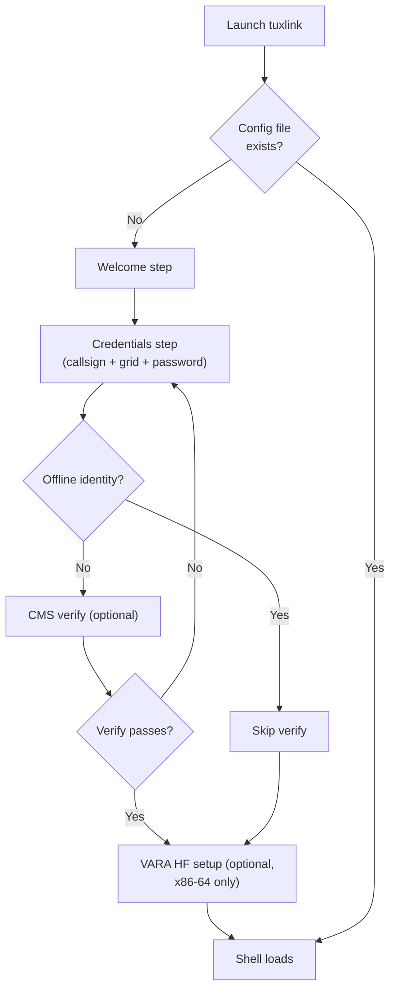

# First-launch wizard

Tuxlink is a native Linux desktop Winlink client. On first launch it opens a
short wizard that captures the minimum identity required to send and receive
mail: a callsign, a Maidenhead grid, and the credentials Winlink needs to
confirm that callsign belongs to the operator.

## First launch

<!-- screenshot-needed: docs/user-guide/images/02-first-launch-wizard/welcome.png
     Show: the wizard's Welcome step on first launch. Include the title
     bar so the operator sees what greets them. ~1280x800 window crop. -->

<!-- screenshot-needed: docs/user-guide/images/02-first-launch-wizard/credentials.png
     Show: the Credentials step with callsign + Maidenhead grid + Winlink
     password fields. Use a placeholder callsign (N0CALL) and grid
     (CN85qe). Step content crop ~900x600. -->

<!-- screenshot-needed: docs/user-guide/images/02-first-launch-wizard/cms-verify.png
     Show: the optional CMS verify step with the verify button and a
     successful-verify outcome (green checkmark or "Credentials
     verified" line). Step content crop ~900x600. -->

The wizard flow is short:

1. **Welcome.** A landing screen that explains what comes next and links
   to the project's privacy notes.
2. **Credentials.** A licensed amateur callsign, a 4- or 6-character
   Maidenhead grid, and the Winlink password. Tuxlink does not check the
   license database — it is the operator's responsibility to enter a real,
   currently-valid call. If GPS is wired and enabled later, the broadcast
   grid updates from GPS at the chosen precision; the entered grid stays
   as the manual fallback. An **offline-identity** path is offered for
   operators who want to use Tuxlink without registering credentials —
   the password step is deferred to first CMS connect.
3. **CMS verify.** Optional. A connect-only verification (no transmission)
   that confirms the credentials work against the CMS endpoint before the
   shell loads. Skipping this step is fine; the first real Connect will
   surface any auth issue.
4. **Location.** GPS detection with guided fixes for the common Linux
   blockers (dialout group membership, ModemManager holding the port),
   plus manual grid entry as the always-available fallback. The grid and
   position source persist as entered; every identity path passes through
   this step. The same controls live in Settings afterward.
5. **Set up VARA HF.** Optional. A guided installer for the VARA HF
   modem: download the installer from the VARA author's page
   (rosmodem.wordpress.com) in a browser, point the wizard at the
   `.exe`, and a live checklist walks the Wine setup, the VARA
   installation, its runtime pieces, a launch check, and auto-start on
   login. The step appears only on hardware that can run VARA (x86-64
   Linux) and needs internet, so first launch — while online — is the
   right moment. Skipping is fine: ARDOP works without it, and the same
   flow is available later from the VARA panel's **Set up VARA HF…**
   button. See the [VARA HF deep dive](16-vara-hf-deep-dive.md).

The wizard writes to `~/.config/tuxlink/config.json` (the XDG-config
location, separate from the mailbox data at
`~/.local/share/com.tuxlink.app/native-mbox/`). Deleting the config file
resets the wizard on next launch.

Available transports — Telnet (CMS over the internet), Packet (1200-baud
AX.25 over a radio modem), ARDOP HF, and VARA HF / FM — surface in the folder
sidebar once the shell opens. The operator picks which transport the next
Connect will use by clicking its entry; nothing is locked in by the wizard.

## After the wizard

<!-- screenshot-needed: docs/user-guide/images/02-first-launch-wizard/main-window-overview.png
     Show: the main shell after wizard completes — dashboard ribbon at
     top, folder sidebar at left, message list centre, reading pane
     right, mailbox bar at bottom. Full window, ~1280x800. Label-overlays
     NOT needed (per spec §5.5 — captions in prose are preferred over
     baked-in arrows). -->

The main window appears:

- **Dashboard ribbon** (top) — operator-facing identity (callsign, grid,
  position, UTC/local time, connection state, the Connect button).
- **Folder sidebar** (left) — Inbox, Outbox, Sent, Drafts, Archive, any
  user-created folders, plus the configured connections.
- **Message list** (centre) — the selected folder's messages or the
  results of a search.
- **Reading pane** (right) — the selected message, or a connection panel
  when a transport is open.
- **Radio panel** (far right, conditional) — per-mode controls when a
  modem is running or a non-Telnet connection is selected.
- **Mailbox bar** (bottom) — outbox queue depth, unread count, app
  version.

To send the first real message, click **New Message** (or press Ctrl+N) to
open the compose window, fill in `To` and a subject, write a body, and
press Send. The message lands in the Outbox; the next CMS connect (F5 or
Ctrl+Shift+O) sends it.

## Your Winlink account

Operating Winlink — with tuxlink, Winlink Express, or Pat — requires a
**Winlink account** registered at winlink.org. The account is a
callsign-keyed identity that the CMS authenticates against on every
session. The wizard's credentials step captures three things; this
section explains where each one lives:

| Field | What it is | Lives where |
|---|---|---|
| **Callsign** | Your licensed amateur callsign. | Winlink-side: keyed to your account record. Tuxlink-side: persisted to `~/.config/tuxlink/config.json` as plaintext (it's not a secret). |
| **Maidenhead grid** | Your station's grid square (manual fallback when GPS is unavailable). | Tuxlink-side only. Not part of your Winlink account. |
| **Winlink password** | Set by you when you register your account at winlink.org. The CMS validates it on every session. | Winlink-side: stored by Winlink. Tuxlink-side: written to the OS keyring (Secret Service / GNOME Keyring / KWallet), never to a config file. See [Settings — Credentials and the keyring](27-settings.md#credentials-and-the-keyring) for the keyring side. |

### Registering with Winlink (first time)

The Winlink account-creation flow lives at winlink.org and is outside
tuxlink. The short version: you go to the Winlink site, register your
callsign, set a password, and that password is what you enter in the
tuxlink wizard. Account approval timing and the specific details of how
Winlink handles your registration are documented by Winlink itself;
tuxlink does not duplicate them.

**Set a password recovery address while you are there.** Winlink's only
self-service password-recovery path emails your password to a recovery
address stored on your account, and it works only if that address was set
*before* you lose access. Add one in your winlink.org account profile now —
a missing recovery address is the single most common reason operators get
locked out of their Winlink account later.

### What happens to your password if you reinstall tuxlink

The keyring is **not** part of tuxlink's install footprint. It is a
system service that lives in your user account independently. Reinstall
tuxlink, downgrade tuxlink, switch between tuxlink builds — the
keyring entry survives, and the wizard's "Credentials already
configured" path skips straight past the password step.

What requires re-entry is **moving to a new machine** (or a new Linux
user account), because the keyring is per-user-per-machine. The
password is still your same Winlink password; you just enter it once
on the new machine and tuxlink writes it to the new machine's keyring.

If you lose your Winlink password entirely (not the keyring entry, but
the actual password Winlink validates against), recovery goes through
winlink.org — tuxlink has no recovery path because tuxlink does not own
the credential. Winlink's recovery tool emails your password to the
recovery address on your account, so it only works if you set one
beforehand (see above). If no recovery address was ever set, the
self-service tool cannot help: post on the Winlink support forum and a
Winlink administrator will add a recovery address for you, after which
recovery works. The tool also covers **call-sign accounts only** —
**tactical-address** passwords are not recoverable through it and likewise
go through the support forum.

## What can go wrong

- "Not configured" in the message list = the backend has no callsign or
  no transport yet. Delete the config file to re-run the wizard on next
  launch, or recover the callsign/password through the auth-recovery
  banner that appears after a failed CMS login.
- "CMS unreachable" — the optional verify step failed. Either retry with a
  different CMS endpoint (the Telnet connection panel) or skip verification
  and let the first real Connect surface the failure with full session log
  context.
- **"Authentication failed" on first Connect** = the Winlink password
  entered in the wizard does not match what winlink.org has on file.
  Re-check the password (look-alikes between `0`/`O`, `1`/`l`/`I`); if
  it still fails, reset the password through winlink.org and re-run the
  wizard.

## Where next

- [Picking a transport](08-picking-a-transport.md) — what Telnet / Packet / ARDOP / VARA each do.
- [Composing](19-composing.md) — drafts, Cc, attachments, forms.
- [Keyboard](28-keyboard.md) — the full accelerator list.
