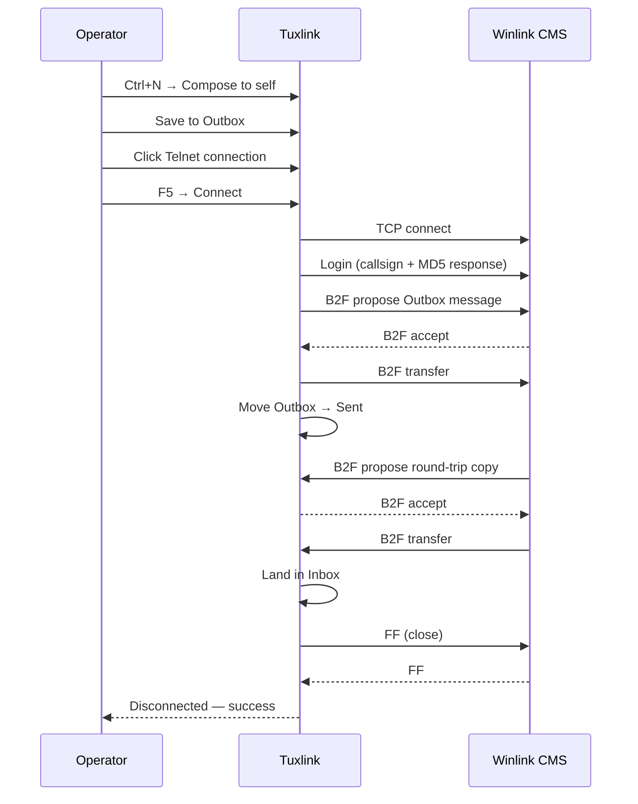

# Sending your first message

The fastest end-to-end check that the wizard ran correctly is sending one
message over Telnet to your own callsign and reading it back. Telnet does not
need a radio — the round trip exercises the mailbox, the compose surface, and
the CMS handshake without involving RF.

## Compose

<!-- screenshot-needed: docs/user-guide/images/03-sending-your-first/compose-window.png
     Show: the Compose window with To, Subject, and Body fields filled in
     for a round-trip-to-self test. Use the operator's actual callsign
     in To (placeholder if not yet operating). ~900x600 compose-window
     crop. -->

Press **Ctrl+N** (or click **New Message** in the dashboard ribbon) to open the
compose window. The compose surface is its own window, not a panel inside the
main shell — closing it does not close the rest of tuxlink.

Fill in:

- **To** — your own Winlink address, formatted `<callsign>@winlink.org`.
- **Subject** — anything; `tuxlink first send` works.
- **Body** — anything; one line confirms the round trip.

Click **Save** to land the draft in the Outbox without sending. The
message-list updates immediately; the Outbox folder badge in the sidebar
increments.

## Pick a transport

<!-- screenshot-needed: docs/user-guide/images/03-sending-your-first/telnet-connection-panel.png
     Show: the folder sidebar with Telnet selected (highlighted), and the
     reading pane showing the Telnet connection panel with host + status
     + empty session log area. Pre-Connect state. Full window or split
     between sidebar + reading pane, ~1100x700. -->

In the folder sidebar, click the **Telnet** connection entry. The reading
pane swaps from the compose draft view to the Telnet connection panel —
status, host, and a session log area that fills with line-by-line progress
once Connect runs.

If the Telnet entry is missing, the wizard's CMS step was skipped. Select
**Connections → Winlink (CMS) → Telnet** in the sidebar and set the CMS
host and transport in the Telnet connection panel.

## Connect

Press **F5** (or click the **Connect** button at the top right of the
dashboard ribbon).

> [!NOTE]
> **Per-session consent.** Clicking Connect is the explicit on-the-record
> consent that this session may send and receive on the operator's behalf.
> Telnet does not transmit on air; the consent affordance applies to every
> transport for consistency. On radio transports the consent affordance is
> load-bearing — see the warning callouts in the [ARDOP](15-ardop-deep-dive.md)
> and [VARA HF](16-vara-hf-deep-dive.md) topics.

The session log streams:

1. TCP connect to the CMS host.
2. CMS greeting + login.
3. Outbox flush — your queued message goes up.
4. Inbox pull — the same message comes back down (you sent to yourself).
5. Session close.

<!-- screenshot-needed: docs/user-guide/images/03-sending-your-first/session-log-success.png
     Show: the Telnet connection panel after a successful round-trip,
     with the session log scrolled to show all 5 phases visible (TCP
     connect, login, outbox flush, inbox pull, disconnect-success).
     Reading-pane crop, ~700x500. -->

<!-- screenshot-needed: docs/user-guide/images/03-sending-your-first/inbox-roundtrip-result.png
     Show: the Inbox selected in the sidebar with the round-trip message
     at the top of the message list, just-arrived. Sidebar + message list,
     ~700x500. -->

A clean session ends with a "Disconnected — success" line. The Outbox empties
to zero, the Sent folder gains one message, and the Inbox gains one message
(the round-trip copy).

End-to-end the round trip is:

(the round-trip copy).

## Read the result

Click **Inbox** in the sidebar. The new message is at the top. Click it; the
reading pane shows the body. The header line reports the path the message
took (`CMS via Telnet`).

If the round trip succeeded, the wizard's credentials are correct, the
mailbox is functional, and the Telnet transport is wired. Picking a radio
transport from here (Packet, ARDOP, VARA HF) is the next layer.

## What can go wrong

- **"Login failed"** — the wizard saved a different password than what's
  registered against your callsign. Update the password through the
  auth-recovery banner that appears after a failed CMS login, or edit the
  identity under **Settings → Identities**.
- **"CMS unreachable"** — DNS, firewall, or upstream issue. The session log
  shows the underlying error (connection refused, timeout, TLS).
- **Outbox stays non-zero after a successful disconnect** — the message
  failed at the B2F layer (too large, malformed addressing). The session
  log carries the reason.

See [Troubleshooting](29-troubleshooting.md) for a full diagnostic walk.

## Where next

- [The mailbox](18-the-mailbox.md) — folder semantics, sorting, archive.
- [Picking a transport](08-picking-a-transport.md) — when to use radio versus Telnet.
- [The Winlink ecosystem](04-the-winlink-ecosystem.md) — what was on the other end of that round trip.
