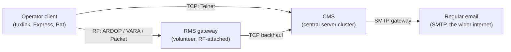

# The Winlink ecosystem

Winlink is a worldwide radio email system operated by the Amateur Radio Safety
Foundation (ARSF). It sits on top of standard amateur radio (HF, VHF, UHF) plus
a centralised internet backbone, and lets a licensed operator exchange email
with the regular internet from a station that may have no internet
connectivity of its own. The use cases that drive its design are emergency
communications (EmComm), maritime mobile operations, expedition and
back-country traffic, and routine emcomm training nets.

Three roles cooperate in every Winlink exchange:

## The CMS

The **Common Message Server** (CMS) is a redundant cluster of servers operated
by ARSF. It holds every operator's mailbox, routes messages between operators,
and gateways traffic to and from the wider internet via SMTP. The CMS is the
authoritative store: a message lives there until both ends have transferred
it. Operator clients are caches.

The CMS does not have a single hostname. There are multiple geographically
distributed endpoints; clients fall back across them. Tuxlink's wizard
defaults to the standard endpoint and offers an override in Settings for
operators who want to point at a development CMS for testing.

## RMS gateways

A **Radio Mail Server** (RMS) is a station — usually a single ham's
home installation — that bridges an RF link to the CMS over the internet.
The RMS volunteer runs gateway software (RMS Trimode, RMS Packet, RMS Relay,
or equivalent), keeps a working antenna up, and stays online so other
operators can reach the CMS via that RMS's frequency, mode, and bandwidth.

Three things characterise an RMS gateway: its **frequency**, its **mode**
(ARDOP, VARA HF, VARA FM, Packet), and its **footprint** (how far it
reasonably hears callers). The published gateway list — which Winlink
clients fetch periodically — names all of those plus the operator's grid
square. Picking the right gateway is part of the operator's job: a 200-mile
ARDOP gateway on the wrong band-condition day is worse than a 50-mile VARA
HF gateway on a good day.

Tuxlink's catalog request (see [Catalog requests](23-catalog-requests.md))
fetches the gateway list into the local message store. The gateway list is
not a connection registry — picking a gateway is still operator work.

## Operator clients

The operator's software runs the client side. Three implementations matter
for tuxlink's audience:

- **Winlink Express** — the official Windows client. The reference.
- **Pat** — open-source Go client, runs on Linux / macOS / Windows. The
  first viable alternative.
- **Tuxlink** — native Linux client. This guide.

All three speak the same protocol on the wire (B2F, see
[The B2F protocol](06-the-b2f-protocol.md)). What differs between them is the
user surface, the install footprint, and the bundled modem support. From the
CMS's perspective, a session from any of them looks the same.

## A typical session, end to end

A connect from tuxlink runs through this sequence:

1. The operator clicks **Connect** in tuxlink with a transport selected
   (Telnet, Packet, ARDOP, or VARA HF).
2. The transport opens — for RF this means the modem keys the radio and the
   handshake plays out over the air; for Telnet this means a TCP connect.
3. The CMS (or the RMS, which proxies for the CMS on RF transports)
   identifies the operator by callsign + password.
4. Both sides exchange **proposals** — one line per message they have for
   the other side, naming size and a unique message ID. Each side answers
   accept / reject / defer per proposal.
5. Accepted messages transfer.
6. Either side sends `FF` (or `FQ`) to end the exchange, and the connection
   closes.

This is the **two-pass model**: Outbox flush followed by Inbox pull, both
inside the same session. Most sessions complete in under a minute on
Telnet, a minute to several minutes on radio modes depending on band
conditions.

## Peer-to-peer

The same B2F protocol runs station-to-station with no CMS in the middle.
Peer-to-peer Winlink is operationally relevant for emcomm — when the
internet backbone is unreachable, two stations within RF range can still
exchange traffic. Tuxlink's peer-to-peer support is described in the
per-mode topics ([ARDOP](15-ardop-deep-dive.md), [VARA HF](16-vara-hf-deep-dive.md)).

## Where next

- [CMS and RMS gateways](05-cms-and-rms.md) — how the call routes.
- [The B2F protocol](06-the-b2f-protocol.md) — what runs underneath every session.
- [The mailbox model](07-mailbox-model.md) — Inbox, Outbox, Sent, persistence.
- [Picking a transport](08-picking-a-transport.md) — which transport when.
