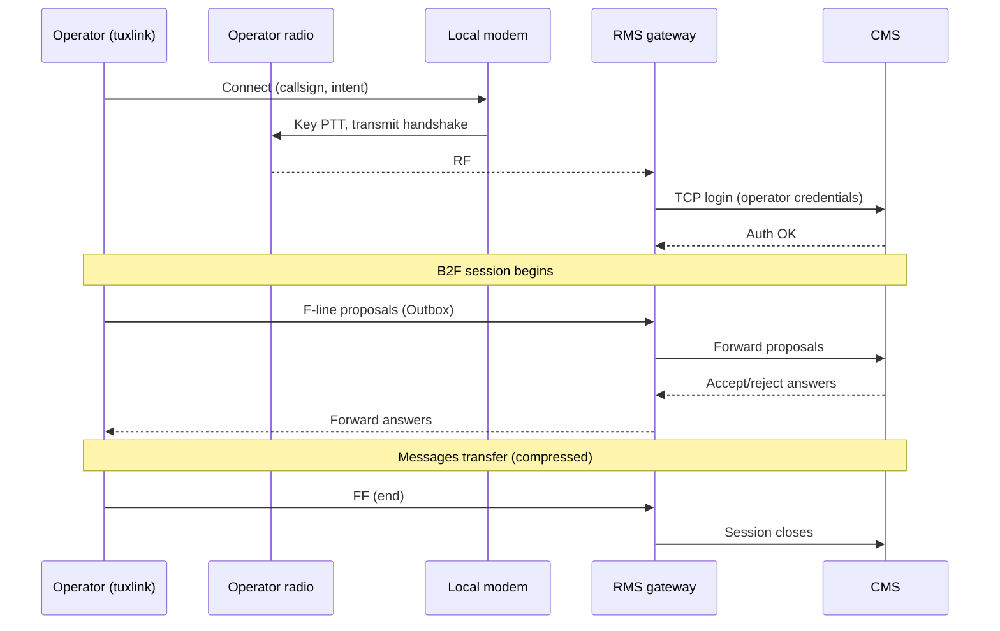

# CMS and RMS gateways

The Common Message Server (CMS) and the Radio Mail Server (RMS) gateway are
distinct pieces of infrastructure with distinct jobs. Understanding the
boundary matters for picking a transport, reading session logs, and
diagnosing failures.

## The CMS

The **CMS** is a server cluster operated by the Amateur Radio Safety Foundation.
It is the authoritative store of every operator's mailbox, the routing fabric
between operators, and the SMTP gateway between Winlink and the wider internet.

Key properties:

- **Authoritative storage.** A message lives on the CMS until both ends —
  the sender's client and the recipient's client — have transferred it. The
  client-side mailbox is a cache, not the source of truth.
- **Redundant cluster.** Multiple geographic endpoints front the same
  back-end. Clients failover between them; the operator usually does not
  need to pick one.
- **Authentication.** Every session authenticates by callsign + password.
  The password is registered with Winlink (out-of-band, the first time the
  operator sets up their account) and stored by the client.
- **Speaks B2F.** Every exchange uses the same protocol —
  [B2F](06-the-b2f-protocol.md) — whether the transport getting there is
  internet (Telnet) or radio (via an RMS).

The CMS is reachable two ways from a client like tuxlink: directly over
Telnet (TCP, internet), or indirectly via an RMS gateway over RF.

## RMS gateways

An **RMS gateway** is a volunteer-operated station that bridges between RF
and the CMS. The gateway has:

- A radio + antenna staying on a known frequency.
- A modem that decodes the relevant Winlink mode (Packet, ARDOP, VARA HF,
  VARA FM, PACTOR for licensed stations).
- A TCP / internet uplink to the CMS.
- Server software (RMS Trimode, RMS Packet, RMS Relay, equivalents) that
  proxies a B2F session between the RF link and the CMS.

An operator with no internet calls an RMS over the air. The RMS authenticates
the operator against the CMS, runs the B2F exchange, and routes the messages
through to the CMS, which then routes them on to their final destinations
(other Winlink callsigns or external email addresses).

## How a call routes

A typical RF Winlink connect looks like this from the operator's perspective:

The RMS is **transparent** to the protocol. Tuxlink negotiates with the CMS,
and the RMS is in the middle relaying lines. To tuxlink's session log, the
session looks identical to a direct Telnet session — same prompts, same
handshake, same disconnect lines. The only difference is the transport
underneath: the proposals, sizes, and answers are the same.

## Why this separation matters

The CMS / RMS split is what makes Winlink scale and survive bad days:

- **No-internet operating.** An operator at an EOC with no upstream internet
  reaches the CMS via any RMS within RF range.
- **Volunteer infrastructure.** No central agency runs every gateway. Hams
  set them up, keep them on the air, and retire them. Coverage maps shift.
- **Redundancy at the gateway tier.** When one RMS is off the air, the
  operator picks another. Modes and frequencies matter: a 40-meter ARDOP
  RMS at night may be hearable across a continent, while the same RMS at
  noon is unreachable.

## Picking a gateway

The operator (not tuxlink) picks the gateway for each radio connect. The
inputs are:

1. **Band conditions.** A propagation report (online or via past
   operating experience) suggests which bands are open between the operator
   and which regions.
2. **The gateway list.** Tuxlink fetches and caches the list via a
   [catalog request](23-catalog-requests.md). Each entry names callsign,
   frequency, mode, and the gateway operator's grid square.
3. **Recent reachability.** Past sessions inform whether a particular
   gateway has been reliable. RMS uptime varies.

Tuxlink does not auto-pick a gateway. The
[AutoConnect](29-troubleshooting.md#connect-button-does-nothing) helper, when
filled out in subsequent work, will sequence through gateways for an operator
who has set rules; until then, the operator names the target gateway before
each radio connect.

## Failures and what they mean

| Symptom | Where it's failing |
|---|---|
| Tuxlink connects but the RMS times out the login | RMS reached the CMS but CMS rejected the credentials |
| RMS never answers the call | No RF path (band conditions, gateway off the air, wrong frequency) |
| RMS answers, login OK, no message transfer | B2F session opened but disconnected mid-exchange (band condition collapse) |
| Telnet works, RF doesn't | Modem / radio / antenna chain, not the Winlink layer |

The session log (visible in the connection panel) carries the diagnostic
detail: which side disconnected, what the last line received was, whether
the failure was a timeout or a protocol error.

## Where next

- [The B2F protocol](06-the-b2f-protocol.md) — the message-exchange details.
- [Picking a transport](08-picking-a-transport.md) — which mode for which conditions.
- [ARDOP deep dive](15-ardop-deep-dive.md) — the ARDOP-specific behaviours.
- [VARA HF deep dive](16-vara-hf-deep-dive.md) — VARA's modes, bandwidth tiers, and wiring.
