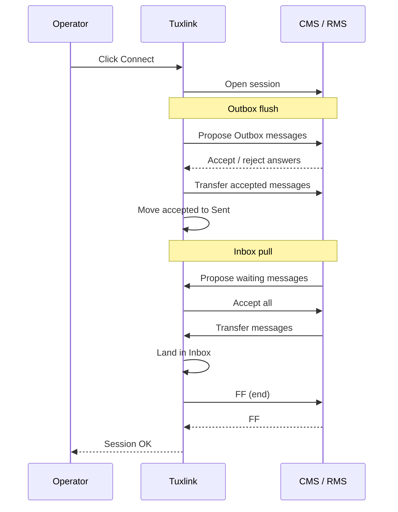

# The mailbox model

Tuxlink's mailbox is a local folder cache of the messages the operator has
sent or received via Winlink. The structure mirrors what Winlink Express and
Pat operators expect — Inbox, Outbox, Sent, Drafts, Archive — with a small
set of semantic refinements covered below.

## Folder semantics

| Folder | Holds | Lifecycle |
|---|---|---|
| **Inbox** | Messages received from the CMS, not yet archived | Stays until the operator moves to Archive or deletes |
| **Outbox** | Messages composed and queued for the next Connect | Empties as messages transfer to the CMS |
| **Sent** | Copies of messages successfully delivered | Persists indefinitely until archived or deleted |
| **Drafts** | Messages saved by the compose window without a Send | Persists until the operator opens and Sends, or discards |
| **Archive** | Manual long-term storage | The operator's responsibility to organise |
| **User folders** | Operator-created folders for organisation | See [User folders](22-user-folders.md) |

The folder semantics are deliberate. The Outbox is the **queue** — anything
in the Outbox is what the next Connect will attempt to send. The Sent
folder is **post-delivery confirmation** — a message moves there only after
the B2F session reports the CMS accepted it. A message that fails delivery
stays in the Outbox; the session log explains why.

## The two-pass model

Every Connect runs a two-pass exchange:

1. **Outbox flush.** Tuxlink offers every message in the Outbox as a B2F
   proposal. The other side answers per proposal. Accepted messages
   transfer; on a clean ack, tuxlink moves them from Outbox to Sent. On a
   reject, the message stays in the Outbox with the reject reason logged.
2. **Inbox pull.** The other side then offers any messages waiting for the
   operator. Tuxlink answers Y to each and stores accepted messages in the
   Inbox.

Both passes run in the same B2F session. Aborting mid-session is safe — any
not-yet-transferred messages stay in their pre-session folders.

## Persistence

Messages live at `~/.local/share/com.tuxlink.app/native-mbox/` as files.
Each folder is a subdirectory under that root; each message is one file
inside its folder. The format is B2F-style (the same compressed envelope
the protocol moves on the wire, plus a small per-message metadata
sidecar).

The mailbox is portable: copying the `native-mbox/` directory to another
machine moves the operator's history. The CMS-side state is unaffected —
deleting the local mailbox does not delete anything from the CMS, and
restoring an old mailbox does not resurrect messages that have since been
purged from the CMS.

A message is identified by its **MID** (message ID), a 10–12 character
opaque string generated when the message is composed. The MID is the
operator-facing handle in the message-list and the deduplication key on
the CMS side.

## Backup, import, and export

The current supported export path is a filesystem copy of the whole
`native-mbox/` directory while tuxlink is closed. Copy the entire directory,
not individual message files, so built-in folders, user folders, message
metadata, and searchable message bodies stay together.

Tuxlink does not yet provide an in-app Import / Export command, nor an
automatic Winlink Express or Pat archive converter. Operators migrating from
another client should keep the source client intact until the tuxlink mailbox
has been verified, and should treat any archive migration as a one-time
conversion step. See [Moving from other Winlink clients](32-from-express-or-pat.md)
for the migration sequence.

Direct filesystem copy is also the recovery path after a machine rebuild:
install tuxlink, quit it, replace the generated `native-mbox/` directory with
the backed-up copy, then relaunch. The CMS is not consulted during this step;
it restores local history only.

## Message states

A message moves through a small set of states:

- **Draft** — composed, not yet Sent. Lives in Drafts.
- **Outbound** — Sent from compose, queued for delivery. Lives in Outbox.
- **In flight** — currently being transferred during a B2F session.
  Tuxlink shows a transient marker in the message list; the folder
  membership doesn't change until the session ends.
- **Delivered** — CMS acknowledged. Lives in Sent.
- **Received** — pulled from CMS during Inbox pull. Lives in Inbox.
- **Archived** — explicitly moved by the operator. Lives in Archive.

The transitions are one-way except for Archive (the operator can move out
of Archive into any other folder).

## Search and the local archive

Every message in the local mailbox is indexed for full-text search via the
shell's built-in search surface (see [Search](21-search.md)). The index
covers headers (From, To, Subject), body text, and the MID. A search query
like `digirig sma` returns every message in the local archive whose body
mentions both terms.

The index is local — it does not query the CMS or the wider Winlink
network. To find a message that's no longer in the local mailbox, the
operator either restores from backup or accepts that the message is gone
(the CMS does not maintain message history past the delivery window).

## Why this model

The two-pass-per-session model and the local cache exist because Winlink
sessions are expensive: an HF radio session may consume 30 seconds to
several minutes of channel time. Batching all outbound + inbound traffic
into one session minimises airtime and lets the operator do other things
(compose, read, archive) between connects with no network involvement.

The local cache means the operator's archive is reachable offline. An
emcomm responder running tuxlink in a power-out scenario can still read
every message they have ever received from Winlink, without internet or
RF.

## Where next

- [Composing](19-composing.md) — drafts, Cc, attachments.
- [The mailbox](18-the-mailbox.md) — sorting, sidebar, message list.
- [User folders](22-user-folders.md) — creating, organising, sync.
- [Search](21-search.md) — token vocabulary for finding messages in the archive.
