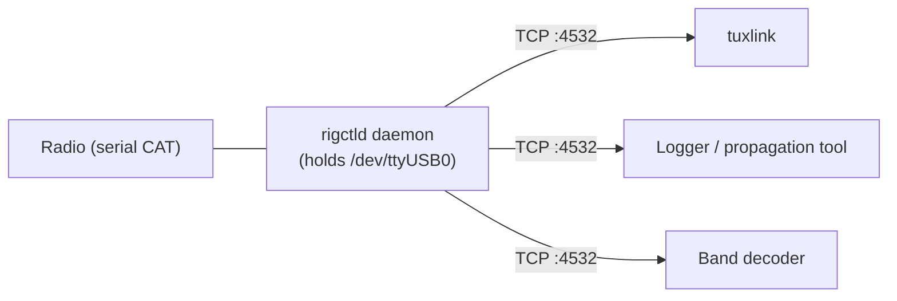

# CAT and rigctld

CAT — Computer Aided Tuning — is the serial protocol that lets a PC read and
set radio parameters: frequency, mode, split, VFO selection, transmit power,
and dozens of others. Hamlib's `rigctld` is the standard server that
exposes any CAT-capable radio over a single TCP port so multiple programs
can share the radio.

This topic covers when tuxlink benefits from CAT, the rigctld pattern, and
the common configurations.

## When CAT matters

CAT control is **optional** for tuxlink in the strict sense — a station
with a tuned-by-hand radio and a hardware PTT line can run Winlink without
any CAT involvement. CAT becomes valuable when:

- **Multiple modes are operationally relevant.** Switching from VARA HF to
  ARDOP to FM Packet without touching the radio means CAT can change the
  mode + filter settings.
- **Frequency hopping is expected.** Catalog requests fetch a gateway list
  with dozens of frequencies; pre-tuned hopping requires CAT.
- **PTT goes via CAT.** Some setups use CAT-command PTT rather than a
  hardware line (see [PTT methods overview](09-ptt-overview.md)).
- **Logging or propagation tooling shares the rig.** A logger like CQRLOG
  or a band-decoder needs to read the current frequency.

If none of these apply, CAT is a "nice to have." If two or more apply,
CAT via rigctld is the production-ready setup.

## The rigctld pattern

`rigctld` is a daemon that opens the radio's serial port once and exposes
it over TCP on port 4532 (by default). Every client — tuxlink, a logger,
a propagation tool — connects to rigctld over TCP, sends commands, and
reads responses.



Two problems are solved by this:

1. **Serial port exclusivity.** Without rigctld, only one process at a time
   can open the radio's CAT serial port. With rigctld, every client shares
   one underlying serial connection.
2. **Per-radio command translation.** Each radio has its own CAT command
   set (Kenwood / Yaesu / Icom / etc. all differ). `rigctld -m <model>`
   loads the right Hamlib backend; clients send standardised commands
   ("set frequency to 14070000") and rigctld translates.

## Starting rigctld

Manual one-shot for testing:

```bash
rigctld -m 3088 -r /dev/ttyUSB0 -s 19200 -t 4532
```

- `-m 3088` — the Hamlib model number for the Xiegu G90 (as of Hamlib
  master, June 2026). Other models: `1041` (FT-818), `2031` (TS-590S),
  `3073` (IC-7300), `3085` (IC-705), `1035` (FT-991/991A). `rigctl --list`
  enumerates every supported model; numeric IDs occasionally shift between
  Hamlib versions.
- `-r /dev/ttyUSB0` — the radio's CAT serial device. With the
  [DigiRig udev rule](10-digirig.md), this is `/dev/digirig-cat`.
- `-s 19200` — baud rate. Must match the radio's CAT-port setting.
- `-t 4532` — TCP port to expose. 4532 is the rigctld default.

For production, a systemd unit keeps rigctld running across reboots:

```ini
# /etc/systemd/system/rigctld.service
[Unit]
Description=Hamlib rigctld
After=network.target

[Service]
ExecStart=/usr/bin/rigctld -m 3088 -r /dev/digirig-cat -s 19200 -t 4532
Restart=on-failure

[Install]
WantedBy=multi-user.target
```

`sudo systemctl enable --now rigctld` brings the daemon up immediately and
on every boot.

## Verifying rigctld

Once rigctld is running, the `rigctl` client (note the missing `d`) tests
it from any shell:

```bash
rigctl -m 2 -r localhost:4532 F
```

- `-m 2` — the special "use rigctld" model, which tells rigctl to talk
  TCP to rigctld instead of opening the serial port directly.
- `-r localhost:4532` — where rigctld is listening.
- `F` — the command "get current frequency."

A working setup returns the frequency in hertz. A non-working setup
returns `RPRT -1` or a connection refused; the rigctld journal log
(`journalctl -u rigctld`) explains.

## Tuxlink's rigctld integration

Tuxlink reads the radio's frequency for display in the dashboard ribbon
and for catalog request preview. Per-mode panels also use CAT for the
operator-friendly "set radio to this gateway's frequency" button.

Configuration: **Tools → Settings → Radio → rigctld**. Fields:

- **Enabled** — toggle.
- **Host** — typically `localhost`.
- **Port** — typically `4532`.
- **Poll interval** — how often to refresh the frequency display. 1
  second is a sensible default; faster polls add load without operator
  benefit.

When rigctld is enabled, the dashboard's frequency display updates live
as the operator tunes the radio. When disabled, the display reads "No
CAT" and the gateway preview falls back to "verify frequency manually."

## CAT-PTT conflict avoidance

If tuxlink is configured to use CAT-command PTT, that command runs over
rigctld too — rigctld accepts a `T 1` / `T 0` (transmit on / off)
command from any client. The conflict to avoid: two programs sending
overlapping PTT commands.

If hardware PTT is in use (DigiRig PTT line, SignaLink hardware-PTT
mod), keep CAT-PTT off in tuxlink's config to avoid double-driving the
transmit line.

## Common configurations

| Setup | rigctld? | PTT source |
|---|---|---|
| Tuxlink only, hardware PTT (DigiRig) | Yes, for frequency display | Hardware (DigiRig RTS) |
| Tuxlink + logger, hardware PTT | Yes, shared via rigctld | Hardware (DigiRig RTS) |
| Tuxlink only, CAT-PTT | Yes | CAT command via rigctld |
| FM Packet only, fixed frequency, no logger | No, hand-tune | Hardware (DigiRig RTS) |

## Common failures

| Symptom | Cause |
|---|---|
| `rigctld: Permission denied: /dev/ttyUSB0` | User not in `dialout` group; or systemd unit running as `root` and the device-node permissions don't allow it |
| `RPRT -1` from `rigctl F` | rigctld can't reach the radio (cable, baud rate mismatch, radio in wrong CAT mode) |
| Frequency display in tuxlink stuck at 0.000 MHz | rigctld is running but the connection from tuxlink failed; check the configured host:port |
| Logger and tuxlink both freeze | One client is sending malformed commands; check rigctld logs to find the culprit |

## Where next

- [DigiRig setup](10-digirig.md) — physical wiring + udev rules.
- [Radio-specific notes](13-radio-specific-notes.md) — per-rig CAT model numbers and quirks.
- [PTT methods overview](09-ptt-overview.md) — when CAT-PTT is the right call.
- [Settings](27-settings.md) — the tuxlink-side rigctld configuration panel.
