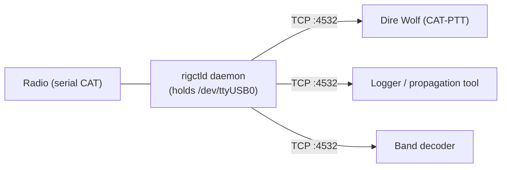

# CAT and rigctld

CAT — Computer Aided Tuning — is the serial protocol that lets a PC read and
set radio parameters: frequency, mode, split, VFO selection, transmit power,
and dozens of others. Hamlib's `rigctld` is the standard server that
exposes any CAT-capable radio over a single TCP port so multiple programs
can share the radio.

This topic covers rigctld as external infrastructure: what it is, when an
operator needs it, and how it relates to tuxlink's radio chain.

## Tuxlink does not drive CAT

Tuxlink bundles `rigctld` (Hamlib 4.6.2) and integrates rig-control support
in its settings. However, Tuxlink's dashboard does not display the radio's
live CAT frequency; tune the radio by hand to the frequency a gateway listing
names, then Connect. You only need rigctld running if other software on your
station needs to share the rig.

CAT via rigctld becomes valuable when:

- **Dire Wolf needs CAT-command PTT.** A Packet setup that keys the radio
  through CAT rather than a hardware PTT line points Dire Wolf at rigctld for
  PTT (see [PTT methods overview](09-ptt-overview.md)).
- **A logger or propagation tool shares the rig.** A logger like CQRLOG or a
  band decoder reads the current frequency from rigctld.
- **One daemon should own the serial port.** rigctld holds the CAT port once
  and lets every client share it instead of fighting over it.

For a tuxlink station with a hand-tuned radio and a hardware PTT line, rigctld
is not required at all.

## The rigctld pattern

`rigctld` is a daemon that opens the radio's serial port once and exposes
it over TCP on port 4532 (by default). Every client — Dire Wolf, a logger,
a propagation tool — connects to rigctld over TCP, sends commands, and
reads responses.



Two problems are solved by this:

1. **Serial port exclusivity.** Without rigctld, only one process at a time
   can open the radio's CAT serial port. With rigctld, every client shares
   one underlying serial connection.
2. **Per-radio command translation.** Each radio has its own CAT command
   set (Kenwood / Yaesu / Icom / etc. all differ). `rigctld -m <model>`
   loads the right Hamlib backend; clients send standardised commands
   ("set frequency to 14070000") and rigctld translates.

## Starting rigctld

Manual one-shot for testing:

```bash
rigctld -m 3088 -r /dev/ttyUSB0 -s 19200 -t 4532
```

- `-m 3088` — the Hamlib model number for the Xiegu G90 (as of Hamlib
  master, June 2026). Other models: `1041` (FT-818), `2031` (TS-590S),
  `3073` (IC-7300), `3085` (IC-705), `1035` (FT-991/991A). `rigctl --list`
  enumerates every supported model; numeric IDs occasionally shift between
  Hamlib versions.
- `-r /dev/ttyUSB0` — the radio's CAT serial device. With the
  [DigiRig udev rule](10-digirig.md), this is `/dev/digirig-cat`.
- `-s 19200` — baud rate. Must match the radio's CAT-port setting.
- `-t 4532` — TCP port to expose. 4532 is the rigctld default.

For production, a systemd unit keeps rigctld running across reboots:

```ini
# /etc/systemd/system/rigctld.service
[Unit]
Description=Hamlib rigctld
After=network.target

[Service]
ExecStart=/usr/bin/rigctld -m 3088 -r /dev/digirig-cat -s 19200 -t 4532
Restart=on-failure

[Install]
WantedBy=multi-user.target
```

`sudo systemctl enable --now rigctld` brings the daemon up immediately and
on every boot.

## Verifying rigctld

Once rigctld is running, the `rigctl` client (note the missing `d`) tests
it from any shell:

```bash
rigctl -m 2 -r localhost:4532 F
```

- `-m 2` — the special "use rigctld" model, which tells rigctl to talk
  TCP to rigctld instead of opening the serial port directly.
- `-r localhost:4532` — where rigctld is listening.
- `F` — the command "get current frequency."

A working setup returns the frequency in hertz. A non-working setup
returns `RPRT -1` or a connection refused; the rigctld journal log
(`journalctl -u rigctld`) explains.

## Tuxlink and CAT

Tuxlink bundles `rigctld` (Hamlib 4.6.2) and integrates it for full rig-control
support. Rig control works out of the box with no separate Hamlib installation
required. The Settings panel includes a `rigctld binary` option that defaults
to the bundled copy; you can override it with an absolute path to use your own
Hamlib installation if needed. The bundled copy is used deterministically
regardless of any system Hamlib version.

Tuxlink does not display the radio's live CAT frequency in the dashboard ribbon
(which shows the operator's identity and grid instead). When rig control is
configured, Tuxlink uses its bundled `rigctld` to set the radio's frequency and
mode for a session and to populate the rig-model picker; otherwise, tune the
radio by hand to the gateway's frequency before connecting. The bundled copy is
a private, short-lived helper for Tuxlink's own use, not a shared system daemon:
other CAT applications (Dire Wolf, loggers, propagation tools) use their own
Hamlib installation. Tuxlink's modems handle their transmit path independently —
ardopcf and VARA assert PTT through their own configuration, and the DigiRig's
hardware PTT line keys the radio directly (see [DigiRig setup](10-digirig.md)).

## CAT-PTT conflict avoidance

If Dire Wolf — or another tool — keys the radio via CAT, that `T 1` / `T 0`
(transmit on / off) command runs over rigctld, which accepts PTT from any
client. The conflict to avoid is two programs sending overlapping PTT commands
to the same rig.

If a hardware PTT line is in use (DigiRig PTT line, SignaLink hardware-PTT
mod), keep CAT-PTT off in every tool that could assert it, so the transmit
line is driven from one source only.

## Common configurations

| Setup | rigctld? | PTT source |
|---|---|---|
| Tuxlink + hardware PTT (DigiRig), no other rig software | Not needed | Hardware (DigiRig RTS) |
| Tuxlink + a logger sharing the rig | Yes, for the logger | Hardware (DigiRig RTS) |
| Packet via Dire Wolf with CAT-PTT | Yes, for Dire Wolf's PTT | CAT command via rigctld |
| FM Packet, fixed frequency, no logger | No, hand-tune | Hardware (DigiRig RTS) |

## Common failures

| Symptom | Cause |
|---|---|
| `rigctld: Permission denied: /dev/ttyUSB0` | User not in `dialout` group; or systemd unit running as `root` and the device-node permissions don't allow it |
| `RPRT -1` from `rigctl F` | rigctld can't reach the radio (cable, baud rate mismatch, radio in wrong CAT mode) |
| Frequency reads 0.000 MHz in a logger or rig-control tool | rigctld is running but that client's connection failed; check its configured host:port |
| A logger and Dire Wolf both freeze | One client is sending malformed commands; check rigctld logs to find the culprit |

## Where next

- [DigiRig setup](10-digirig.md) — physical wiring + udev rules.
- [Radio-specific notes](13-radio-specific-notes.md) — per-rig CAT model numbers and quirks.
- [PTT methods overview](09-ptt-overview.md) — when CAT-PTT is the right call.
