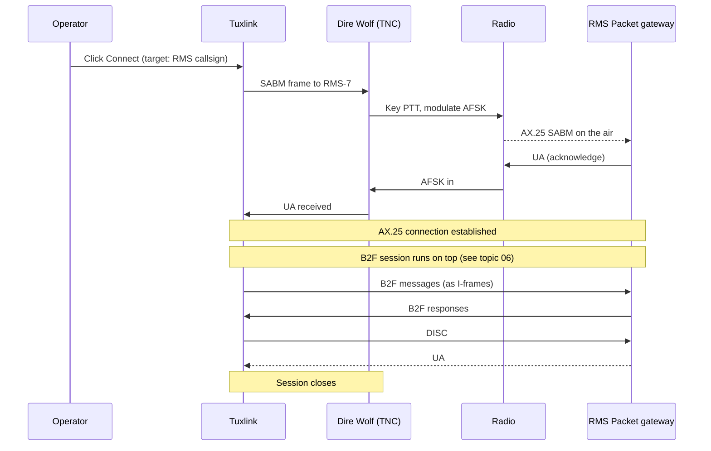

# Packet on AX.25

Packet radio carries Winlink traffic over AX.25 framing, typically at 1200
baud over FM VHF. It is the oldest Winlink transport, the simplest to set up,
and the right answer for short-range local emcomm and FM-only stations.

Tuxlink speaks AX.25 connected mode directly to a KISS-compatible TNC. The
KISS link runs over a TCP socket (the conventional Dire Wolf pattern) or a
serial port (hardware TNCs). The B2F session on top of AX.25 looks identical
to the B2F session on any other transport — only the framing underneath
changes.

## The AX.25 layer

AX.25 is a packet protocol — variable-length frames carrying addressing,
control, and payload over a half-duplex RF link. The protocol-relevant
properties:

- **Frame size.** Tuxlink defaults to `paclen = 128` bytes of payload per
  I-frame (the AX.25 I-frame is the type that carries data). The AX.25
  standard allows up to 256, and some networks negotiate higher via
  extended mode, but 128 is the conservative interoperable default
  tuxlink ships.
- **Window size.** Tuxlink defaults to `maxframe = 4` — up to four
  unacknowledged I-frames in flight at once. The mod-8 numbering AX.25
  uses caps the window at 7.
- **Addressing.** Source + destination callsigns, optionally with a path
  of digipeaters. Each callsign carries a `-N` SSID suffix (`-7` is the
  Winlink convention for the operator's mailbox endpoint).
- **Modulation.** 1200-baud AFSK over FM, the Bell 202 standard the
  amateur packet network adopted in the 1980s. Two audio tones — 1200 Hz
  (mark) and 2200 Hz (space) — carry the bit stream.
- **Connected mode.** Two stations establish a virtual circuit (the SABM
  / UA handshake), exchange numbered I-frames, and tear down with DISC.
  Frames are acknowledged; missed frames are retransmitted. This is the
  mode Winlink uses.

Tuxlink's AX.25 implementation is in `src-tauri/src/winlink/ax25/` —
codec, KISS framing, datalink state machine, link layer. The implementation
is mentioned here because session-log diagnostics reference these layers
when something goes wrong.

## KISS — the host-to-TNC protocol

KISS (Keep It Simple, Stupid) is the protocol between tuxlink and the TNC.
The TNC owns the radio-side details — bit stuffing, frame check sequence,
modulator timing — and exposes the host side as a simple byte stream where
each frame is wrapped in `FEND` markers.

Dire Wolf is the open-source software TNC almost universally used for
Winlink Packet on Linux. It runs as a daemon, listens on a TCP port (8001
by default), and accepts KISS frames from clients (tuxlink, in this case).
Dire Wolf handles the AFSK modulation, the radio's PTT, and the on-air
timing.

Managed packet mode runs Dire Wolf for the operator: pick a sound card, a
PTT line, and a callsign in the packet panel, and tuxlink generates the
configuration, launches Dire Wolf, and shuts it down on disconnect. The
`.deb` package installs Dire Wolf as a `Recommends`, so a standard
`apt install tuxlink` pulls it in automatically. If Dire Wolf is absent —
a slimmed install, or a system whose repositories lack it — managed mode
reports it by name; install it with `sudo apt install direwolf`, or switch
to a bring-your-own KISS endpoint (TCP, serial, or Bluetooth) and supply
an external TNC. The remainder of this section covers the manual
configuration a bring-your-own endpoint uses.

Configuration:

```
# /etc/direwolf.conf (excerpt)
ADEVICE plughw:1,0     # ALSA device — the DigiRig USB sound card
CHANNEL 0
MYCALL <your-callsign>-7
MODEM 1200             # 1200 baud AFSK
PTT RIG 2 4532         # rigctld PTT, or PTT GPIO N for a wired line
KISSPORT 8001          # the TCP port tuxlink connects to
```

After starting Dire Wolf, tuxlink's Packet configuration uses:

- **KISS host:** `localhost`
- **KISS port:** `8001`
- **SSID:** the SSID suffix to attach to the operator's callsign (`-7` by
  convention; `-10` for some emcomm networks)

The SSID picker in the dashboard ribbon attaches `-N` to the callsign for
each AX.25 session. Pick a SSID the local network reserves for Winlink —
the SSID convention is a local-network decision, not a hard rule.

## A Packet session, end to end

> [!WARNING]
> **Connect is on-air transmission.** Pressing Connect on a Packet
> transport keys the radio via Dire Wolf and transmits an AX.25 SABM
> frame on the configured frequency under the operator's callsign.
> Confirm: (a) you're on a frequency you're licensed for, (b) the radio
> is on a band-appropriate antenna, (c) the radio's power switch is
> reachable. The Connect button is the per-session licensee consent
> gate.



The B2F session running on top is the same one described in
[The B2F protocol](06-the-b2f-protocol.md) — the AX.25 layer just frames
the lines for over-the-air transport.

## Bandwidth and message size

1200-baud AX.25 is **slow**. The on-air bit rate is 1200 bits per second
(150 bytes per second at the link layer); after AX.25 framing overhead
(addressing, control, FCS), B2F's per-message header, and the
acknowledgement round trips, the operator-visible throughput is in the
50–100 bytes per second range on a clean local channel — significantly
less on a noisy channel with retransmissions. Order-of-magnitude planning:
a 1 KB message takes tens of seconds; a 10 KB message takes several
minutes; a 100 KB message takes the better part of an hour.

Practical limits:

- **Plain text messages: fine.** Most operating traffic.
- **ICS-213 forms: fine.** A few hundred bytes.
- **Photos, attachments, large catalogs: not fine.** A 100 KB attachment
  takes 20+ minutes of continuous airtime — antisocial on a shared packet
  frequency and brittle to RF dropout.

For attachment-heavy traffic, ARDOP or VARA HF is the right tool. Packet
is the right tool for short messages, fast turnaround, and local networks.

## When Packet is the right answer

| Scenario | Why Packet |
|---|---|
| Local emcomm net (1–50 mile radius, VHF) | Direct line-of-sight; FM is robust against weak signals |
| Training stations and demos | Simplest setup; no licensing tier above Technician |
| Backup to HF when bands are out | The ionosphere doesn't matter on VHF |
| ARES / neighborhood nets | Many existing Packet gateways on VHF; well-established practice |
| Daily routine traffic at home (short messages) | Reliable, no Wine, no licensing |

## When Packet is not the right answer

| Scenario | Better choice |
|---|---|
| Long-range emcomm (>100 miles) | ARDOP or VARA HF |
| Large attachments | VARA HF (or skip RF entirely with Telnet) |
| Spotty conditions, no nearby VHF gateway | ARDOP on HF |
| Operating from a mountain or backpack with no VHF coverage | ARDOP (more robust at low SNR) |

## Dire Wolf gotchas

| Symptom | Cause |
|---|---|
| `Could not open audio device plughw:1,0` | Wrong ALSA card number; check `aplay -l` |
| Tuxlink connects to KISS port, no frames go out | PTT path broken; check `direwolf -t 1` for transmit-only test |
| Frames go out, RMS doesn't answer | Wrong frequency, RMS busy, or audio level too low / too high |
| Connection drops mid-session | RF dropout (mobile / portable), or PTT release timing too tight |
| `Bad CRC` errors in Dire Wolf log | RX audio too low or distorted; recalibrate |

The Dire Wolf log (`direwolf` running in a terminal) is the diagnostic of
record for the radio layer. Tuxlink's session log shows the B2F exchange
on top; the two together explain most failures.

## Where next

- [The B2F protocol](06-the-b2f-protocol.md) — what runs on top of AX.25.
- [PTT methods overview](09-ptt-overview.md) — including Dire Wolf's PTT integration.
- [Choosing the right mode](17-choosing-the-right-mode.md) — Packet vs ARDOP vs VARA decision tree.
- [DigiRig setup](10-digirig.md) — the canonical sound-card + PTT chain Dire Wolf uses.
