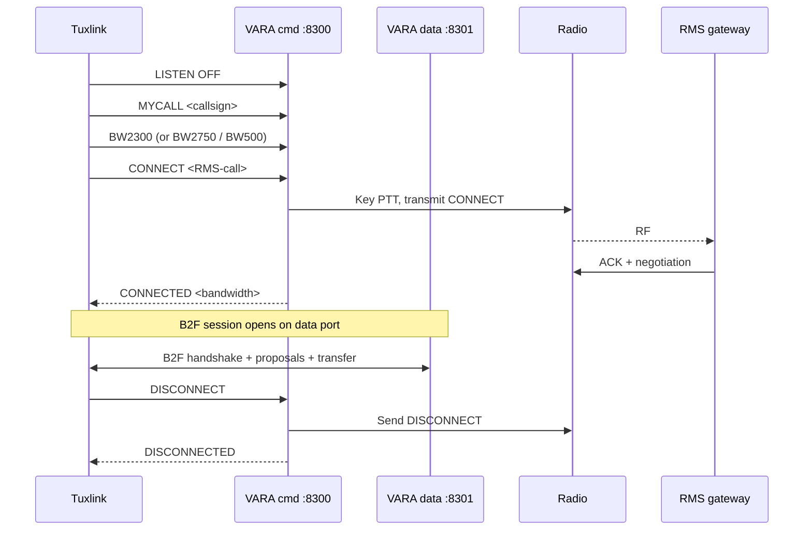

# VARA HF deep dive

VARA is a high-performance HF data mode for amateur radio, developed and
maintained by EA5HVK. It is one of the two HF data modes Winlink supports
(the other is ARDOP). VARA is faster than ARDOP on a clean channel,
generally more robust at low SNR, and the de-facto choice for many active
HF Winlink operators — but it has licensing tiers, runs only as a Windows
binary (requiring Wine on Linux), and is closed source.

Tuxlink does not bundle VARA. The operator installs and runs VARA HF
separately; tuxlink connects to its TCP command + data ports.

This topic covers the tier model, the Wine setup on Linux, the tuxlink-side
wiring, and the operator-visible behaviours.

## Bandwidth modes and licensing

VARA HF exposes three on-air bandwidth modes. Tuxlink's wire codec
(`src-tauri/src/winlink/modem/vara/command.rs`) names them by their
`BW<hz>` wire tokens:

| Mode | Bandwidth | Wire token | Licensing |
|---|---|---|---|
| **Narrow** | 500 Hz | `BW500` | Available across tiers |
| **Standard** | 2300 Hz | `BW2300` | Free / Standard tier |
| **Tactical / Wide** | 2750 Hz | `BW2750` | Paid tier |

The licensing tier is a property of the VARA installation, not tuxlink.
A tuxlink station running the free VARA tier sends `BW2300` over the
command port the same way a paid-tier station sends `BW2750`; the modem
decides on-air what is allowed.

**Operationally confirmed from this project:** VARA HF Standard (2300 Hz)
working against real RMS gateways on a Xiegu G90 (per the project's
firsthand-operation memory). Narrow and Tactical have not been
separately confirmed by this project, though tuxlink's wire codec sends
the right tokens for each.

For an EmComm-ready Linux station, the Standard tier covers most
operating scenarios. Tactical's wider bandwidth produces faster
throughput on a clean channel; Narrow is a fallback for very poor
conditions where 500 Hz is the only bandwidth that survives.

## VARA on Linux (Wine)

VARA is a native Windows binary. Running it on Linux means running it under
Wine. The Linux-amateur community has well-documented Wine setups that
work; the broad strokes:

1. **Install Wine.** A recent version (8.x or later) from your distribution.
2. **Install VARA HF.** Downloaded from the EA5HVK site, installed under
   Wine via `wine VaraHF_setup.exe`.
3. **Configure audio routing.** Wine sees ALSA / PulseAudio devices via
   its own audio driver. The VARA in-app **Setup → Sound Card** menu
   lists what Wine exposes.
4. **Configure CAT / PTT inside VARA.** VARA can drive CAT and PTT
   itself, but the common pattern is letting tuxlink (or whatever drives
   PTT externally) handle that, and VARA's PTT setting stays "External."

> [!NOTE]
> **Pi 5 16k-page-kernel constraint.** A Raspberry Pi 5 running the
> default 16K-page kernel (`kernel_2712.img`) cannot run Wine — `wineboot
> --init` hard-fails on the 16K page size. To run VARA on a Pi 5, switch
> to the 4K-page kernel (`kernel8.img`) via `/boot/firmware/config.txt`
> and reboot. Alternative: run VARA on an x86 machine (laptop, mini-PC)
> on the same network and connect tuxlink to it over TCP.

The Wine-on-Linux story is workable but is not the focus of this project.
For a station that prefers staying off Wine, [ARDOP](15-ardop-deep-dive.md)
is the open native alternative.

## VARA's TCP interface

Once running, VARA exposes two TCP sockets:

- **Command port** (default `8300`) — control commands (LISTEN, CONNECT,
  DISCONNECT, BW, etc.) and asynchronous events back to the host.
- **Data port** (default `8301`) — the bytestream of decoded data
  in / data to send out.

VARA runs as a Windows GUI app even under Wine. The GUI shows the operating
state (idle / connecting / connected) and the waterfall — useful for the
operator's situational awareness but not strictly required for tuxlink to
operate.

Tuxlink connects to both ports over TCP. The VARA HF radio panel includes
the configuration:

- **Host** — typically `127.0.0.1` if VARA runs on the same machine.
  Remote VARA setups (VARA on a Windows box, tuxlink on a Linux laptop)
  populate the LAN IP.
- **Command port** — `8300` default.
- **Data port** — `8301` default.
- **Bandwidth** — optional override. Empty means "leave VARA at its
  configured default."

The "Bandwidth" override exists because the radio panel can pin the
session's on-air bandwidth — useful for gateway-specific tuning where the
RMS expects a specific bandwidth.

## A typical VARA session

> [!WARNING]
> **Connect is on-air transmission.** Pressing Connect on a VARA HF
> transport initiates a VARA CONNECT request that transmits under the
> operator's callsign — call frame, then the negotiated ARQ session.
> Confirm: (a) you're on a frequency you're licensed for, (b) the
> catalog-suggested RMS frequency is correct, (c) the radio's power
> switch is reachable. The Connect button is the per-session licensee
> consent gate.

The exchange:

1. Tuxlink connects to VARA's command port (TCP).
2. Tuxlink sends `LISTEN OFF` and the per-session configuration
   (bandwidth, my-call).
3. Tuxlink sends `CONNECT <RMS-call>`.
4. VARA transmits the on-air CONNECT frame and waits for the RMS to ACK.
5. VARA negotiates bandwidth (within the licensed tier) and modulation
   based on the perceived link quality.
6. Once connected, the B2F session opens over the data port (see
   [topic 06](06-the-b2f-protocol.md)).
7. The session ends; VARA sends DISCONNECT; the channel is released.

The session log carries VARA's state-change messages plus the B2F
exchange — same shape as the ARDOP session log, different modem
underneath.

## Audio calibration

VARA is, if anything, more demanding than ARDOP on audio calibration. The
modem's GUI shows a level meter; the standard procedure:

1. Set the radio to USB / USB-D, clean 2700 Hz audio bandwidth.
2. Disable AGC slow-attack, noise reduction, notch, anything that warps
   the audio.
3. Send a calibration tone from VARA's GUI ("Tune" button); adjust the
   radio's TX audio level so VARA's level meter reads in the green
   (typically -10 dB to -3 dB; check VARA documentation for the exact
   target).
4. Listen on a second receiver for spectrum cleanliness.

Cameron has operated VARA HF Standard 2300 Hz on a Xiegu G90 against real
RMS gateways — the calibration procedure above produces a working signal
out of the box for that combination.

## Peer-to-peer

VARA supports peer-to-peer mode, in which two stations connect directly
without an RMS. The session runs the same B2F dance at the application
layer; the difference is that both ends authenticate as operator callsigns
rather than the gateway side authenticating as an RMS.

Tuxlink's VARA radio panel opens and closes the TCP transport to the
operator's VARA instance and runs the CMS/RMS path. RF connect-to-peer
over VARA is pending — it needs the peer-to-peer session state machine and
the per-session consent flow, which are not yet shipped. The VARA CMS/RMS
flow is the supported VARA path today.

## VARA FM — the FM counterpart

This topic is HF-focused, but tuxlink also supports **VARA FM** — the
VHF / UHF FM-band variant. VARA FM uses the same TCP command + data
protocol as VARA HF, which is why tuxlink's single Vara radio panel
handles both modes. The operator chooses by pointing tuxlink at the
appropriate VARA instance.

What is different about VARA FM:

| Property | VARA HF | VARA FM |
|---|---|---|
| RF band | HF SSB | VHF / UHF FM |
| Bandwidth | 500 / 2300 / 2750 Hz tiers | Single tier, ~6800 Hz |
| Licensing tier model | Standard (free) + Tactical (paid) | One mode, no on-wire tier negotiation |
| Audio chain | USB / USB-D, clean 2700 Hz bandwidth, AGC off | FM repeater audio (wider, less critical to calibrate) |
| Use cases | Long-distance HF emcomm + ham mail | Local emcomm faster than 1200-baud Packet on the same VHF chain |

What is the same:

- The TCP socket pair (`command` + `data` ports). Operators
  conventionally run VARA FM on different ports than VARA HF (commonly
  `8400/8401` vs the VARA HF default of `8300/8301`) so both binaries
  can coexist on one host. The wire protocol on the ports is the same.
- The B2F application layer runs over the data port unchanged.
- The Wine-on-Linux constraint applies to both binaries (Pi 5
  16k-page-kernel block included).
- The licensing tier setting in VARA HF (paid Tactical) does not apply
  to VARA FM; VARA FM is shipped as a single-tier free download from
  the EA5HVK site at time of writing.

The tuxlink radio panel's **Bandwidth** dropdown lists the HF presets
(500, 2300, 2750). For VARA FM, the operator selects **Auto (VARA
default)** — the panel does not currently surface a `6800 Hz` preset
explicitly, but VARA FM's binary defaults to the right bandwidth on its
own. The Auto setting means "don't send a `BW` command on session
start, let VARA use whatever is configured in its GUI."

Operationally, VARA FM is the mode of choice when:

- A 1200-baud Packet gateway is the only Winlink option locally, and
  the operator wants higher throughput on the same VHF chain.
- The local repeater system happens to have a VARA FM RMS riding it
  (this varies dramatically by region).
- Local emcomm nets have standardized on VARA FM for higher-payload
  exchanges than packet supports.

Coverage is regional. Some areas have several VARA FM gateways; many
areas have none. The catalog (see [topic 23](23-catalog-requests.md))
identifies gateways by mode — `vara-fm` rows in the catalog are the
ones to look for.

## Common failure modes

| Symptom | Cause |
|---|---|
| Tuxlink reports "VARA unreachable" | VARA isn't running; or `Host`/`Port` mismatch in the radio panel |
| Wine `wineboot --init` fails on Pi 5 | 16K page-size kernel; switch to `kernel8.img` |
| VARA GUI shows "Listening" but no incoming connect detected | Audio chain not routing RX correctly; check the sound-card selection inside VARA's Setup |
| Connection negotiates but no data transfers | Audio level off; or the B2F handshake is failing — check the session log |
| Sessions complete but throughput is far below VARA's published numbers | Wrong bandwidth tier (you're stuck at Standard but expecting Tactical), or noisy channel |
| "Authentication failed" on connect | Callsign tier mismatch (the RMS requires a registered callsign and yours isn't); or password is wrong |

## Where next

- [ARDOP deep dive](15-ardop-deep-dive.md) — the open alternative.
- [Choosing the right mode](17-choosing-the-right-mode.md) — when VARA wins.
- [The B2F protocol](06-the-b2f-protocol.md) — the application layer above the modem.
- [Radio-specific notes](13-radio-specific-notes.md) — VARA-confirmed rig configurations.
