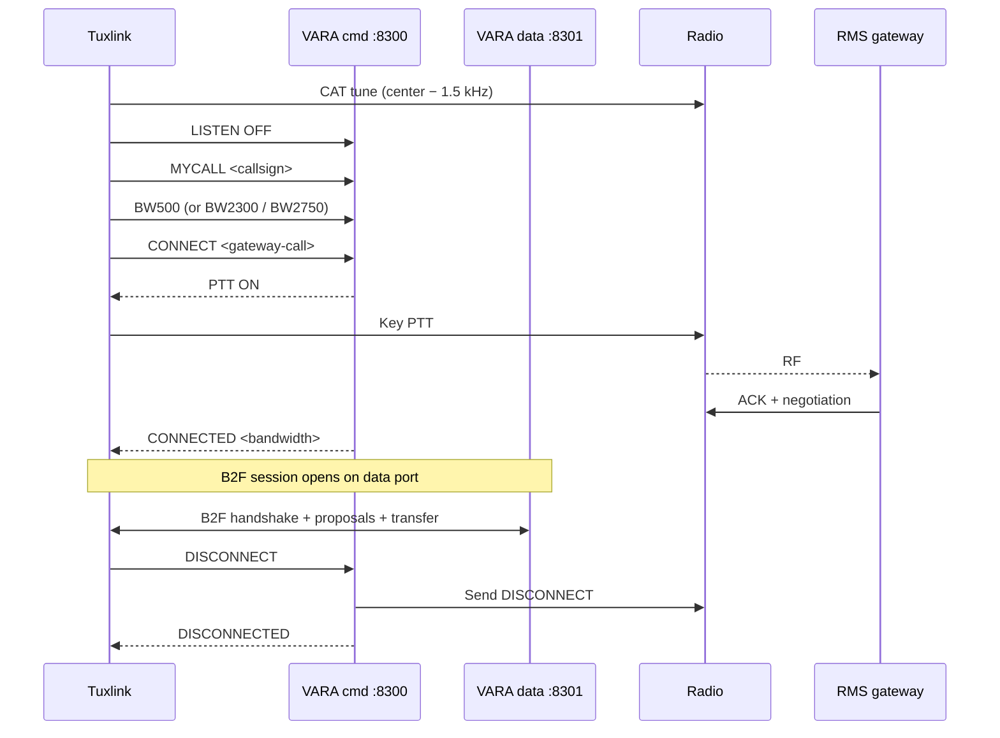

# VARA HF deep dive

VARA is a high-performance HF data mode for amateur radio, developed and
maintained by EA5HVK. It is one of the two HF data modes Winlink supports
(the other is ARDOP). VARA is faster than ARDOP on a clean channel,
generally more robust at low SNR, and the de-facto choice for many active
HF Winlink operators — but it has licensing tiers, runs only as a Windows
binary (requiring Wine on Linux), and is closed source.

Tuxlink cannot bundle VARA (it is proprietary), but it ships a guided
setup flow that installs VARA HF under Wine from an installer the
operator downloads (see "Guided setup" below). At run time, tuxlink
connects to VARA's TCP command + data ports.

Tuxlink's VARA HF dialing works end to end on the air: the CAT tune,
PTT keying on VARA's PTT events, a bandwidth-selectable connect
request, the gateway's answer, ARQ link establishment, and the B2F
handshake over the RF link. Full message exchange with the production
Winlink CMS over RF awaits Winlink's registration of the Tuxlink
client type — the same registration step that gates production-CMS
message exchange on every transport (RF gateways relay to the
production CMS, which rejects unregistered clients; the Winlink test
server accepts them). Peer-to-peer sessions do not involve the CMS.

This topic covers the tier model, the Wine setup on Linux, the tuxlink-side
wiring, and the operator-visible behaviours.

## Bandwidth modes and licensing

VARA HF exposes three on-air bandwidth modes. Tuxlink names them by
their `BW<hz>` wire tokens:

| Mode | Bandwidth | Wire token | Licensing |
|---|---|---|---|
| **Narrow** | 500 Hz | `BW500` | Available across tiers |
| **Standard** | 2300 Hz | `BW2300` | Free / Standard tier |
| **Tactical / Wide** | 2750 Hz | `BW2750` | Paid tier |

The licensing tier is a property of the VARA installation, not tuxlink.
A tuxlink station running the free VARA tier sends `BW2300` over the
command port the same way a paid-tier station sends `BW2750`; the modem
decides on-air what is allowed.

**Operationally confirmed:** Narrow (500 Hz) has linked against a real
RMS gateway on HF, holding the link at signal levels well below the
noise floor — a verified session ran at S/N −11.8 dB at roughly
41 bit/s: slow, but solid. Standard (2300 Hz) has established full ARQ
links between two local stations over RF, with the called station
answering and the exchange completing. Tactical sends the right wire
token but has not been separately confirmed on the air.

For an EmComm-ready Linux station, the Standard tier covers most
operating scenarios. Tactical's wider bandwidth produces faster
throughput on a clean channel; Narrow is a fallback for very poor
conditions where 500 Hz is the only bandwidth that survives.

**Match the bandwidth to the channel.** Gateway listings advertise each
channel's VARA bandwidth (500 / 2300 / 2750 Hz) and its operating
hours. The gateway decodes connect requests only at the channel's
advertised bandwidth — a channel listed as VARA 500 cannot decode a
2300 Hz connect request, and the call goes unanswered. Select the
bandwidth in the VARA radio panel (or via configuration) to match the
channel being called.

## VARA on Linux (Wine)

VARA is a native Windows binary. Running it on Linux means running it under
Wine.

### Guided setup

Tuxlink drives the whole Wine provisioning as a guided flow with a live
checklist: system dependencies (Wine), the Wine prefix, the VARA HF
installation, the Visual Basic 6 runtime, the OCX controls, a launch +
connection check, and auto-start on login. Because VARA is proprietary,
the flow cannot download it — the operator downloads the installer from
the VARA author's page (rosmodem.wordpress.com, EA5HVK) in a browser
and points tuxlink at the `.exe`.

Two entry points:

- the first-run wizard's **Set up VARA HF (optional)** step, and
- the VARA radio panel's **Set up VARA HF…** button — for setting up
  later, or re-checking after an upgrade.

The guided flow needs an x86-64 Linux host and a working internet
connection, so run it before deploying — it cannot install VARA in the
field. Once set up, VARA starts with tuxlink automatically.

### Manual setup

The Linux-amateur community also has well-documented manual Wine setups
that work; the broad strokes:

1. **Install Wine.** A recent version (8.x or later) from your distribution.
2. **Install VARA HF.** Downloaded from the EA5HVK site, installed under
   Wine via `wine VaraHF_setup.exe`.
3. **Configure audio routing.** Wine sees ALSA / PulseAudio devices via
   its own audio driver. The VARA in-app **Setup → Sound Card** menu
   lists what Wine exposes.
4. **Configure CAT / PTT inside VARA.** VARA can drive CAT and PTT
   itself, but the common pattern is letting tuxlink (or whatever drives
   PTT externally) handle that, and VARA's PTT setting stays "External."

> [!NOTE]
> **VARA does not run on ARM.** VARA is an x86 Windows binary; an ARM
> host (Raspberry Pi and similar) cannot run it usefully — even under
> x86 emulation layers, VARA refuses to transmit. On ARM hardware,
> either run VARA on an x86 machine (laptop, mini-PC) on the same
> network and point tuxlink's VARA panel at it over TCP, or use
> [ARDOP](15-ardop-deep-dive.md), which is native on ARM.

The Wine-on-Linux story is workable, and the guided setup absorbs most
of its friction. For a station that prefers staying off Wine entirely,
[ARDOP](15-ardop-deep-dive.md) is the open native alternative.

## VARA's TCP interface

Once running, VARA exposes two TCP sockets:

- **Command port** (default `8300`) — control commands (LISTEN, CONNECT,
  DISCONNECT, BW, etc.) and asynchronous events back to the host.
- **Data port** (default `8301`) — the bytestream of decoded data
  in / data to send out.

VARA runs as a Windows GUI app even under Wine. The GUI shows the operating
state (idle / connecting / connected) and the waterfall — useful for the
operator's situational awareness but not strictly required for tuxlink to
operate.

Tuxlink connects to both ports over TCP. The VARA HF radio panel includes
the configuration:

- **Host** — typically `127.0.0.1` if VARA runs on the same machine.
  Remote VARA setups (VARA on a Windows box, tuxlink on a Linux laptop)
  populate the LAN IP.
- **Command port** — `8300` default.
- **Data port** — `8301` default.
- **Bandwidth** — the session's on-air bandwidth (500 / 2300 / 2750 Hz),
  or Auto to leave VARA at its configured default. Set it to match the
  target channel's advertised bandwidth (see above).
- **Center freq (MHz)** — the target channel's audio-center frequency,
  the number the catalog shows. The panel shows the derived **USB
  dial** frequency as a hint; the CAT tune dials the rig 1.5 kHz below
  the entered center (see "Frequency: enter the center" below).

## A typical VARA session

> [!WARNING]
> **Connect is on-air transmission.** Pressing Connect on a VARA HF
> transport initiates a VARA CONNECT request that transmits under the
> operator's callsign — call frame, then the negotiated ARQ session.
> Confirm: (a) you're on a frequency you're licensed for, (b) the
> catalog-suggested RMS frequency is correct, (c) the radio's power
> switch is reachable. The Connect button is the per-session licensee
> consent gate.

### Frequency: enter the center

Winlink catalogs and gateway listings publish **audio-center**
frequencies. The rig's USB dial frequency sits 1500 Hz below that
center. Tuxlink converts automatically: enter the center — the number
the catalog shows — in the panel's **Center freq (MHz)** field, and
the CAT tune (via hamlib `rigctld`) dials the rig to center − 1.5 kHz.
The panel shows the derived **USB dial** frequency as a hint so the
two numbers never get confused. Dialing the published number directly
on the rig puts the signal 1.5 kHz off the gateway's passband — the
most common self-inflicted "nobody answers."

### Address the exact callsign

Gateway callsigns can carry SSIDs (for example `XX1XXX-10`). The
connect request must address the exact callsign the gateway operates
under — calling the base callsign when the gateway listens as `-10`
goes unanswered.

### The exchange

1. Tuxlink tunes the rig over CAT to the entered center − 1.5 kHz.
2. Tuxlink connects to VARA's command port (TCP).
3. Tuxlink sends `LISTEN OFF` and the per-session configuration
   (bandwidth, my-call).
4. Tuxlink sends `CONNECT <gateway-call>`.
5. VARA raises `PTT ON` / `PTT OFF` on the command port; tuxlink keys
   the rig on those events (VARA is a soundcard modem with no PTT of
   its own) while VARA transmits the on-air CONNECT frame and waits
   for the gateway to ACK.
6. VARA negotiates bandwidth (within the licensed tier) and modulation
   based on the perceived link quality.
7. Once connected, the B2F session opens over the data port (see
   [topic 06](06-the-b2f-protocol.md)).
8. The session ends; VARA sends DISCONNECT; the channel is released.

The session log carries VARA's state-change messages plus the B2F
exchange — same shape as the ARDOP session log, different modem
underneath.

## Audio calibration

VARA is, if anything, more demanding than ARDOP on audio calibration. The
modem's GUI shows a level meter; the standard procedure:

1. Set the radio to USB / USB-D, clean 2700 Hz audio bandwidth.
2. Disable AGC slow-attack, noise reduction, notch, anything that warps
   the audio.
3. Send a calibration tone from VARA's GUI ("Tune" button); adjust the
   radio's TX audio level so VARA's level meter reads in the green
   (typically -10 dB to -3 dB; check VARA documentation for the exact
   target).
4. Listen on a second receiver for spectrum cleanliness.

VARA HF on a Xiegu G90 against real RMS gateways is a confirmed working
combination — the calibration procedure above produces a working signal
out of the box for it.

## Peer-to-peer

VARA supports peer-to-peer mode, in which two stations connect directly
without an RMS. The session runs the same B2F dance at the application
layer; the difference is that both ends authenticate as operator callsigns
rather than the gateway side authenticating as an RMS.

Tuxlink exposes peer-to-peer VARA alongside the CMS path: one station
arms Listen in the Peer-to-peer VARA connection, the other connects
(see [Picking a transport](08-picking-a-transport.md) for the
walkthrough). Because no CMS is in the path, peer-to-peer sessions are
unaffected by the production-CMS client registration that currently
gates CMS message exchange.

## VARA FM — the FM counterpart

This topic is HF-focused, but tuxlink also supports **VARA FM** — the
VHF / UHF FM-band variant. VARA FM uses the same TCP command + data
protocol as VARA HF, which is why tuxlink's single Vara radio panel
handles both modes. The operator chooses by pointing tuxlink at the
appropriate VARA instance.

What is different about VARA FM:

| Property | VARA HF | VARA FM |
|---|---|---|
| RF band | HF SSB | VHF / UHF FM |
| Bandwidth | 500 / 2300 / 2750 Hz tiers | Single tier, ~6800 Hz |
| Licensing tier model | Standard (free) + Tactical (paid) | One mode, no on-wire tier negotiation |
| Audio chain | USB / USB-D, clean 2700 Hz bandwidth, AGC off | FM repeater audio (wider, less critical to calibrate) |
| Use cases | Long-distance HF emcomm + ham mail | Local emcomm faster than 1200-baud Packet on the same VHF chain |

What is the same:

- The TCP socket pair (`command` + `data` ports). Operators
  conventionally run VARA FM on different ports than VARA HF (commonly
  `8400/8401` vs the VARA HF default of `8300/8301`) so both binaries
  can coexist on one host. The wire protocol on the ports is the same.
- The B2F application layer runs over the data port unchanged.
- The Wine-on-Linux constraint applies to both binaries (x86 only; no
  ARM — see the note above).
- The licensing tier setting in VARA HF (paid Tactical) does not apply
  to VARA FM; VARA FM is shipped as a single-tier free download from
  the EA5HVK site at time of writing.

The tuxlink radio panel's **Bandwidth** dropdown lists the HF presets
(500, 2300, 2750). For VARA FM, the operator selects **Auto (VARA
default)** — the panel does not currently surface a `6800 Hz` preset
explicitly, but VARA FM's binary defaults to the right bandwidth on its
own. The Auto setting means "don't send a `BW` command on session
start, let VARA use whatever is configured in its GUI."

Operationally, VARA FM is the mode of choice when:

- A 1200-baud Packet gateway is the only Winlink option locally, and
  the operator wants higher throughput on the same VHF chain.
- The local repeater system happens to have a VARA FM RMS riding it
  (this varies dramatically by region).
- Local emcomm nets have standardized on VARA FM for higher-payload
  exchanges than packet supports.

Coverage is regional. Some areas have several VARA FM gateways; many
areas have none. The catalog (see [topic 23](23-catalog-requests.md))
identifies gateways by mode — `vara-fm` rows in the catalog are the
ones to look for.

## Common failure modes

| Symptom | Cause |
|---|---|
| Tuxlink reports "VARA unreachable" | VARA isn't running; or `Host`/`Port` mismatch in the radio panel |
| Gateway never answers the connect request | Bandwidth mismatch (the panel's bandwidth must match the channel's advertised VARA bandwidth); frequency entered as the dial instead of the center (enter the catalog's center frequency); wrong callsign (include the gateway's SSID exactly); or the channel is outside its published operating hours |
| VARA GUI shows "Listening" but no incoming connect detected | Audio chain not routing RX correctly; check the sound-card selection inside VARA's Setup |
| Connection negotiates but no data transfers | Audio level off; or the B2F handshake is failing — check the session log |
| Sessions complete but throughput is far below VARA's published numbers | Wrong bandwidth tier (you're stuck at Standard but expecting Tactical), or noisy channel |
| "Authentication failed" on connect | Callsign tier mismatch (the RMS requires a registered callsign and yours isn't); or password is wrong |

## Where next

- [ARDOP deep dive](15-ardop-deep-dive.md) — the open alternative.
- [Choosing the right mode](17-choosing-the-right-mode.md) — when VARA wins.
- [The B2F protocol](06-the-b2f-protocol.md) — the application layer above the modem.
- [Radio-specific notes](13-radio-specific-notes.md) — VARA-confirmed rig configurations.
- [Troubleshooting](29-troubleshooting.md) — session-log-first diagnosis, including the no-answer checklist.
