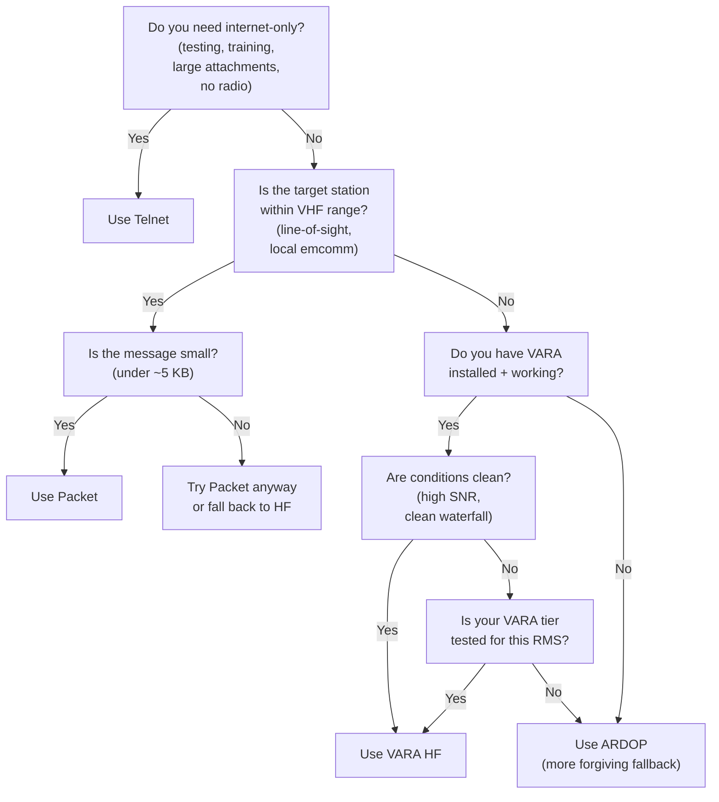

# Choosing the right mode

Four transports cover every Winlink session tuxlink can run: Telnet, Packet,
ARDOP, and VARA HF. They differ on bandwidth, license tier, RF path, and
the operator effort involved in keeping them working. This topic walks the
decision so the operator picks the right mode quickly under operating
pressure.

## The decision tree

Plain English: Telnet if internet works and you want internet. Packet for
short local VHF traffic. VARA HF if conditions are good and you have it
running. ARDOP for everything else on HF.

## Input axis 1: band conditions

Band conditions are the single biggest determinant for HF transports. The
operator's situational awareness — the waterfall display, the time of day,
the season, the band — drives the call.

| Conditions | Implication |
|---|---|
| Clean band, high SNR, gateway 1000 km away | VARA wins on throughput |
| Marginal band, deep fades, low SNR | ARDOP's narrow modes outperform VARA's narrow modes at the very low end |
| Spotty mobile / portable operation | ARDOP's adaptive bandwidth helps; VARA also adapts but is less forgiving on rapid changes |
| Local VHF | Packet wins (FM is robust against weak signals) |

## Input axis 2: message size

Different transports have different practical message-size envelopes.

| Transport | Comfortable size | Painful size |
|---|---|---|
| Telnet | Any size (megabytes) | None (internet bandwidth is uncapped at scale) |
| VARA HF Standard | Up to ~50 KB | Above ~100 KB |
| ARDOP 1000–2000 Hz | Up to ~30 KB | Above ~50 KB |
| ARDOP 200–500 Hz | Up to ~10 KB | Above ~20 KB |
| Packet 1200 baud | Up to ~5 KB | Above ~10 KB |

For attachments — photos, ICS-205 PDFs, KML files — only Telnet and VARA HF
are practical. Anything on Packet over 10 KB is antisocial on a shared
frequency.

## Input axis 3: license tier

Both ARDOP and VARA HF require HF data privileges — General class or
higher in the US. Telnet has no license gate at the protocol layer (it
authenticates by Winlink credentials, not by RF). Packet's license tier
depends on the band — VHF FM packet is Technician-accessible; HF packet
is General.

A Technician-class licensee with no HF data privileges is limited to:

- Telnet (any time).
- VHF Packet (FM, local).

A General-class-and-up licensee has all four available.

## Input axis 4: gateway availability

Even with a perfect chain, the gateway side has to exist + be on the air +
be reachable. The catalog request fetches the gateway list; reading it
informs the choice:

| Gateway type | Where to find it |
|---|---|
| Telnet | Always available — talks to the CMS directly |
| Packet | VHF / UHF gateways near you on the catalog list; APRS-Linked nodes |
| ARDOP | HF gateways on the catalog; geographic spread varies by band |
| VARA HF | HF gateways on the catalog; the dominant HF mode by gateway count |

Per region: some areas have dense VARA HF coverage and few ARDOP gateways;
some areas are reversed. Check the catalog for your geography.

## Input axis 5: setup effort

For a freshly-installed tuxlink station:

| Transport | Setup effort | Notes |
|---|---|---|
| Telnet | Lowest — works out of the box after the wizard | No RF chain needed |
| Packet | Moderate — install Dire Wolf, configure ALSA + PTT | One-time setup; well-documented |
| ARDOP | Moderate — install ardopcf, point at it | Linux-native, no Wine |
| VARA HF | Highest — install Wine, install VARA, configure audio routing | Closed source; tier licensing decision |

For a new station getting on the air, **start with Telnet** for the
functional verification (the wizard's optional CMS verify step does this
automatically). Move to **Packet** for the first RF session. Add **VARA**
or **ARDOP** for HF reach.

## Quick lookup table

| Goal | Pick |
|---|---|
| Fastest send right now, conditions don't matter | Telnet |
| Local emcomm net, small messages | Packet |
| Long-distance HF, you have VARA + clean conditions | VARA HF |
| Long-distance HF, marginal conditions | ARDOP |
| You don't know what's working today | Catalog request via Telnet to fresh the list, then ARDOP at 500 Hz to a regional RMS |
| All license tiers on this radio | Packet over VHF FM (Technician-accessible) |
| Closed-source modem is a no-go | ARDOP (the open answer) |

## Modes Winlink supports that tuxlink does not

Winlink's ecosystem covers more transports than tuxlink ships. The
notable absence:

**PACTOR (I, II, III, IV).** PACTOR is a long-running HF data mode that
predates VARA and ARDOP, with strong real-world EmComm deployment. It
runs on SCS hardware modems (the most common is the SCS Tracker, P4
Dragon, or DR-7800 — all closed-source proprietary hardware costing
$1500–$2500). The radio side of the chain is a standard SSB rig; the
modem is the differentiator. PACTOR I is the only no-cost-to-receive
mode in the family; PACTOR II–IV require a licensed firmware unlock per
hardware unit.

Tuxlink does not ship a PACTOR transport. The reasons are pragmatic:

1. **Hardware lock-in.** SCS is the sole vendor and the modem is
   proprietary. Building tuxlink-side support without an SCS modem in
   hand to verify is a non-starter.
2. **Audience overlap.** The HF Winlink stations that own SCS modems
   are largely the same population running Winlink Express on a Windows
   laptop — exactly the audience tuxlink is not targeting at v0.0.1.
3. **VARA and ARDOP cover the use case.** For an operator who does not
   already own an SCS modem, the modem cost is steep relative to the
   VARA Standard tier (free) or ARDOP (free, open) running on the same
   sound card the operator already has.

The tuxlink listener type system reserves a `Pactor` transport slot for
future use, but no listener path is wired up; selecting it in a
catalog entry produces a "transport not supported" disposition.

If PACTOR support matters to a specific operator, the canonical path is
to keep running Winlink Express on Windows for that PACTOR session and
use tuxlink for everything else.

## Pre-flight checklist

> [!WARNING]
> **The pre-flight precedes on-air transmission.** Every item below is
> in the licensee's chain of responsibility before pressing Connect.
> The Connect press itself is the per-session consent gate; the
> pre-flight is the operator's verification that consent is informed.

Before every RF session:

1. **Conditions check.** Glance at the waterfall, listen to the band, or
   pull a propagation report.
2. **Frequency check.** Catalog says the RMS is on X.XXX MHz USB or USB-D.
   Tune accordingly.
3. **Mode check.** Catalog says ARDOP 500 Hz or VARA Standard. Tuxlink
   needs to match.
4. **Levels check.** Audio-level meter in the right zone for the modem.
5. **Power check.** Within FCC limits for the band. For QRP work,
   sometimes lower is better (less ALC squashing, cleaner waveform).
6. **Consent check.** This is going on the air under your callsign;
   the radio's power switch is reachable.

The pre-flight is short — under 30 seconds with practice — and catches
the failures that otherwise burn 5 minutes of operating time.

## Where next

- [Packet on AX.25](14-packet-on-ax25.md) — Packet's deep dive.
- [ARDOP deep dive](15-ardop-deep-dive.md) — ARDOP details.
- [VARA HF deep dive](16-vara-hf-deep-dive.md) — VARA details.
- [Picking a transport](08-picking-a-transport.md) — the per-transport configuration entry point.
