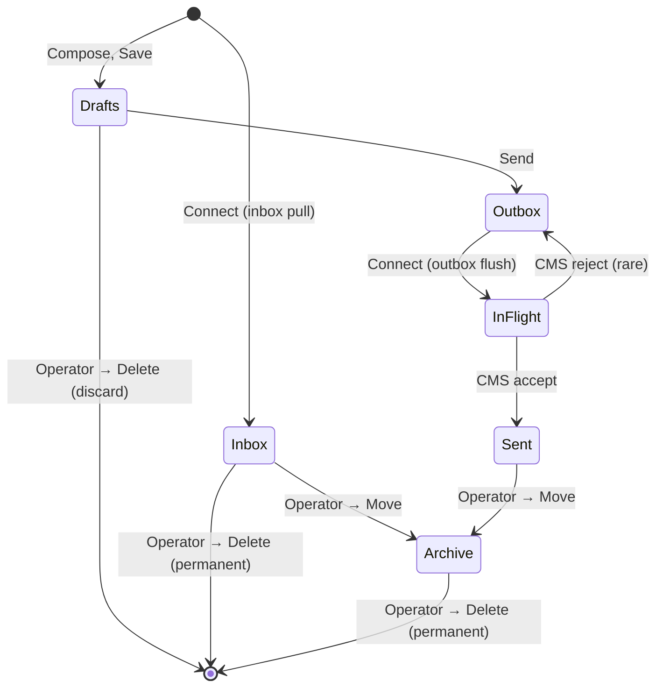

# The mailbox

The folder sidebar lists every mailbox folder. The selected folder's
messages render in the message list; the selected message renders in the
reading pane.

## Folders

<!-- screenshot-needed: docs/user-guide/images/18-the-mailbox/folder-sidebar.png
     Show: the folder sidebar with Inbox / Outbox / Sent / Drafts / Archive
     visible plus any user folders. Inbox should show an unread badge >0.
     Sidebar crop only, ~300x600. -->

<!-- screenshot-needed: docs/user-guide/images/18-the-mailbox/message-list-with-sort.png
     Show: the message list with the Sort control visible at the top
     (e.g., sorting by Date descending). Several messages visible. Message
     list area only, ~500x500. -->

- **Inbox** — messages the CMS has delivered to the operator's callsign.
  The badge shows the unread count.
- **Outbox** — outbound messages queued for the next CMS connect. The
  Mailbox bar's "N to send" segment surfaces the count from peripheral
  vision. Cleared on successful send.
- **Sent** — outbound messages that completed a CMS exchange. The badge
  shows the total. Read-only locally.
- **Drafts** — saved compose drafts not yet sent. The draft store is
  local to the operator's machine.
- **Archive** — messages the operator has moved out of the Inbox for
  long-term reference. The `A` accelerator (when a message row has focus
  and no text input is taking keystrokes) archives the selected message.

## User folders

The operator can create additional folders below the four built-ins to
organize messages by net, deployment, correspondent, or any other axis.
The folder sidebar's New Folder affordance opens a dialog for the name;
right-click an existing user folder for Rename or Delete. The
**Move to…** control in the reading-pane toolbar moves the selected
message between the built-ins and any user folder.

User folders are local to the operator's machine — they do not round-trip
through the CMS.

## The message list

Each row shows:

- Subject (highlighted when search-matched).
- From / To (the relevant party for the folder).
- Date (the message header date, not the local-receive time).
- Indicators: unread dot, form tag (HTML-form messages), attachment clip,
  body-size hint.

The list defaults to newest-first by date. The **Sort** control above the
list switches between Date, Subject, and From — ascending or descending —
and persists the choice per folder.

## The reading pane

Selecting a row opens the parsed message: headers (From, To, Cc, Subject,
Date), the body, attachments (if any), and form payload (if the message
is an HTML-form). The reading pane shares a query key with the message
list — TanStack caches the result, so opening the same message twice does
not double the IPC cost.

The reading pane's toolbar surfaces Reply, Reply All, and Forward.

## Message kinds you will see

The mailbox intentionally uses one list for every Winlink message type. A
plain text message, an HTML form, a catalog response, a weather response, and
a message with an inbound attachment all land in the same folders and use the
same Reply / Forward / Move controls.

The row indicators tell you what needs special handling:

- A form tag means the body includes Winlink HTML Forms payload data; open the
  message to render the structured form.
- A paperclip means the message has received attachments; open the message
  and use the attachment strip in the reading pane to save them.
- A large body-size hint means the message may be a poor fit for a slow RF
  path if you forward it unchanged.

Compose currently sends ordinary Winlink messages and form messages through
their dedicated compose paths. The Express-style "Send as" message-type
selector is visible but not wired; catalog and weather requests use their own
forms to create the right message shape.

## What the connection does to the mailbox

A CMS connect does two passes against the selected transport:

1. **Outbox flush.** Every queued message is offered. Successful messages
   move to Sent.
2. **Inbox pull.** Any waiting mail is downloaded and inserted into the
   Inbox folder.

The Mailbox bar's "N to send" segment is the canonical "is there work to
do" indicator — when it shows a number, the next Connect will move those
messages.

## When an outbound message does not leave

The Outbox is a queue, not an error folder. A message can remain there because
the operator has not connected yet, because the connection failed before B2F
message exchange, or because the remote side rejected or deferred the MID.

After any unsuccessful connect, read the radio panel's session log from the
top of the attempt downward. Look for:

- No connection or login: the Outbox was never offered.
- `Remote rejected` with a MID: the remote side declined that proposal; check
  the recipient, message type, and whether the remote already has that MID.
- `Remote deferred` with a MID: retry later, preferably on a faster or more
  stable path.
- An abrupt disconnect before final `FF`: some accepted messages may have
  moved to Sent while others still need attention.

The Sent folder is the confirmation surface. A message belongs in Sent only
after the session reports it was accepted and tuxlink files it there.

## Search

The search bar above the message list filters / cross-folder-searches.
Free-text matches against subject and from. Special tokens (`FOLDER:`,
`FROM:`, etc.) compose. The dropdown carries saved searches and recent
searches. See [Search](21-search.md) for the full vocabulary.

## Where next

- [Composing](19-composing.md) — drafts, Cc, Reply / Forward.
- [HTML forms](20-html-forms.md) — Position, ICS-213, ICS-309, others.
- [Search](21-search.md) — the search-token vocabulary.
- [Troubleshooting](29-troubleshooting.md) — reading session-log failures.
