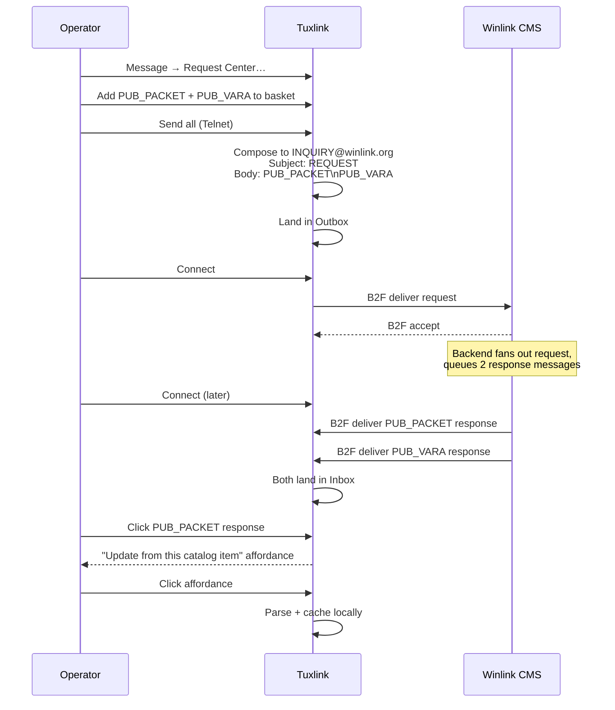

# Catalog requests

A catalog request is a special Winlink message that asks the CMS to send back
a piece of pre-published data — the active-users list, the help bulletin,
the public packet gateway list, the public VARA gateway list, and so on.
Each catalog item lives on the CMS as a named file; the operator asks for
a file by name, and the CMS replies with one regular Winlink message per
requested file. The response lands in the Inbox the next time the operator
connects.

This topic covers the request wire format, the catalog item naming
convention, and the related but separate mechanisms tuxlink uses for
gateway lists and weather data.

## The request shape

Tuxlink composes a Winlink message with these fields:

```
To:      INQUIRY@winlink.org
Subject: REQUEST
Body:    PUB_PACKET
         PUB_VARA
```

- The recipient is the literal address `INQUIRY@winlink.org`. This is the
  CMS endpoint that fans inquiries out to catalog responders.
- The Subject is always the literal `REQUEST`.
- The Body is a newline-separated list of catalog item filenames. One or
  more items per request — the CMS replies with one separate Private
  message per filename.

This is the wire format tuxlink's catalog composer
(`src-tauri/src/catalog/composer.rs`) emits, verified against a Winlink
Express outbox fixture (the canonical 2026-06-02 protocol-grounding
research). It is also the standard format compatible Winlink clients
use.

## Catalog item naming

Catalog items are filenames using letters, digits, and underscores. They
are case-insensitive on the CMS side; tuxlink normalises to uppercase by
convention.

Common items:

| Item | What it returns |
|---|---|
| `PUB_PACKET` | The list of active Packet RMS gateways |
| `PUB_VARA` | The list of active VARA HF RMS gateways |
| `WL2K_HELP` | The Winlink help bulletin |
| `WL2K_USERS` | The active-users list |

The catalog catalog itself — the index of every available item — is a
catalog item. Operators new to the system request that index first, then
pick from its contents.

> [!NOTE]
> The catalog item names above are stable across the network, but the
> full set evolves: catalog responders add items, retire items, and
> occasionally rename them. The catalog index is the authoritative
> current list at any time.

## Driving a catalog request

<!-- screenshot-needed: docs/user-guide/images/23-catalog-requests/request-center.png
     Show: the Request Center (Message → Request Center…) with the
     "Browse full catalog by category" view open and a few items in the
     request basket. ~900x600. -->

**Message → Request Center…** opens the request workspace:

1. **Browse or search the catalog** — the "Browse full catalog by
   category" view lists items by category and the search field filters
   across them. The index itself is a catalog item; fetch it first when
   the available set is unknown.
2. **Collect items in the basket** — selected items, plus the curated
   hero cards (gateway lists, propagation, nearby stations), gather in the
   shared request basket.
3. **Send all** — CMS catalog items collapse into a single inquiry
   message to the CMS. It lands in the Outbox, and the next Connect sends
   it. Telnet is the fastest path because the response messages can be
   large.

> [!WARNING]
> **A catalog request over RF is on-air transmission like any other
> Winlink message.** If the Send transport is ARDOP, VARA HF, or Packet,
> the Connect keys the radio under the operator's callsign — same gate
> as any RF Winlink session. Telnet does not transmit on air.

## The response

Catalog responses arrive in the Inbox like any other received Winlink
message. The body is plain text (for the index, help bulletin, etc.) or
formatted with a structure tuxlink's parser recognises (for the gateway
lists). Selecting a parseable response surfaces an "Update from this
catalog item" affordance that pulls the parsed data into the local
cache.

A response that doesn't get parsed (or that the operator dismisses) still
sits in the Inbox as a readable message — no data is lost.

The CMS replies to each requested filename with a separate message, so
a request that bundled three filenames produces three Inbox messages on
the next Connect.



That's the canonical request → response → parse flow. For details on
which catalog filenames exist, see the catalog index item; the catalog
network publishes the index plus the list of catalog items as a
catalog item itself.

## The RMS gateway list — two mechanisms

The Winlink network publishes the RMS gateway list two ways. Tuxlink's
gateway-list refresh tries each in order of operator preference:

1. **HTTPS REST.** `https://api.winlink.org/gateway/status.json` returns
   a JSON document with every active RMS gateway: callsign, frequency,
   mode, bandwidth, grid square, last-heard time. Fast — single HTTPS
   round trip — but requires internet. Tuxlink uses this when online and
   the operator hasn't explicitly preferred the in-band path.
2. **In-band catalog inquiry.** Sending `PUB_PACKET` and `PUB_VARA`
   (and possibly `PUB_ARDOP` and similar) catalog requests pulls the
   per-mode gateway lists as Winlink messages over the operator's
   current transport. Works over RF when internet is unavailable;
   slower than the HTTPS path; the response is the published catalog
   format, parsed into the same local gateway list the HTTPS path
   populates.

The catalog inquiry path matters specifically for emcomm operators
running RF-only with no internet — it is how a station with no upstream
connectivity refreshes its gateway list mid-event.

## Weather data — not a Winlink catalog item

A common newcomer surprise: weather data on Winlink is NOT a catalog
inquiry, and it does NOT come from `INQUIRY@winlink.org`. Weather is a
**third-party service** (Saildocs) that happens to use Winlink as the
mail transport.

To fetch a GRIB file or a NWS text forecast, tuxlink composes a regular
outgoing message addressed to:

```
To:      query@saildocs.com
Subject: (anything)
Body:    send gfs:40N,60N,140W,120W|2,2|24,48,72|PRESS,WIND
```

- The recipient is Saildocs, NOT Winlink.
- The Body is Saildocs' own request grammar (`send <category>:<args>`).
- The response is a GRIB-1 binary file (for `gfs` and similar weather-
  model requests) or plain text (for NWS bulletins).

The full Saildocs grammar is documented at https://saildocs.com/gribinfo.
Tuxlink offers a dedicated GRIB request form in the Request Center
(Message → Request Center… → GRIB, or Message → GRIB File Request…) that
hides this grammar behind a region picker and parameter checkboxes.
Saildocs requests ride their own rail in the basket — each is dispatched
as its own outgoing message when the basket is sent.

The reason this matters operationally: Saildocs is a separate service.
Its availability is independent of Winlink's. An operator can request
weather even when the Winlink catalog system is congested. The trade-off
is that Saildocs occasionally rate-limits unauthenticated traffic;
heavy-use stations register with Saildocs for higher limits.

## How often to refresh

The RMS gateway list changes slowly — gateways come and go, but the
quarterly turnover is small. A monthly refresh is sufficient for a
station that operates regularly. For a station that is dormant for
months and then comes back for an emcomm event, a refresh just before
the event is the right call.

The Winlink help bulletin and active-users list are static-ish — refresh
when curious, not on schedule.

GRIB / weather data is the opposite — it's perishable. A 12-hour-old
weather file is operationally useless. Fetch just before you need it.

## Size and bandwidth

| Item | Typical response size | Practical transport |
|---|---|---|
| `PUB_PACKET` (global) | 100–300 KB | Telnet preferred; VARA HF Standard works for regional subset |
| `PUB_VARA` (global) | 100–300 KB | Same |
| `WL2K_HELP` | ~5–20 KB | Any transport |
| `WL2K_USERS` (global) | 50–200 KB | Telnet preferred |
| GRIB regional 24-hour forecast | 10–50 KB | VARA HF, ARDOP 1000 Hz |
| Saildocs NWS text forecast | 2–20 KB | Any HF transport |

A global Packet list pulled over Packet would tie up the channel for 30+
minutes. The right answer for HF refresh is either the HTTPS path (when
online) or a regional-filter inquiry (when supported by the catalog item).

## When catalog requests are inappropriate

Catalog requests are NOT appropriate during an active emcomm event when
operating time is tight and the gateway list is already sufficient. They
are appropriate during the **pre-event preparation** phase, when the
operator has time and a good Telnet path.

For routine non-emcomm operating, catalog requests are background work —
slot them between traffic.

## Where next

- [The Winlink ecosystem](04-the-winlink-ecosystem.md) — where the CMS sits.
- [CMS and RMS gateways](05-cms-and-rms.md) — what the gateway list describes.
- [Picking a transport](08-picking-a-transport.md) — which transport for which size of response.
- [The mailbox](18-the-mailbox.md) — where catalog responses land.
- [HTML Forms](20-html-forms.md) — form-based composition (separate from catalog requests).
