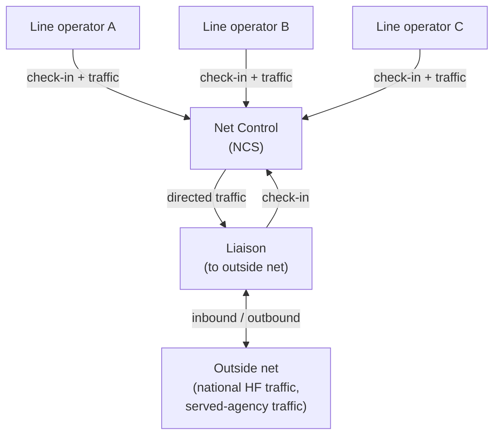

# Emcomm and ICS

Emcomm — emergency communications — is the operational context most Winlink
operators care about. Winlink fits into Incident Command System (ICS)
operations as the long-haul text-traffic backbone when normal email is
unavailable. Tuxlink supports the standard message forms (ICS-213, ICS-205,
and the broader Winlink HTML Forms catalog) that the EmComm community has
standardised on.

This topic covers where Winlink sits in ICS, the standard message types, net
structure, and how tuxlink's surfaces line up with EmComm practice.

## Where Winlink fits in ICS

The Incident Command System assigns formal roles — Incident Commander,
Operations, Planning, Logistics, Finance — each with their own
communications needs. Winlink belongs to the Communications Unit under
Logistics in formal incidents.

Two operating modes matter:

- **Tactical / on-scene.** Voice repeaters, simplex, packet for short
  data traffic, runners on foot. Winlink is rarely the right tool at
  this layer — its session establishment is too slow for tactical decision
  loops.
- **Logistical / sustaining.** Resource requests, supply ordering, status
  reports up the chain, situation reports across the operating area.
  Winlink shines here — when the routine email goes down, Winlink keeps
  the multi-day logistical conversations moving.

The split: voice for now-traffic, Winlink for sustain-traffic.

## Standard message types

### ICS-213 (General Message)

The single most common emcomm form. A general-purpose message with
sender / recipient / priority / subject / body fields. Used for anything
that doesn't fit a more specific form.

In tuxlink: **Compose → Use form → ICS-213**. The form opens with the
standardised fields. The operator fills them in and Sends; the resulting
message is a Winlink HTML Forms message that the recipient sees as a
formatted ICS-213 (and tuxlink renders the same way on receive).

### ICS-205 (Communications Plan)

A pre-incident or early-incident form that lays out frequencies, channels,
modes, and assignments for the operating area. Comm Unit Leaders author
this; line operators read and follow.

In tuxlink: receive-only is the common case; line operators don't typically
author 205s. The form parser displays the structured fields cleanly.

### ICS-309 (Communications Log)

The radio log. Net Control operators typically author 309s after a net
ends, recording who checked in, what traffic moved, and any anomalies.

### Position reports

Not strictly ICS, but operationally important. A Winlink position report
embeds the operator's grid (or precise GPS coordinate, see
[Position and privacy](26-position-and-privacy.md)) in the message. ARES
nets use these to track who is operating from where.

In tuxlink: the dashboard ribbon's identity affordance carries the grid;
the catalog request for position reports surfaces who is on the air.

### Winlink Catalog

The broader [HTML Forms](20-html-forms.md) catalog covers ARES check-ins,
Red Cross Welfare Inquiries, Coast Guard checkings, and dozens of other
standardised forms. Tuxlink ships the same catalog as Winlink Express
through the catalog-cache subsystem.

## Net structure

A Winlink net is a scheduled time and frequency where multiple operators
log on, exchange traffic with the net controller, and log off. Three roles:

- **Net Control (NCS).** Runs the net. Solicits check-ins, takes traffic,
  coordinates third-party relays, closes the net.
- **Liaison.** Brings traffic to or from outside the net (e.g. national
  HF traffic into a local VHF net).
- **Line operators.** Everyone else — check in, take or pass traffic, log
  out.

Tuxlink's role in a Winlink net is the same as any Winlink client — open
a session at the net's scheduled time, send queued outbound traffic,
receive inbound. The session log is the operator's record; an ICS-309 form
can be authored from it after the net for the formal log.

## Pre-event preparation

For a planned event (hurricane season ramp-up, marathon, public service
event), preparation work has a predictable shape:

1. **Verify the chain.** Run a Telnet round-trip-to-self
   ([topic 03](03-sending-your-first.md)) and a short RF session to a known
   gateway.
2. **Refresh the catalog.** Fetch the RMS gateway list filtered to the
   operating region.
3. **Pre-load forms.** Verify the ICS-213, ICS-205, and any
   event-specific catalog forms render correctly in tuxlink.
4. **Brief paths.** Identify primary and backup gateways for the event.
   Document them — paper, sealed and on the operator's clipboard, is the
   right medium for this kind of pre-flight reference.
5. **Power planning.** Confirm radio + tuxlink-host power can run for the
   expected event duration. Battery + solar for portable; UPS + generator
   for fixed.

## In-event operating

Once the event starts, operating discipline matters more than tooling. A
few patterns:

- **Don't catalog-request during the event.** Catalog responses can be
  large; the time to fetch them is during pre-event.
- **Use the smallest mode that works.** A 5 KB message on Packet to a
  local RMS uses less channel time than the same message on VARA to a
  distant RMS.
- **Read before sending.** Tuxlink's Drafts folder is for messages
  composed mid-event that need a second look before transmission. Use it.
- **Log the traffic.** Keep the session log open in the radio panel; it
  is the operator's record of what happened. Save it after each net.

## Post-event documentation

After the event:

- **Author an ICS-309** if NCS responsibilities were assumed.
- **Archive event traffic** into a dedicated user folder
  ([User folders](22-user-folders.md)) — `<event-name> <year>` is the
  conventional layout.
- **Clear the Outbox.** Verify nothing was left queued.
- **Note lessons learned.** What worked, what didn't, what setup change
  would have helped. These notes inform the next pre-event preparation.

## Tuxlink and Part 97

Tuxlink does not transmit autonomously. Every session is initiated by the
operator clicking Connect; that click is the per-session licensee consent
gate. This is required by the FCC's Part 97 amateur radio rules — an
amateur transmitter has to be operated by a licensee at the time of
transmission, and no automated system can initiate transmissions under the
operator's callsign without their per-event consent. Tuxlink's design
treats this as load-bearing, not as a recommendation. See the warnings on
the [ARDOP](15-ardop-deep-dive.md) and [VARA HF](16-vara-hf-deep-dive.md)
topics for the corresponding operating-time framings.

## Where next

- [Net check-ins](25-net-check-ins.md) — the routine traffic pattern.
- [Position and privacy](26-position-and-privacy.md) — what your station broadcasts.
- [HTML Forms](20-html-forms.md) — using ICS-213 and the wider forms catalog in tuxlink.
- [Picking a transport](08-picking-a-transport.md) — which mode for emcomm in which context.
