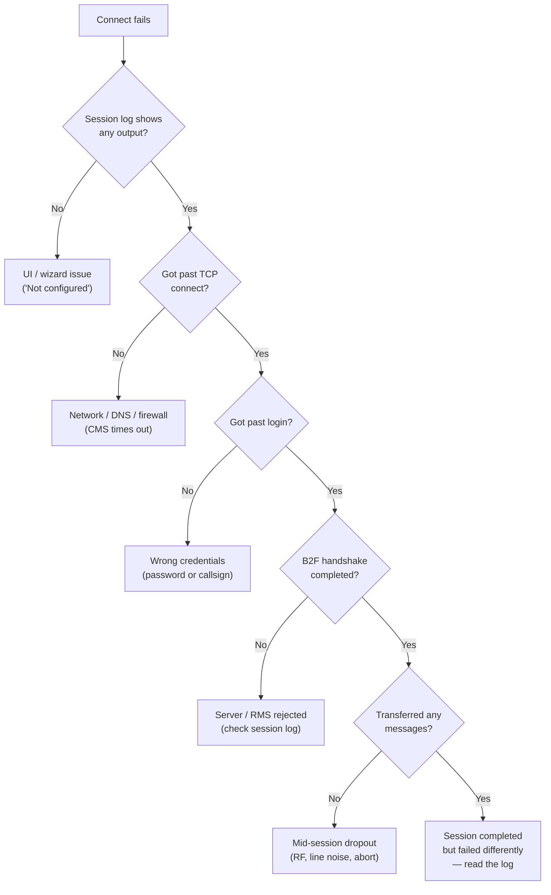

# Troubleshooting

Quick diagnostics for the most common issues, plus where to look when
things are not working.

For a Connect-fails situation specifically, this decision tree narrows
the cause:



## Read the session log first

The radio panel's session log is the fastest way to diagnose mailbox and
transport failures. Read one attempt from top to bottom before changing
settings. The important milestones are:

- Transport opened: TCP, KISS, ARDOP, or VARA reached the configured peer.
- Login accepted: the callsign and password challenge were accepted.
- Proposals exchanged: the log shows outbound MIDs being offered and inbound
  MIDs being accepted.
- Filing completed: sent messages report `-> Sent`; received messages report
  `-> Inbox`.
- Clean close: both sides finish with `FF`.

The log is operator-facing evidence, not just developer debug output. If a
bug report involves mail not moving, include the relevant lines around the
failed attempt.

## "Not configured" in the message list

The backend has no callsign / grid / transport. Either re-run the wizard
or delete the config file:

```
rm ~/.local/share/com.tuxlink.app/config.json
```

The wizard re-runs on next launch.

## Connect button does nothing

- Check the selected transport in the folder sidebar — the highlighted
  connection is the one Connect uses.
- Watch the session log inside the radio panel; backend errors land
  there.
- For Packet: confirm the modem (e.g. Dire Wolf) is listening on the
  configured KISS TCP port.
- For ARDOP: confirm `ardopcf` is running and the configured ALSA
  capture / playback devices exist (`aplay -l`, `arecord -l`).
- For VARA: confirm the VARA HF modem is running on the host the radio
  panel's Host field points at (default `127.0.0.1`) and the Cmd / Data
  ports match (defaults `8300` / `8301`).

## CMS times out

- Try Telnet first — internet is the simplest failure mode.
- The default CMS endpoint can be slow; consult
  https://winlink.org/CMSStatus for global CMS health.
- For Packet / ARDOP / VARA: the local gateway must be running.

## VARA fails to connect

- Verify the VARA HF modem process is running. VARA itself runs outside
  Tuxlink — either Wine on x86 Linux or a Windows host on the network.
  An install made through the guided setup (the VARA panel's **Set up
  VARA HF…** button) configures auto-start on login; a manual install
  must be launched by the operator.
- Cmd Port and Data Port (in the VARA radio panel) must match the modem's
  listening ports. A mismatch shows as a TCP connect error in the
  session log.
- If the radio never keys during a connect attempt, PTT may be
  unwired. VARA raises PTT events on its command port and Tuxlink keys
  the rig on them through the configured rig-control / PTT method —
  check the rig control settings. Tuxlink refuses to dial when no PTT
  method resolves, and the session log says so.
- Bandwidth licensing: Tactical (2750 Hz) requires the operator's paid
  VARA license tier; Narrow (500 Hz) and Standard (2300 Hz) work on the
  free tier and are operationally confirmed against RMS gateways.

## VARA gateway never answers

The connect transmits, the log shows the call going out, but no gateway
comes back. Check, in order:

- **Bandwidth matches the channel.** Gateway listings advertise each
  channel's VARA bandwidth (500 / 2300 / 2750 Hz). The gateway decodes
  connect requests only at that width — a VARA 500 channel cannot hear
  a 2300 Hz connect request. Set the VARA panel's Bandwidth to match.
- **Frequency entered as the center.** Catalogs publish audio-center
  frequencies; the rig's USB dial belongs 1.5 kHz below. Enter the
  catalog's center in the panel's Center freq field and let the CAT
  tune dial the rig — dialing the published number directly on the rig
  puts the signal 1.5 kHz off the gateway's passband.
- **Exact callsign, including SSID.** A gateway operating as
  `XX1XXX-10` does not answer a call addressed to `XX1XXX`.
- **Operating hours.** Gateway listings publish each channel's hours;
  outside them, nobody is listening on that frequency.

## Message remains in Outbox after Connect

- Confirm the session reached B2F exchange. If the log stops at transport
  setup or login, the message was never offered.
- Look for `Sent "<subject>" (MID ...) -> Sent.` If present, the accepted
  message should be in Sent even if a later message in the same batch failed.
- Look for `Remote rejected` or `Remote deferred`. A reject usually means the
  remote side declined that MID; check the recipient address, message type, and
  whether the remote already has it. A defer means retry later.
- For a message with a large attachment, confirm the attachment fits the
  transport's practical limit (see
  [Composing](19-composing.md#attachments)). An oversized attachment on a
  narrow RF link can exhaust the session before the message completes.
- For large messages, retry with Telnet or a faster RF mode. Packet and narrow
  HF links are easy to exhaust with catalog responses, form bundles, and
  image-heavy traffic.

## Internet mail, spam, and Accept List issues

If outgoing mail to an internet address works but replies never appear in
Tuxlink, the failure may be outside tuxlink. Winlink's CMS applies account-side
spam controls and Accept List rules before a message ever reaches the client.

Tuxlink does not yet expose Accept List management in Settings. Manage those
rules from Winlink's account tools or another Winlink client, then reconnect
with tuxlink to pull any newly-allowed mail.

## Background tasks and statistics

Tuxlink is currently designed for attended operation. It does not run
Express-style unattended background connects, catalog auto-fetch, or a
separate traffic-statistics console. The authoritative per-session record is
the live session log, and the durable traffic record is the local mailbox plus
any exported bug-report logs.

## GPS shows nothing

- Tools → Settings → GPS state must be `Broadcast at precision` or
  `Local display only` (not `Off`).
- A `gpsd` instance must be running on the host; Tuxlink reads from
  `gpsd` over TCP (default `localhost:2947`).

## Theme looks wrong

- Use View → Color Scheme to verify the active scheme.
- If switching from a custom theme leaves stale color: pick the Default
  preset to clear the inline override, then pick the desired theme.

## Compose window will not open

- The compose window is a separate Tauri webview; webview creation can
  fail if WebKitGTK is not installed. On Debian / Ubuntu:
  ```
  sudo apt install libwebkit2gtk-4.1-0
  ```
- The native title-bar Close on the compose window does NOT save in some
  early builds — confirm via Drafts that the in-progress text persisted.

## Archive, import, or export questions

The supported mailbox backup path is a copy of
`~/.local/share/com.tuxlink.app/native-mbox/` while tuxlink is closed. Tuxlink
does not yet have a one-click Import / Export command or an automatic Winlink
Express / Pat archive converter. See [Mailbox model](07-mailbox-model.md) and
[Moving from other Winlink clients](32-from-express-or-pat.md) before moving
history between clients.

## Reporting a bug

The Help → Report Issue menu opens the GitHub issue tracker in the
operator's default browser. Include:

- Tuxlink version (Help → About Tuxlink, or the Mailbox bar's right end).
- Transport (Telnet / Packet / ARDOP / VARA).
- The line(s) from the radio panel's session log around the failure.
- Steps to reproduce, if possible.

## Where next

- [Settings](27-settings.md) — every preference's effect.
- [Picking a transport](08-picking-a-transport.md) — what each transport needs.
- [Mailbox model](07-mailbox-model.md) — message states, backup, and local archive behavior.
- [First-launch wizard](02-first-launch-wizard.md) — wizard recovery.
