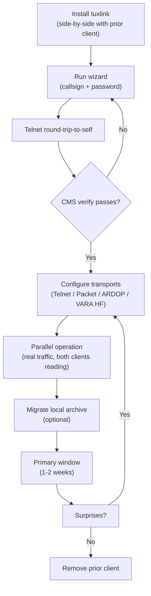

# Moving from other Winlink clients

Operators coming from another Winlink client already know how Winlink
works. What's different about tuxlink is the surface, the platform, and a
small set of conceptual shifts where tuxlink deliberately departs from
existing client conventions. This topic covers the known client landscape,
settings mapping for the two most likely migration sources, conceptual
differences, parity gaps, and a recommended order for moving the operating
environment over.

## Known Winlink clients

The official [Winlink client comparison](https://winlink.org/ClientSoftware)
currently lists eight client programs: [Outpost](https://www.outpostpm.org/),
[AirMail](https://www.siriuscyber.net/ham/),
[WoAD](https://woad.sumusltd.com/),
[Pat](https://getpat.io/),
[RadioMail](https://radiomail.app/),
[Paclink-Unix](https://paclink-unix.sourceforge.net/),
Paclink, and [Winlink Express](https://winlink.org/WinlinkExpress).
Tuxlink is not part of that official list yet; it is an independent Linux
client in alpha.

| Client | Main platform | Best fit | How it differs from tuxlink |
|---|---|---|---|
| **Winlink Express** | Windows; usable under Wine/VMs on Linux/macOS | Official reference client, broadest Winlink feature surface, forms, PACTOR, VARA, ARDOP, Packet, Telnet, Radio-only/Post Office workflows | Tuxlink is Linux-native, uses a single integrated desktop shell, stores credentials in the OS keyring, and is still closing parity gaps |
| **Pat** | Linux, macOS, Windows | Open-source cross-platform Winlink with GUI, web UI, CLI, scripting, major transports, and strong Linux culture | Tuxlink is a desktop app rather than a web/API-first tool; it owns the native mailbox/UI experience instead of exposing Pat's config/API model |
| **RadioMail** | iOS/iPadOS | Mobile field use, GPS-aware station directory, polished phone/tablet workflow, packet/Bluetooth and external VARA integrations | Tuxlink targets Linux laptops/tablets and integrated desktop operation; RadioMail is the better fit when the station is phone-first |
| **WoAD** | Android | Android field operation with mobile Winlink access and evolving RF-mode support | Tuxlink is not mobile; WoAD is better when the operator wants an Android device as the primary client |
| **AirMail** | Windows | Mature PACTOR/marine-style workflows and direct interoperability with Express-era peer clients | Tuxlink does not support PACTOR and is not aimed at legacy Windows/marine operating habits |
| **Outpost** | Windows | Packet/BBS-style served-agency traffic, especially local ARES/RACES packet workflows | Tuxlink is a full Winlink mail client with native B2F mailbox handling, not a packet-message-manager front end |
| **Paclink / Paclink-Unix** | Windows / Unix-like systems | Gatewaying a local POP/SMTP-style mail program or agency workstation into Winlink | Tuxlink is for a human operator at the Winlink console, not for bridging another mail client into the system |

There are also important programs that are **not** operator mail clients in
the same sense:

- **RMS Trimode, RMS Packet, and RMS Relay** are sysop/gateway programs.
  They run the stations clients connect to.
- **VARA, ardopcf, Dire Wolf, AGWPE, and hardware TNC tools** are modems
  or modem-control layers. They move bits; they do not replace the mail
  client.
- **SailMail** uses related radio-email technology for a different
  service. It is not the amateur Winlink client target tuxlink is trying
  to replace.

## Where tuxlink fits

Tuxlink is meant for a Linux operator who wants an attended, native desktop
Winlink client with the radio/modem state visible in the same application
as the mailbox. Its design center is a field laptop, Raspberry Pi-class
Linux station, or Linux tablet used by an operator who wants less Wine,
less browser-tab management, and less hand-editing of config files.

That makes tuxlink complementary rather than universally superior:

- Keep **Winlink Express** available when you need the official reference
  behavior, PACTOR, or an event plan standardized on Express screenshots.
- Keep **Pat** available when you need scriptable automation, a web UI, or
  an HTTP/API surface.
- Use **RadioMail** or **WoAD** when the phone/tablet is the station.
- Use **Paclink/Paclink-Unix** when the goal is agency email integration,
  not an operator-facing Winlink mailbox.
- Use **Outpost** when a packet-message-manager workflow is part of the
  local served-agency plan.

## Settings mapping

### From Winlink Express

| Express setting | Tuxlink equivalent |
|---|---|
| **Setup → My Settings → Call Sign** | Tools → Settings → Identity → Callsign |
| **Setup → My Settings → Grid Square** | Tools → Settings → Identity → Maidenhead Grid |
| **Setup → My Settings → Password** | Tools → Settings → Identity → Password |
| **Setup → Connections → Telnet Winlink** | Tools → Settings → Connection → Telnet (host + port) |
| **Setup → Connections → Vara HF** | VARA HF radio panel (Host / Cmd Port / Data Port / Bandwidth) |
| **Setup → Connections → Packet Winlink** | Tools → Settings → Packet → KISS host + KISS port + SSID |
| **Open Session → New Message** | Compose window (Ctrl+N) |
| **Open Session → Read Selected Message** | Message list → click → reading pane |
| **Contacts / Address Book** | Address -> Contacts in the sidebar |
| **Group Addresses** | Address -> Contacts -> Groups |
| **Import / Export Contacts** | Not yet provided; recreate high-value entries manually for now |
| **Channel Selection** | Catalog request → RMS_LIST → results show in the radio panel's gateway picker |
| **Color preferences** | Tools → Settings → Color schemes (6 bundled schemes) |

### From Pat

| Pat config key | Tuxlink equivalent |
|---|---|
| `mycall` in `config.json` | Tools → Settings → Identity → Callsign |
| `locator` in `config.json` | Tools → Settings → Identity → Maidenhead Grid |
| `secure_login_password` | Tools → Settings → Identity → Password |
| `connect_aliases` | Per-transport panel (Telnet / Packet / ARDOP / VARA) |
| `service.command` (auto-connect rules) | (Future work; tracked as the AutoConnect feature) |
| `forms.path` | Built-in — Tuxlink ships the Winlink Forms catalog |
| `mailbox.path` | `~/.local/share/com.tuxlink.app/native-mbox/` |

Pat's web UI is gone in tuxlink. Tuxlink is a desktop application —
the surfaces are inline windows + panels, not a browser. For operators
who specifically want Pat's web-UI / API model, Pat remains the right
choice; tuxlink is for operators who want a native desktop experience.

## Conceptual differences

### Inline UI, not pop-up windows

Winlink Express opens a separate window for almost every action: Compose,
Open Session, Settings, Forms. Tuxlink inlines these into the main shell
where the operating context is already present. The exceptions:

- **Compose** has its own window (the only intentional Express-style
  detached surface — composing a message is the one operating context
  worth its own focus).
- **Help / User Guide** has its own window (this guide).

Everything else — settings, transport configuration, transport status,
session log, forms catalog — is a panel inside the main shell.

### Per-session-consent affordance

Tuxlink treats Connect as the per-session on-the-record operator consent
to transmit under the operator's callsign. Express treats Connect as a
casual "go ahead and run this session" button. The difference matters
for Part 97 compliance: tuxlink's UI is designed so the consent gate is
unambiguous (one button click per session) rather than implicit.

In practice this changes nothing about how the operator works — clicking
Connect once per session is what an Express operator already does. The
documentation makes it explicit.

### GPS broadcast precision-reduced by default

Express broadcasts what the GPS says: precise coordinates, sub-meter.
Tuxlink defaults to 4-character Maidenhead (county-scale resolution). The
operator opts up to 6-character, 8-character, or full GPS via Settings.
See [Position and privacy](26-position-and-privacy.md) for the privacy
framing.

For an Express operator who specifically wants precise position broadcast,
the Settings panel takes one toggle.

### Folder semantics

Express has Inbox, Outbox, Sent, Drafts, Archive — same as tuxlink.
Express also has the concept of "user folders" but exposes them
through a separate "folder management" surface. Tuxlink's user folders
appear inline in the sidebar, right-click to create / rename / delete.
See [User folders](22-user-folders.md).

### Contacts and group addresses

Express separates Address Book and Group Addresses into their own menu
items. Tuxlink puts both under **Address -> Contacts** in the sidebar.
Saved people, suggested correspondents, and groups live in one surface,
and Compose autocompletes from all of them.

Tuxlink does not yet import an Express address book or export contacts as
CSV. Recreate the high-value contacts and distribution groups by hand
while keeping Express available as a reference. See
[Contacts and groups](34-contacts-and-groups.md).

### No catalog auto-fetch

Express periodically auto-fetches the catalog (gateway list, etc.)
without operator initiation. Tuxlink does not — every catalog request is
an explicit operator action. See [Catalog requests](23-catalog-requests.md).

This is a deliberate choice for emcomm scenarios where uncontrolled
transmission is undesirable. An operator who wants Express-style
auto-fetch can run it on a periodic basis manually.

## Parity gaps

Tuxlink does not yet match Express feature-for-feature. Gaps that are
operationally significant:

| Gap | Status |
|---|---|
| AutoConnect / scheduled connects | Partial — basic AutoConnect Family A is in-progress; advanced rules planned |
| PACTOR support | Not planned — PACTOR requires the SCS hardware modem; the ARDOP / VARA combination covers HF |
| AGW / Linbpq packet drivers | Not supported — Dire Wolf KISS is the canonical path |
| Mid-session resume after disconnect | Not supported — interrupted transfers restart from the beginning |
| RMS Express Telnet (the special variant) | Not relevant — tuxlink speaks standard B2F over standard Telnet |
| Send-as / message-type selector | Not yet — Compose currently sends ordinary Winlink messages, while forms, catalog requests, and weather requests use dedicated compose paths |
| Outbound file attachments and image resize/crop | Partial — received attachments work; outbound attachment send and Express-style image tools are not shipped yet |
| Message templates | Not yet — the Compose template button is visible but disabled |
| Accept List / spam controls | Not yet — manage Winlink account-side Accept List rules outside tuxlink for now |
| In-app import / export / archive conversion | Not yet — copy `native-mbox/` for backup; Express/Pat conversion remains a manual or one-time-script migration task |
| Background auto-fetch, unattended connects, and traffic statistics | Not provided — tuxlink is currently attended-operation-first, with the session log as the per-session record |

The mapping the other way — features tuxlink has that Express does not —
includes the per-session consent affordance (above), the privacy-default
position model, and the inline-UI architecture.

## Parity gaps from Pat

| Gap | Status |
|---|---|
| Web UI | Not provided (intentional — see "Inline UI") |
| HTTP/JSON API | Not exposed |
| Multiple-profile support | Not yet — tuxlink assumes one callsign per install |
| Forwarding / inbox rules | Not yet |
| GPSD direct integration | Same path — tuxlink reads from gpsd when available |

## Recommended migration sequence

For an operator moving from another client to tuxlink:

1. **Install tuxlink** alongside Express / Pat. Don't uninstall the
   prior client yet.
2. **Run tuxlink's wizard** with the same callsign and password as the
   prior client. The wizard's CMS verify step confirms credentials.
3. **Send a round-trip-to-self via Telnet** ([topic 03](03-sending-your-first.md))
   to confirm the local mailbox and the CMS handshake work.
4. **Configure the same transports** the prior client uses, where tuxlink
   supports them. Telnet, Packet (Dire Wolf), ARDOP (ardopcf), and VARA HF
   are the normal migration targets. The radio chain (DigiRig + radio) is
   unchanged — tuxlink talks to the same modems.
5. **Run a few sessions in parallel.** Send a few real messages with
   tuxlink while still receiving via Express / Pat. Confirm tuxlink works
   the way the operator expects.
6. **Migrate the local archive.** Optional — tuxlink starts with an empty
   mailbox. If preserving history matters, the Pat mailbox or Express's
   exported messages can be copied into tuxlink's
   `~/.local/share/com.tuxlink.app/native-mbox/` directory after conversion.
   The format is different; tuxlink does not yet ship the conversion tool, so
   keep the source archive untouched until the migrated messages have been
   verified.
7. **Run as primary for a defined window** (a week, two weeks). If no
   surprises, the prior client is now the backup.
8. **Remove the prior client** when confident.

The whole sequence usually takes a day or two of part-time effort.

## When to stay with another client

Stay with the prior client if:

- The operator is on Windows-only — Express is the native Windows client.
- The operator needs PACTOR — tuxlink does not support PACTOR.
- The operator depends on Pat's web UI / API for integration with other
  systems — tuxlink does not provide either.
- The operator depends on bulk contact import/export from another client -
  recreate critical contacts manually until Tuxlink ships migration tooling.
- The operator's served agency has standardized on Outpost, Paclink, or a
  specific Express workflow for an exercise.
- The operator's practical station is a phone or tablet — RadioMail or
  WoAD may be the better field client.
- The operator runs unattended-station configurations Express specifically
  supports — tuxlink is currently designed for attended-operator use.

For everyone else (Linux operator, attended operating, no PACTOR
requirement), tuxlink is a viable migration target.

## Reporting migration issues

The migration path above is what the project knows works as of this
guide's writing. If something the spec implies should work doesn't, file
an issue at the project's GitHub repo. The migration topic is meant to
be living documentation — it gets updated as parity gaps close and the
operating practice evolves.

## Where next

- [Contacts and groups](34-contacts-and-groups.md) - address book, groups, suggestions, and migration limits.

- [What is tuxlink](01-what-is-tuxlink.md) — the framing, including who tuxlink is for.
- [First-launch wizard](02-first-launch-wizard.md) — the start of the install.
- [Credits](31-credits.md) — what tuxlink draws from prior clients.
- [Troubleshooting](29-troubleshooting.md) — what to check when something doesn't work.
